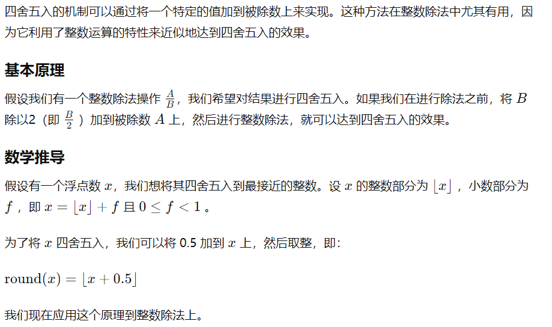

### 1. fpga_top.v 100(83)

---

1. AD7276使用SPI接口，SPI相关知识？
2. 为什么使用AD7276？介绍AD7276参数，为什么不使用其他ADC/有其他ADC可以替代吗？
   - datasheet
3. 同上，N-MOSFET的选型、参数，NMOS和PMOS有什么区别？MOS与三极管有什么区别？
4. 为什么系统的输入时钟是81.36mHz？
5. PLL相关知识点——实现原理？
6. 为什么有了uart2nfca_system_top.v还要再封装一层？

### 2. uart2nfca_system_top.v 200(158)

---

1. ADC的频率是怎么计算出来的？时钟有什么说法？为什么最大采样率是3Msps？
2. 系统中的模块有哪些，都负责哪些功能？如何确定这些模块的，从哪个模块开始编写的？
   - 从系统的几个关键参数入手
3. FIFO相关的知识点
   - 手撕同步、异步FIFO
   - FIFO深度计算
   - 跨时钟域等知识，详细参见笔记
4. UART相关知识点
5. 为什么两个uart模块中实现了fifo？uart_rx和nfca_tx_frame之间还要有一个fifo？
6. 握手协议知识点，哪些模块间采用了握手协议，为什么采用握手协议？
7. 函数/任务知识点，hex2ascii和ascii2hex的实现方法，手写？
8. uart_rx和uart_tx参数的含义
9. uart_tx模块的i_tdata与i_tkeep输入思路

### 3. nfca_tx_frame.v 200(145)

---

1. remainb这个参数的意义？
   - 结合命令进行解释（拍草稿纸截图）
2. CRC16的原理，手撕一下CRC16的计算函数？
   - NFCA-3的附录里
3. 结合代码，介绍短帧的特殊处理方式？
4. tx_tready与tx_tvalid处的if判断为什么不能合并？
5. 结合状态机说一下数据发送的流程，能大概把状态机写一下吗？

### 4. nfca_tx_modulate.v 150(105)

---

1. rx_on的时间窗口安排的理由？
   - 结合波形图说明
2. CARRIER_SETUP、CARRIER_HOLD参数的设置思路？为什么要在两个CARRIER_SETUP之间进行数据发送？为什么要这样划分时间段？
   - 设计思路是1.2s内不发送波形就关闭载波
3. wcnt为什么要初始化为’hFFFFFFFF?以及其它计数器的作用？
4. 载波发送的过程？按照代码的流程描述一下？

### 5. ad7276_read.v 100(60)

---

1. 分频多少？是如何实现的？能画出时序图吗？
   1. 81.36mHz/2=40.68mHz
2. 采样率，采样周期计算，为什么要采样14个sclk，总共16个sclk？
3. 结合代码流程讲一下数据采样/提交部分的设计，为什么在sclk时钟下降沿采样？
4. ADC有哪些种类，这是什么类型的ADC？答：逐次逼近型。逐次逼近型ADC的原理？
5. 奈奎斯特——香农采样定理

### 6. nfca_rx_dsp.v 100(89)

---

1.  冒泡排序算法的实现，手撕一下？为什么采用冒泡排序，时间复杂度？有没有更好的实现？
2. ASK解调的DSP算法思路，从提到的中值滤波和比例阈值判断讲讲，是如何实现的？包络检波原理（讲一下计算公式）
3. 具体讲讲比例阈值判断是怎么做的？
   - 从2%到10%ASK这个角度来说
4. 如何保持中值滤波的稳定性？
   - 使用acnt计数器实现

### 6. nfca_tobits.v 200(132)

---

1. 结合状态机讲一下转换流程（如何将输入的采样点电平值转换为曼彻斯特编码的单bit值）？
2. 更进一步讲，如何将输入的采样值（2.5425mHz）转化为曼彻斯特编码下的bit值（105.9375kHz）？为什么用4个12bit移位寄存器而不是用2个
   - 为了后续判断噪声时更稳定？
   - 每个寄存器用来判断1/2bit的曼彻斯特编码电平值
3. 结合第1点，输出是如何确定的？
4. 为什么要设置DETECT_ONES和DETECT_ZEROS两组寄存器？只用DETECT_ONES不行吗？

### 7. nfca_rx_tobytes.v 150 (103)

---

1. 写一下状态机的运行流程，能不能画一下状态图？
2. 为什么需要一个START状态？
3. 解释一下cnt的作用机制，和remianb、rx_tdatab的关系？cnt在位碰撞时的作用？
   - 发送命令中冒号后的数字表示发送的有效位数，接收的命令中冒号后的数字表示第几位发生了碰撞

### 8. uart_tx.v 254(300)

---

1. 解释一下“精确到分数的计数器”（在uart_rx.v中也一样）
2. 为什么这里不在和tobytes模块之间加一个fifo？
3. 说一下状态机的运行流程，画个状态图？
4. 为什么cycle从1开始？而rxcnt从0开始？
5. BYTEWIDTH和STOPWIDTH为什么要设置成4位？
   - BYTEWIDTH是因为如果发生了位碰撞，PICC-to-PCD传输的数据需要一次传输4字节来进行表示

### 9. uart_rx.v 280(300)

---

1. 为什么要设置fifo，fifo深度计算
2. 为什么需要一个分数精度的计数器？波特周期的计算逻辑
   - 	
3. 为什么要设置连续1计数器（count1）？
4. 讲解一下FSM流程，画一下状态图？
5. countp的作用与代码中类似的设计思路？
6. 奇偶校验函数的实现，手撕？
7. cycle为什么从1开始计数？
8. RX输出条件判断，为什么这里需要使用fifo？fifo的设计思路是什么，比如为什么要拿rptr和打两拍的wptr进行判断，读取为什么要使用rptr_next

### 10. uart_rx_parser.v 200(154)

---

1. 转换区分大小写吗？
   - 不区分，在ascii2hex里对大小写字母都做了判断
2. ascii2hex函数实现思路，手撕？（函数/任务的八股）
3. 状态机流程，画一下状态图？（状态机八股）
4. 从uart_rx.v到uart_rx_parser.v再到nfca_tx_frame.v等字节或字符的发送顺序？
5. 为什么将uart_rx部分拆分成这三个模块？

### 11. fifo_sync.v

---

1. 前面提到的fifo相关的问题都可以在这里问，注意手撕

### 其他问题

1. 有没有跨时钟域相关的内容？
   1. 没有，实际上这个问题是被避免了。无论是载波发送模块还是ADC数据接收模块，它们用到的时钟都是主时钟分频而来的。
2. 