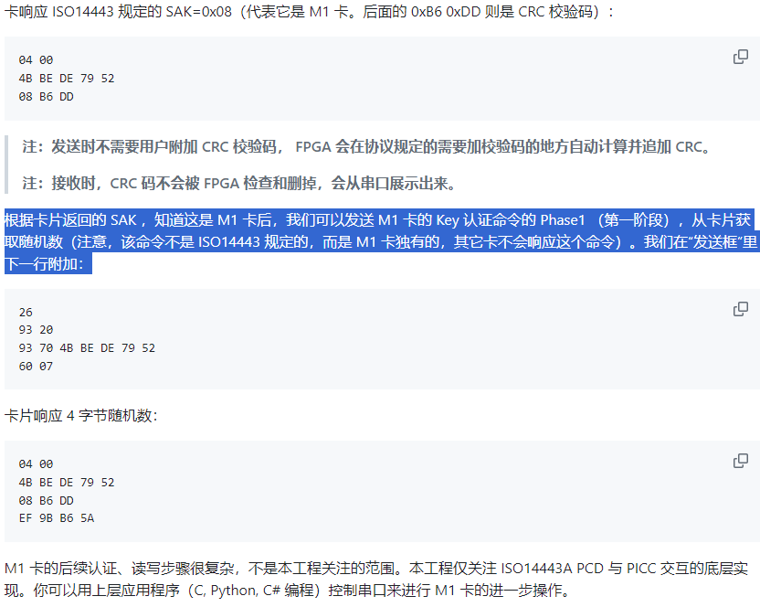
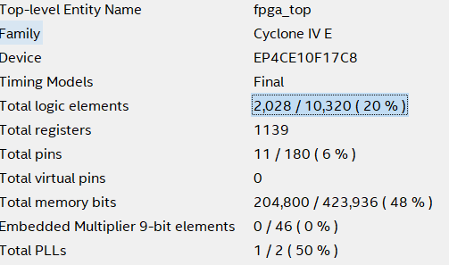
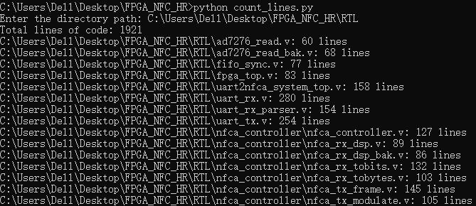

# 项目本身

1. ##### 是什么类型的项目？个人的还是实验室的，自己做了哪些部分？

   1. 自己做的项目，因为本科是学物联网的，但是课程体系与计算机大体一致，所以在物联网方向没有比较深入的做过东西，只是知道有RFID这个概念。学了FPGA之后想用它做点相关的东西，正好发现有相关开源的硬件（THM3060读卡器的不带芯片版本，作为一个Breakout Board），也有资料可以参考（ISO14443-2/3、罗德施瓦茨技术白皮书、介绍NFC技术的PPT：st的tn1216、TI的培训用ppt）于是就做了这个。

2. ##### 模块是如何进行验证的？

   1. 因为项目是跑在FPGA上的，所以主要还是用TestBench进行了行为级仿真以及上板测试。首先是对实现的各个模块进行单独的仿真验证，这个是在编写的过程中逐步完成的。在某一层级的模块整体编写完成后，在将这个层次作为DUT进行统一测试，其中主要测试的是PCD-to-PICC的功能（通过编写一个帧发送函数，将指令字节发送给DUT，然后查看输出的carrier_out等波形是否满足时序），由于没有实现PICC卡的发送模块，所以没有PICC-to-PCD的部分，觉得有点复杂就没做（因为PICC-to-PCD采用的是2%~10%的ASK幅移键控），这部分直接上板测试了。

3. ##### Breakout Board上的元器件参数值是怎么确定的？例如低通滤波器的原件参数等。

   1. 这块是Breakout Board开源硬件是自带的，在THM3060读卡器的模块原理图上也有标注。所以是直接拿来用的。

4. ##### 介绍一下项目的思路？

   1. 首先是载波生成，我们用 FPGA 的引脚产生 13.56MHz 的信号（对应代码文件 nfca_tx_modulate.v），该信号驱动一个 MOS 管 (FDV301N) + 一个谐振电路来让天线(线圈)谐振。

   2. 其次是载波调制发送，ISO14443A 的 PCD-to-PICC 的副载波调制方式是 100% ASK （即在一个副载波周期内，要么满幅度发送载波，要么完全不发送载波），这对 FPGA 也是很容易实现的（对应代码文件 nfca_tx_modulate.v）。

   3. 然后是接收卡片的调制信息，PICC-to-PCD 的调制方式是 2%~10% 的 ASK （即在一个副载波周期内，要么让载波衰减一点，要么不衰减）。我用二极管(1N4148)+电容+电阻来做包络检波，得到包络线的频率=副载波频率=847.5kHz，然后用 ADC 对包络线采样（对应代码文件 ad7276_read.v）。包络检波降低了 ADC 采样率的需求，避免直接使用 ≥20Msps 的 ADC 来采样载波，而是只用一个 3Msps 的 ADC (AD7276B) 来采样副载波即可。在 FPGA 内，用一个数字信号处理(DSP)算法来从 ADC 采样数据中检测 PICC-to-PCD 的 ASK 信号，即检测 ADC 采样数据幅度的微小变化，需要有抗噪声能力，并自适应信号幅度。我用的是中值滤波减去原始信号，再做比例阈值判断，效果不错（对应代码文件 nfca_rx_dsp.v）。

   4. 最后是实现 ISO14443A 的编解码协议，包括发送校验生成和封包（对应代码文件 nfca_tx_frame.v）、接收协议的解包（对应代码文件 nfca_rx_tobits.v 和 nfca_rx_tobytes.v），这部分是按照 Spec 文档 [3] 编写的。

   5. 我还在 FPGA 中实现了串口控制逻辑，将 Host-PC 发送给 FPGA 的串口命令解析成 NFC 发送数据（对应代码文件 uart_rx.v 和 uart_rx_parser.v），并将 NFC 接收数据通过串口发送给 Host-PC （对应代码文件 uart_tx.v）。用户可以在 Host-PC 的”串口调试工具“中发送数据给卡片，然后收到卡片返回的数据。

5. ##### 系统数据流以及系统框图？

   1. 介绍数据的转换和流动形式、各个模块间的握手模式
   2. 画出系统架构图、模块图

6. ##### 包络检波和天线的原理？

   1. 包络检波原理
   2. 天线的原理我不是很清楚。只知道在载波信号的作用下，谐振电路让天线谐振。PCD的线圈产生的能量场通过PICC线圈给PICC的电容充电，然后PICC可以激活其中的电路并对PCD做出反馈（比如发送调制后的载波）。

7. ##### PICC和PCD是什么？

   1. PCD的英文全称为Proximity Coupling Device，直观来说就是读卡器、读写器，它给卡片提供能量，并作为通讯主机的设备，其实就是读卡器，也是本项目主要实现的东西；PICC的全称为Proximity Card，直观来说就是标签、卡片，有各类卡片符合这个定义：M1卡、UID卡以及其他电子标签等。项目中是用NXP的MIFARE Classic 1K简称M1的卡，其实只要是满足ISO14443A的卡（比如门禁卡之类的）都可以用。

8. ##### ISO14443协议框架和具体内容？

   1. 介绍ISO14443的四个组成部分
   2. 主要介绍ISO14443-2/3的整体内容，哪个部分规定了什么

9. ##### 调制方式ASK、FSK、PSK、OOK？

   1. ASK、FSK与PSK分别是辐移键控、频移键控与相移键控

   2. OOK的调制原理就是用来控制把一个幅度取为0，另一个幅度为非0，就是OOK。又名二进制振幅键控（2ASK）。

      （然后 NFC-A 侦听器会使用开关键控 （OOK）技术对子载波进行键控，将无子载波的周期变为有子载波 （子载波频率处的附加负载）的周期。 OOK 的特殊定时可确保比特流中的逻辑 0 和 1 编码；这里采用了曼彻斯特编码。）

10. ##### 低通滤波器原理？

    1. 看下网上是怎么说的……

11. ##### NFCA（ISO14443A简称NFCA）和其他NFC（B/V）有什么区别？为什么做NFCA？

    1. 从ISO14443-2和ISO14443-3两个文件中的内容说
    2. 做NFCA是因为相较于其他两个实现上比较简单，100%ASK调制波形对于FPGA来说好实现，且卡片比较好买，再加上有现成的板子（THM3060和开源的BreakBoard）可以参考所以就做NFCA了。

12. ##### 为什么是13.56mHz?

    1. 13.56Mhz无论在国际还是国内都是ISM（工业、科学、医疗）频段，免费使用无需授权，所以这大概是使用13.56mHz的原因。（ISO14443-2中的说法是The frequency *fc* of the RF operating field shall be 13,56 MHz ±7 kHz）

    2. **CHATGPT解释**：

       - **全球兼容性**：13.56 MHz频段在全球范围内广泛用于各种RFID和NFC应用，减少了跨地区使用时的兼容性问题。

       - **合适的传输距离**：这个频率提供了适中的传输距离，一般在几厘米到十几厘米，适合短距离通信，保证了数据传输的安全性。

       - **良好的穿透性**：13.56 MHz频段具有较好的穿透性，可以通过一定厚度的非金属物体进行通信。

       - **低功耗**：NFC设备通常是低功耗设备，而13.56 MHz的工作频率能有效降低设备的功耗。

13. ##### 调制深度和调制指数的概念？

    1. 看PPT：tn1216的13页

14. ##### 位表示和编码？

    1. 参考ISO14443-2

15. ##### NFC通信流程、bit碰撞的含义与原理、各种命令格式？

    1. 参考ISO14443-3

16. ##### 除了用到的M1命令，M1卡的其他指令有哪些？

    

17. ##### 项目逻辑资源的使用量、代码量？

    1. 逻辑用量

       

    2. 代码量

    

王轩老师的回复也要再看一遍！