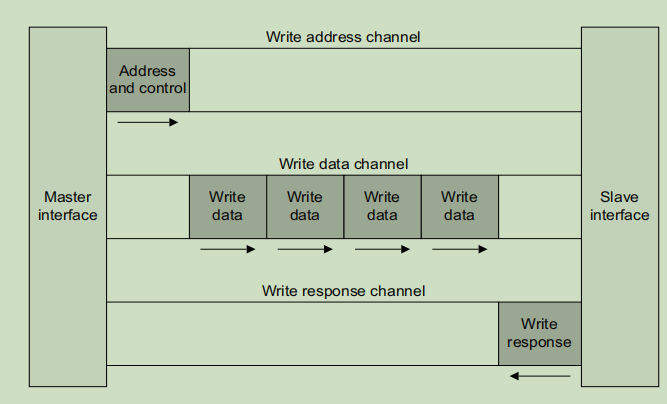
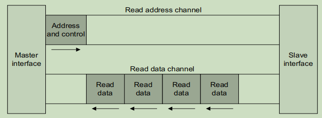

1. 为什么要学习AXI总线？

   1. ZYNQ：异构芯片，内部使用AXI总线；
   2. 纯FPGA的IP接口也要用AXI总线；
   3. 高带宽、高频率、低潜伏期（DDR-MIG）；
   4. 如果想做高速接口，想设计PCIE、204B、DDR、SoC芯片（内部使用AXI总线）

2. 什么是AXI总线？

   1. AXI-Full
   2. AXI-Lite
   3. AXI-Stream

   AXI是ARM研发的，属于AMBA总线其中的一个，包括APB、AHB、AXI（up主这么讲的，实际上还有很多），AXI总线是一种突发总线，突发传输，比如说突发8次传输，就是指传输数据是连续的传输。





AXI的5个通道：

```markdown
写地址通道 
写数据通道
写响应通道
读地址通道
读数据通道
```

波形解读：

	1. VALID和READY同时为高代表当前数据有效
	1. 先写地址，紧接着写数据，最后一个数据时WLAST信号拉高
	1. 先读地址，紧接着读数据，最后一个数据时RLAST信号拉高
	1. 写完数据，有一个响应信号

---

1. 使用FPGA实现AXI主接口

​	突发传输：1 2 4 8 16 32 64 128 256

​	**AXI写实现步骤：**

	1. 写首地址
	1. 紧接着写首地址突发传输数据
	1. 控制LAST信号
	1. LAST脉冲后等待响应信号（从机给主机）

​	**AXI读实现步骤：**

1. 写首地址
2. 紧接着等待从机传输过来的数据，当有效信号和准备信号都为高时，读取数据
3. 接收LAST信号 

---

  实现功能：

1. 向从机的0地址写1~16
2. 读从机的0地址


---

**浅谈AXI传输机制和死锁**

1. outstanding address 和 out-of-order**(IHI0022H，在第五章进行回答的)**
   1. outstanding address：
   2.  out-of-order transaction :
