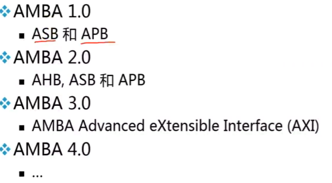
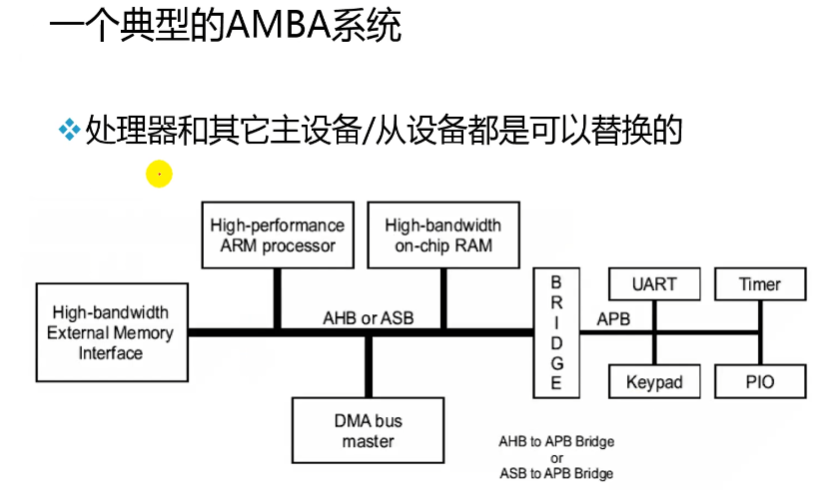
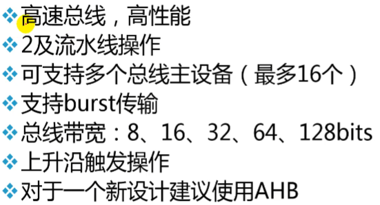
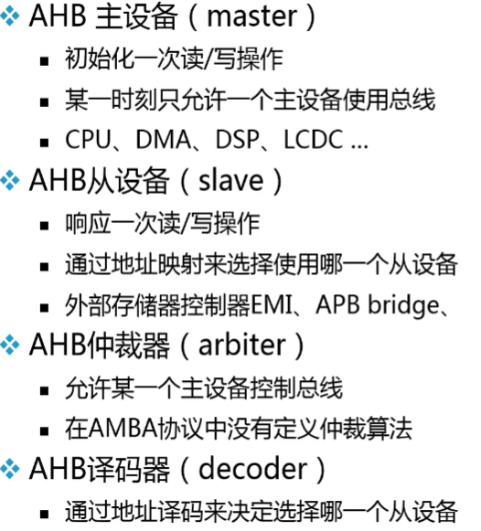
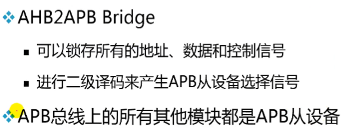
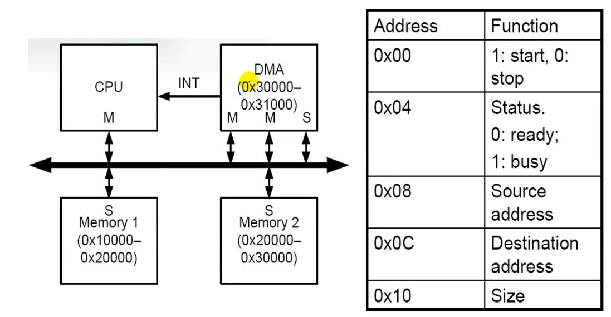
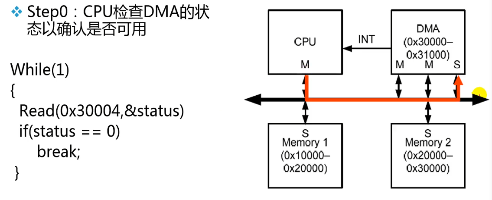
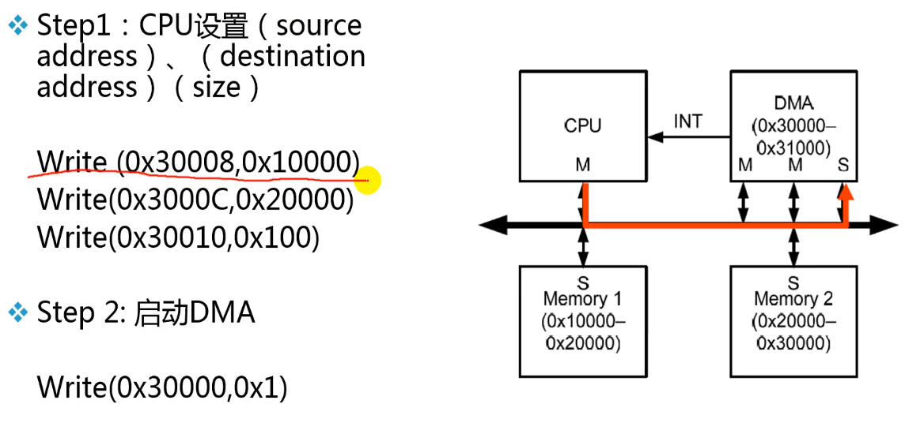
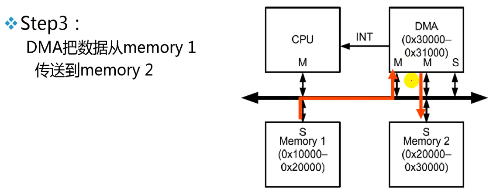
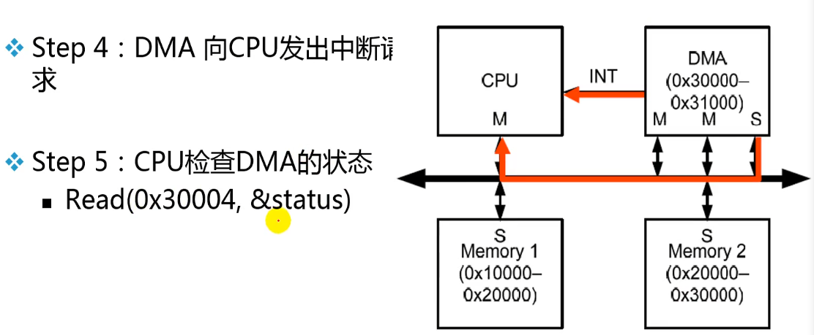

[AMBA总线介绍1-讷言Wisdom-稍后再看-哔哩哔哩视频 (bilibili.com)](https://www.bilibili.com/list/watchlater?oid=984808855&bvid=BV1Jt4y1n7B5&spm_id_from=333.1007.top_right_bar_window_view_later.content.click)

# AMBA总线介绍1

- AMBA总线概述
- AHB
- APB
- 不同IP之间的互联

 （这个介绍没有ASB和AXI）

## 系统总线简介

1. 系统芯片中各个模块之间需要接口来连接
2. 总线作为子系统之间共享的通信链路
3. 优点
   - 低成本
   - 方便易用
4. 缺点
   - 会造成性能瓶颈

## AMBA2.0

Advanced Mircocontroller Bus Architechture 片上总线标准

定义了三种总线：AHB（Advanced High-performance Bus）、ASB（Advanced System Bus）、APB（Advanced Peripheral Bus）。

## AHB

- burst传输就是一次性传输一串数据。
- 通过hsize信号来选择bus到底多宽。

### AHB的组成部分

- master会发request给arbiter，如果arbiter同意就会发grant给master，master收到grant后才可以使用总线，没收到就继续等待。
- AMBA协议没有定义仲裁算法（注：截止到AMBA2.0，后续有没有待考证），如何仲裁需要自己设计：排队、优先级等……。
- 每个Slave都对应一个地址的Map，decoder负责通过地址Addr解析是哪个从设备，将对应的Hsel拉起。slave会看自己的Hsel有没有被拉高，如果拉高才会判断其他的条件。即：

$$
Slave = Hsel\quad\&\&\quad Hreadry\_in\quad\&\&……
$$

## APB

- 大部分功耗来自于CLK翻转
- APB Bridge有现成的

### APB的组成部分

- AHB找到AHB2APB Bridge之后进来要进行二级译码（先找小区再找楼等，东西会在收发室先存以下）。

## AMBA协议其他有关问题

- 与工艺无关：AMBA是一个纯协议，与使用的工艺没有关系
- 没有定义电气特性
- 仅在时钟周期级定义时序：hclk、pclk等，再细小的就没有了
  - 提取时序参数依赖于所采用的工艺和时钟频率

### 例：DMA

（注：这图好不严谨啊……应该只是举例用吧）

？作业题：手绘DMA在SoC系统中，是如何通过AHB总线跟CPU协同工作，实现memory到memory的数据传输的。