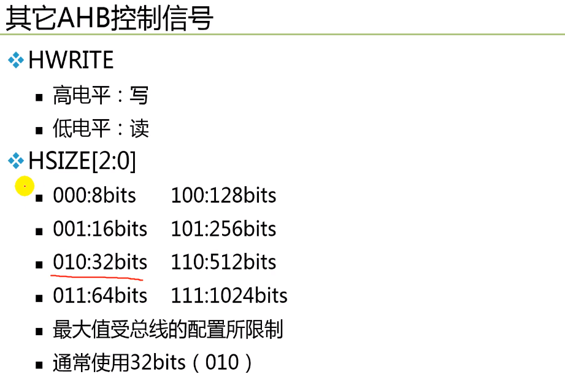
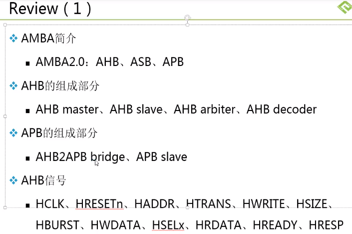
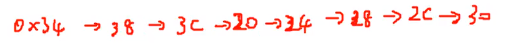
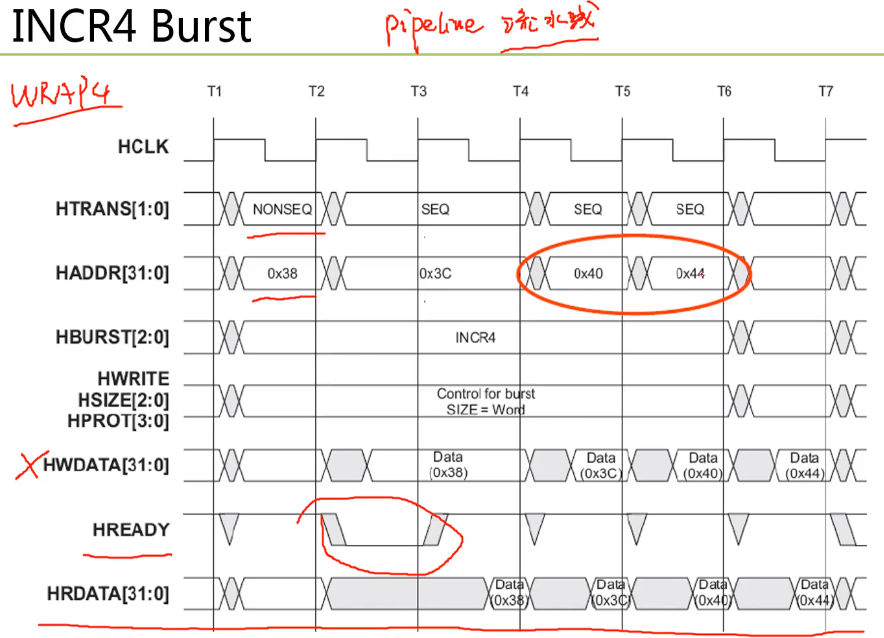
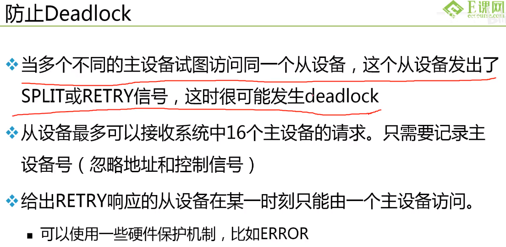

[AMBA总线介绍1哔哩哔哩视频 (bilibili.com)](https://www.bilibili.com/video/BV1Jt4y1n7B5/?spm_id_from=333.337.search-card.all.click&vd_source=a257f8dabd79e42df87ac513807afcef))

[AMBA总线介绍2](https://www.bilibili.com/video/BV1PN4y1c7W4/?spm_id_from=333.337.search-card.all.click&vd_source=a257f8dabd79e42df87ac513807afcef)

[AMBA总线介绍3](https://www.bilibili.com/video/BV1oG41147eP/?spm_id_from=333.999.0.0&vd_source=a257f8dabd79e42df87ac513807afcef)

[AMBA总线介绍4](https://www.bilibili.com/video/BV13G41147xQ/?spm_id_from=333.999.0.0&vd_source=a257f8dabd79e42df87ac513807afcef)

[AMBA总线介绍5](https://www.bilibili.com/video/BV1dY4y1m7zQ/?spm_id_from=333.337.search-card.all.click&vd_source=a257f8dabd79e42df87ac513807afcef)

[AMBA总线介绍6](https://www.bilibili.com/video/BV1Zg411r77n/?spm_id_from=333.788.recommend_more_video.4&vd_source=a257f8dabd79e42df87ac513807afcef)

[toc]

# 第一节

- AMBA总线概述
- AHB
- APB
- 不同IP之间的互联

 （这个介绍没有ASB和AXI）

## 1. 系统总线简介

1. 系统芯片中各个模块之间需要接口来连接
2. 总线作为子系统之间共享的通信链路
3. 优点
   - 低成本
   - 方便易用
4. 缺点
   - 会造成性能瓶颈


## 2. AMBA2.0

Advanced Mircocontroller Bus Architechture 片上总线标准

定义了三种总线：AHB（Advanced High-performance Bus）、ASB（Advanced System Bus）、APB（Advanced Peripheral Bus）。


## 3. AHB


- burst传输就是一次性传输一串数据。
- 通过hsize信号来选择bus到底多宽。

### 3.1 AHB的组成部分


- master会发request给arbiter，如果arbiter同意就会发grant给master，master收到grant后才可以使用总线，没收到就继续等待。
- AMBA协议没有定义仲裁算法（注：截止到AMBA2.0，后续有没有待考证），如何仲裁需要自己设计：排队、优先级等……。
- 每个Slave都对应一个地址的Map，decoder负责通过地址Addr解析是哪个从设备，将对应的Hsel拉起。slave会看自己的Hsel有没有被拉高，如果拉高才会判断其他的条件。即：

$$
Slave = Hsel\quad\&\&\quad Hreadry\_in\quad\&\&……
$$


## 4. APB


- 大部分功耗来自于CLK翻转
- APB Bridge有现成的


### 4.1 APB的组成部分


- AHB找到AHB2APB Bridge之后进来要进行二级译码（先找小区再找楼，东西会在收发室先存以下）。


## 5. AMBA协议其他有关问题

- 与工艺无关：AMBA是一个纯协议，与使用的工艺没有关系
- 没有定义电气特性
- 仅在时钟周期级定义时序：hclk、pclk等，再细小的就没有了
  - 提取时序参数依赖于所采用的工艺和时钟频率


**DMA：**


（注：这图好不严谨啊……应该只是举例用吧）


作业题：手绘DMA在SoC系统中，是如何通过AHB总线跟CPU协同工作，实现memory到memory的数据传输的。


# 第二节

- AHB总线互联（上节内容）
- AHB信号

## 1. AHB信号


Source指的是这个信号是哪个AHB设备输出的。

H打头意味着是AHB的信号，后缀n表示低电平有效。

HTRANS[1:0]指出当前传输的状态，有四种类型：**IDLE、BUSY、NONSEQ、SEQ**。前两种时，总线上的ADDR与DATA都无效，NONSEQ表示开始了一次新的写或读，与之前的地址无关，SEQ则表示有关（如Burst一次读8个字，第二个字地址就是SEQ的，与第一个地址连续）

HWRITE，1为写，0为读。

HSIZE指的是Bus的宽度{8bit, 16bit, **32bit**, ……} = {0， 1， **2**，……}。

HBURST[2:0]，有八种类型：

```verilog
case(HBURST[2:0])
    3'd0 : SINGLE // Single Transfer
    3'd1 : INCR // Incrementing transfer with unspecified length
    3'd2 : WRAP4
    3'd3 : INCR4
    3'd4 : WRAP8
    3'd5 : INCR8
        ...
endcase
```


HWDATA/HRDATA，写数据总线，从主设备写到从设备；读数据总线，从从设备读到主设备。

HSELx，x表示不确定数量，依照从设备数量确定具体值

HREADY为握手信号，高：从设备传输结束、低：从设备需延长传输周期

HRESP[1:0]，表示从设备发给主设备的总线传输状态，有四种：OKAY、ERROR、RETRY、SPLIT，收到正确则返回OK；收到不正确则返回ERROR；暂时不能接收返回后两个，RETRY不影响当前Master优先级而SPLIT会影响，即如果用SPLIT拒绝了当前的Master，那么Arbiter会将当前Master的优先级降低。


## 2. 基本AHB传输

两个阶段

- 地址周期，也看HREADY
- 数据周期，由HREADY信号决定需要几个Cycle

流水线传送

- 先是地址周期，然后是数据周期


## 3. 传输类型


- IDLE的两边不是同一个Burst
- BUSY在一个Burst之内进行传输





HPORT用的比较少，这里没有讲。

---

## 4. AHB控制信号小结


其中HBURST中的WRAP表示**回环**。


# 第三节-第五节

## 1. 回顾



AHB2APB bridge一端作为AHB的Slave，一端作为APB的Master。


Burst传输不可跨越1k边界后边讲？

AHB slave短时间无法响应就把HREADY拉低，长时间无法响应就发RETRY或者SPLIT。


## 2. BURST传输


回环Burst，如果起始地址恰好是`beat x byte`的倍数，则与INCR没有区别，其他情况下，如果下一个地址是`beat x byte`的倍数（如32位下，4beat x 4byte = 16byte -> 0x10）的情况下，则要回弹到`下一个地址-倍数值`的地址处（本例为0x40-0x10 = 0x30），此处是回到0x30（满足4个beat），如果是8个beat，那么例子如下：



**回环（Wrap）的意思也就是几个beat一回环，表现在地址上就是如上图所示。**





为什么不能跨越1K边界？参见这篇知乎https://zhuanlan.zhihu.com/p/489611892


## 3. 地址译码


由地址译码器来提供选择信号：HADDR进入Decoder后Decoder输出HSELx

一个从设备应该至少占用1KB的存储空间：`END - START + 1 >= 0x400`

需要额外缺省从设备：相当于case的default或者if的else


## 4. 从设备响应


响应，也就是HRDATA、HREADY、HRESP这三条信号线给出的响应，不如HREADY位高，HRESP位OKAY视为完成了响应。


SPLIT会降低当前请求Master的优先级，即由Aibiter接收到SPLIT之后，降低请求的Master的优先级。


## 5. 数据总线


在总线概念中，"**PAD**" 通常指的是 "Peripheral Access Device"，即外围访问设备。这个术语通常用于描述与计算机系统或其他电子系统连接的外围设备或接口。外围访问设备可以是各种各样的硬件设备，包括传感器、执行器、存储设备、通信设备等等。它们通过总线与主处理器或其他核心组件进行通信，以便实现数据传输、控制命令传递等功能。

**印第安序**，其实就是端序，分为大端序（Big-Endian）和小端序（Little-Endian）。

小端序：


大端序：


## 6. AHB仲裁信号


1. **x代表每一个Master都会发出这个信号**
2. HBUSREQx总线请求

2. HLOCKx
   - 高电平，主设备请求锁定总线
   - 直到完成这次传输再放开

3. HGRANTx

   - 指出主设备x可访问总线

   - **主设备x控制总线：HGRANTx = 1且HREADY = 1**时

4. HMASTER[3:0]
   - 指出哪个主设备正在进行传输（**由信号位宽可知AHB总线最多支持16个主设备**）
5. HMASTLOCK
   - 指出主设备正在进行一次锁定传输
6. HSPLITx[15:0]
   - x代表的是哪一个slave，[15:0]的16-bit代表Master
   - 从设备用这个信号告诉仲裁器哪个主设备允许重新尝试一次split传输
   - 每一位对应一个主设备


## 7. 仲裁设备


slave设备的HREADY_IN为总线上其他从设备的HREADY_OUT相与得到的信号，只有当HREADY_IN为1的时候，这个slave设备才会工作。


作为m1来说，失去Grant之后还可以再发一个地址+数据。因为m2拿到Grant本来也要晚一拍。


几点说明：

1. 对于固定长度的burst传输，不必持续请求总线
2. 对于未定义长度的burst传输，主设备应该持续送出HBUSREQ信号，直到开始最后一次传输 
3. 如果没有主设备请求总线，则给缺省主设备grant信号，且HTRANS=IDLE
4. 建议主设备在锁定总线传输结束后插入IDLE传输，以重新仲裁优先级


## 8. Split传输过程

 




## 9. AHB主/从设备接口


## 10. AHB-Lite


## 总结


总线控制权移交之后还可以再传一个地址+数据。


Master不能传输还可以插入IDLE，之后的HTRANS是新的NONSEQ，新Burst。


Arbiter的优先级在AMBA里没有定义，用户实现。


DMA就是上面这种形式。


# 第六节：APB

## 1. APB信号


1. PADDR[31:0]
   - 地址总线，由设备总线的bridge单元驱动
2. PSELx
   - 由译码器来的信号，到**每一个总线从设备x**
3. PENABLE
   - 用于在设备总线上把所有访问按时间阶段进行
4. PWRITE
   - 高电平：写
   - 低电平：读
5. PRDATA和PWDATA
   - 最多32位宽


PRDATA这个mux可以通过PSEL来控制。


APB最快每两个Cycle才能读/写一个数据。


# 不同IP之间的互联

## 1. 通信方式

CPU(Master) <--> IP(Slave)

IP(Master)<-->IP(Slave)


## 2. Memory mapped IO

1. 每一个从设备都占用系统中的一段地址空间
2. 所有的从设备都是可寻址的
3. 寄存器/存储器都是内存映射方式访问
4. CPU/IP读写其他IP的数据类似于读写存储器


一个IP可以同时拥有主设备接口和从设备接口。


---


