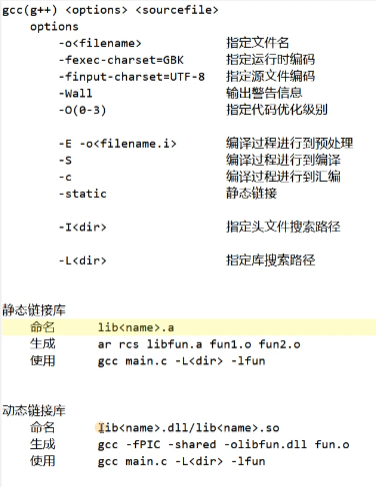
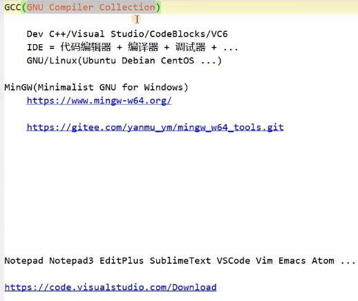
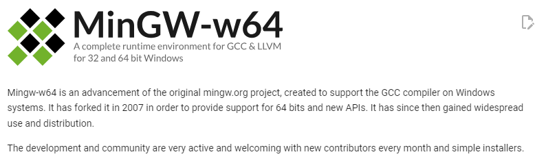
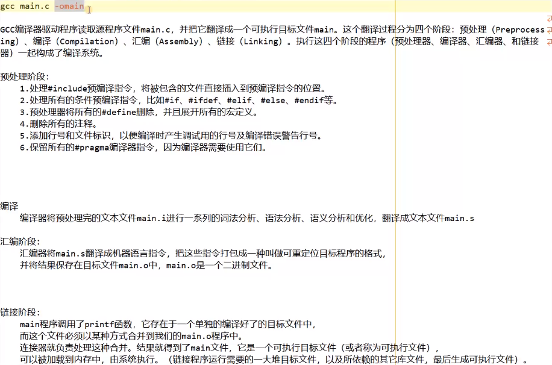
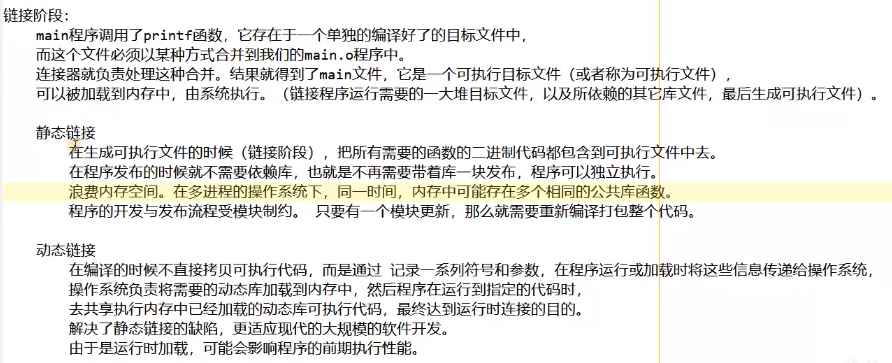
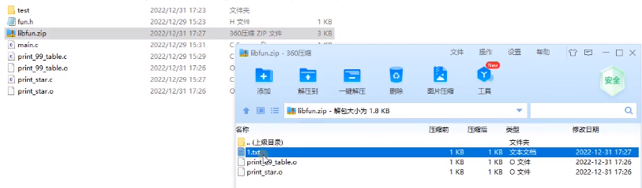

- 动态链接库在Win下以.dll结尾，在Linux下以.so结尾，区别于静态链接库，动态链接库的代码并没有合并到可执行文件中。

---

**以下是二刷时的笔记 2024/1/9 13:52**

1. 在Windows上搭建gcc的编译环境就需要用到Windows平台上的GNU极简工具集“MinGW”，就是Windows版本的GCC。

2. 下载栏目中的Host有Windows的就是可以在Windows上运行的。Cygwin的配置相对复杂，而w64devkit和MingW-W64-builds是解压即用的，注意w64devkit没有iconv（iconv命令是用来转换文件的编码方式的）,所以这里采用的是后者。

3. gcc编译一个c语言源文件只需`gcc <filename>`，这样就会生成一个可执行文件，默认文件名为a，后缀名为.exe，在命令窗口中输入文件名即可运行。如果想要自己指定文件名，则后面跟上`-o`选项，-o后面跟上想生成的文件名，-o与文件名之间**可以有空格也可以没有**。-o可以写在源文件后面也可以写在源文件前面。

4. `chcp 65001`可将命令行窗口的编码格式改为UTF-8。但是这种方法是一次性的，下次打开窗口仍需再次改变。

5. -O可以用来开启优化，有3个等级`-O1/-O2/-O3`，使用范例`g++ hello.cpp -O3`。

6. 下面是编译的完整过程：

   

​	首先是预处理阶段`gcc main.c -E -omain.i`，会把include的内容复制过来（包括各种库文件和头文件）并把宏定义展开。把注释删除等等。

​	接下来是编译阶段`gcc main.i -S`，生成main.s文件，里边是一些汇编指令。

​	接下来是汇编阶段`gcc main.s -c`，生成main.o，是一个二进制文件，但还是不能直接运行。在预处理阶段得到的printf函数只是声明了一下并没有具体的实现内容。要让代码能正常运行，就要把实现的具体代码复制到main.o中，这个过程就叫做链接。

​	链接的命令是` gcc main.o`，链接分为静态链接与动态链接：

​	

​	

7. 通过`gcc main.o -static`或者`g++ hello.cpp -static`等实例中手动指定静态链接，链接后生成的可执行文件可能会变大。`

8. `-I`指定头文件的搜索路径，可以使用相对路径与绝对路径。

9. `libxxxxx.a`文件是静态链接库的文件名格式，真正决定文件名的是`xxxxx`这部分。首先将源文件编译汇编为.o文件，接下来将.o文件通过`ar rcs libxxx.a aaa.o bbb.o`将.o文件打包为.a文件，**实际上.a也是一种压缩包的格式，只是把两个.o文件打包。**将.a文件后缀名改为.zip并用压缩工具打开。

   

   10. 静态库文件配合头文件即可使用。有两种方法：`gcc main.c -L. -l<xxx>`这种方法中-L指定静态链接库所在位置，由于就在当前文件夹下，所以用`.`，使用`-l`后面直接写静态库中间的名称部分xxx就行了，另一种方式是不使用-l，直接写全名。
   11. 使用静态链接库是将库文件代码直接合并到可执行文件当中，编译链接完成之后库文件是可以删除的。
   12. 动态链接库在Windows下的后缀名是`.dll`而在Linux下的后缀名是`.so`。使用`gcc aaa.c bbb.c -fPIC -shared -olibxxx.dll`生成动态链接库。使用方法与静态链接库相同（包括使用-l选项与写全称两种方法）。
   13. 动态链接库的代码并没有合并到可执行文件当中，所以如果删除了动态链接库则可执行文件无法运行。
