**与MinGW攻略相同，来源于B站UP主”无限十三年“，攻略开始日期2024/1/8 9:50**由于up主提供了视频的笔记md，所以这里仅根据我自己的学习过程记录tips，不照搬视频内容。

---

# 从零开始学Makefile

## 00 随便唠两句

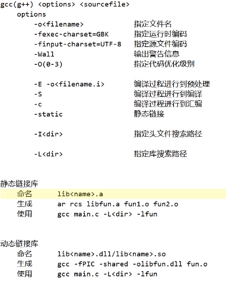

- 如果项目文件非常多时，哪个文件需要重新编译？该怎么编译？
  - make（GNU make，make也分好多版本）：项目构建工具 **管理哪个文件需要更新以及如何更新**
  - Makefile：规则文件，高速make如何进行编译与管理

## 01环境搭建

分为在`Ubuntu`上和`Windows`上搭建

- Ubuntu：

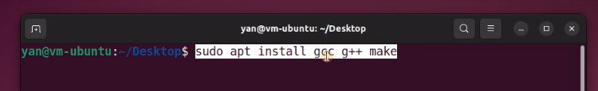

用make --version检查make是否安装成功

- Windows：

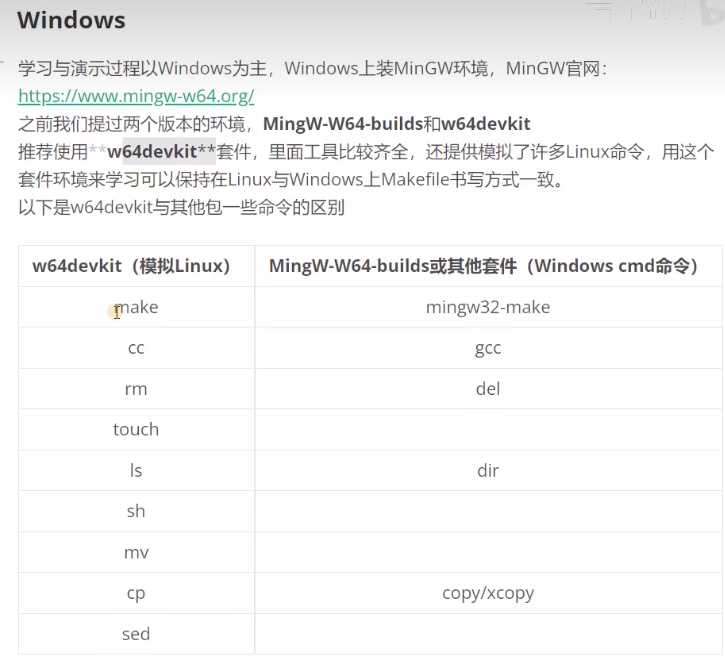

- 以及需要准备一些学习材料：

​	Make官方文档：[GNU Make Manual - GNU Project - Free Software Foundation](https://www.gnu.org/software/make/manual/)这里跟着教程选择了其中的HTML compressed -entirely on one web page.官方文档使用了一个叫edit的编辑器作为例子，up主没找到源码，所以用了下面两个小项目做例子（2048和数独）。

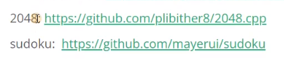

---

## 下面部分不分章节

- 在可执行文件名：源文件名下一行开头**一定是Tab而不是四个空格，注意有的编辑器会用四个空格代替Tab**（PS：我用的是EditPlus5，没有这个问题，只是把Tab占用8个空格改为占用4个），如果是空格则会报错。下面是一个简单的Makefile文件内容。

  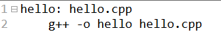

​	之后在当前路径下打开cmd运行输入`make`运行即可。

- 实际当中会把它**分成两步来写**：

​	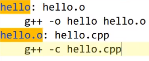

​	hello称为**目标**，在Windows上会自动把它转换为hello.exe，因为**如果不分两步，那么每次有依赖文件发生改动就会重新编译链接所有目标文件。**

- 隐式规则：

  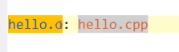

  不写出更新方法部分，让make自己去猜如何从cpp生成.o文件，如果能猜到说明这条规则属于隐式规则，如果猜不到就会报错。

- 注释不要写在方法里面

- `g++ -MM block.cpp`命令可以将block.cpp的目标文件和依赖全部列出来（会把简间接包含也列进来）

​	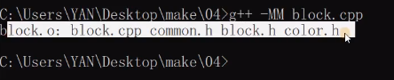

- 在Makefile文件结尾通常会执行`clean:`操作来清除中间文件，在Win当中如果环境中没有rm则改为使用del：

​	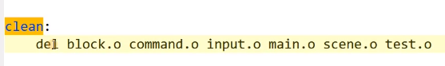

- 虽然是倒着写的，但是在执行的时候还是先编译成目标文件再链接成可执行文件：

  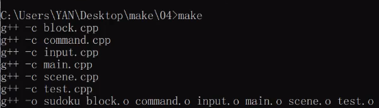

- 依赖文件中列出了.h文件，如果不想列也不会报错，但是由make会根据目标文件和依赖文件的改动重新生成目标文件，如果不列出则改变.h文件内容时不会重新生成目标文件。

- Windows给可执行文件加上了.exe后缀，make认为sudoku目标不存在，所以每次执行都会重新链接一次。

- .PHONY、.SILENT、.ONESHELL等属于**特殊目标**，只有一个目标、一个多个或没有依赖，没有对应的方法。

- $()或${}在Makefile中表示变量，而在sh中也表示变量。

- 除了@echo（取消指令打印的回显）方式外，Makefile还可以使用`@(info $(<变量名>))`这种方式来显示内容。常用于当echo显示失败时（其实时sh运行指令失败）使用。

- 一行中的变量可以加`\`写到第二行，在读取时会删除反斜杠与空白，重新拼接为一行，并非多行变量。

  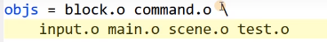

- 在cmd中输入`set`就可以看系统中有哪些环境变量，系统中的环境变量可以在makefile中直接使用，使用方法同普通变量。

- 以下这种方法可以不用自己写依赖：

​	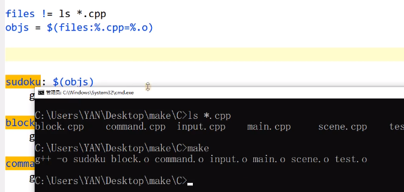

- 指定目标的变量一次只能写一条，如果一个目标想绑定多条变量，就需要写多行：

  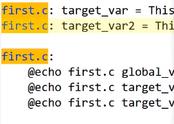

- &*表示的是可以被隐式规则理解的文件主干部分（不包括后缀名）。

- $%的用法如下（用于归档文件）：

  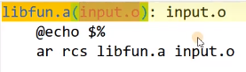

- 二次展开仅用于依赖当中。

- 缩减Makefile内容的写法（不利于将每个目标与依赖分别对应）：

  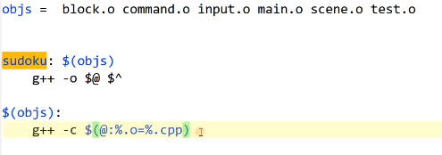

​	这时候依赖只能全放或者全都不放。

- patsubst模式替换的项必须使用空格隔开的，否则会认为是一项；而文本替换则出现在文本中的待修改项都会发生替换。

- findstring查找的字符串是区分大小写的。

- wordlist指定的范围是左右都包含的。

- basename返回的文件名除后缀的部分也包括文件路径。

- `%.o : %.cpp`表示阻止由.cpp编译到.o的隐式规则。也可以像下面这样指定方法，那就是由依赖编译到目标：

  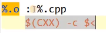

- `-include mk`引入所有以mk开头的文件。

- `-C`表示进入后面的目录中，`$(MAKE)`表示进入到目中之后执行make命令

  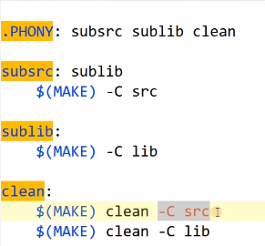

  **视频看一遍记录的笔记就这么多了，以后无论是二刷多刷还是自己实际使用遇到问题后也将笔记记录在这个文件里。**2024/1/9 13:38

  ---

  