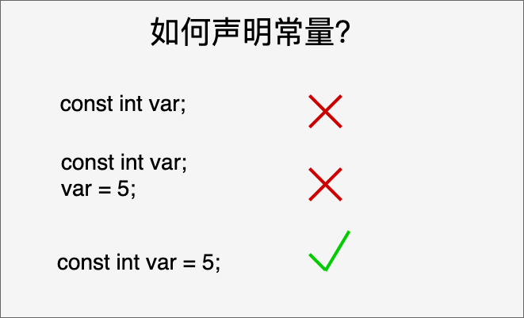
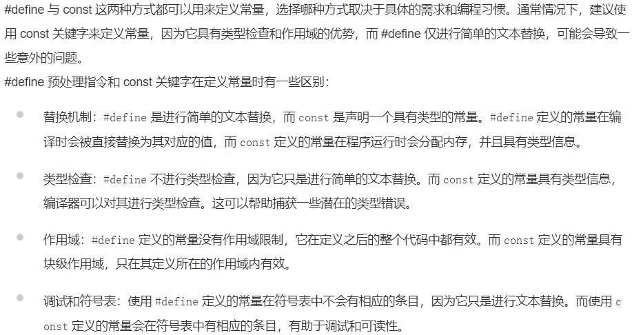
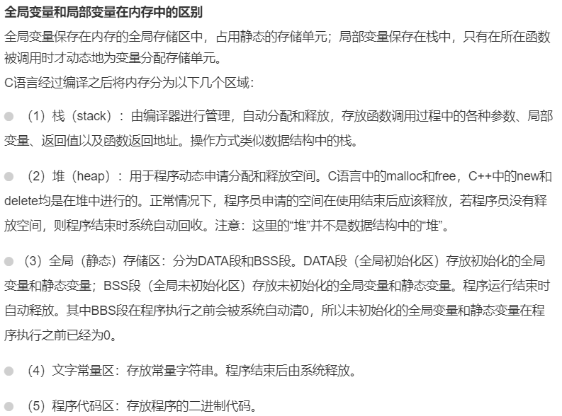

- **C中的左值和右值**:C中有两种类型的表达式

1. 左值（lvalue）：**指向内存位置的表达式**被称为左值.
左值可以出现在赋值号的左边或右边。

2. 右值（rvalue）：术语右值（rvalue）指的是**存储在内存中某些地址的数值**。
右值是不能对其进行赋值的表达式，也就是说，右值可以出现在赋值号的右边，但不能出现在赋值号的左边。

**综上，变量是左值，因此可以出现在赋值号的左边。数值型的字面值是右值，因此不能被赋值，不能出现在赋值号的左边。**

---

- 字符串常量在内存中以`null`终止符`\0`结尾。例如：`char myString[] = "Hello, world!"; `//系统对字符串常量自动加一个 '\0'。
- 使用#define预处理器或者const关键字定义常量，**把常量定义为大写字母的形式，是一个很好的编程习惯。**
- const 声明常量要在一个语句内完成：

- define与const区别：

- C语言全局变量和局部变量在内存中的区别：
