**两篇文章来源：**

[深入浅出DDR系列(一)--DDR原理篇_ddr interleave-CSDN博客](https://blog.csdn.net/u012489236/article/details/107730731)

[深入浅出DDR系列(二)--DDR工作原理_ddr内存的基本原理2-CSDN博客](https://blog.csdn.net/u012489236/article/details/107750942)

---

这份笔记是以这两篇博客为出发点，首先通过阅读分析并记录笔记搞懂DDR的定义与工作原理，接着根据文中知识点做笔记以备后用。2024/1/3

---

# (一)DDR原理篇

本章内容：

- 学习内存基本原理
- 学习内存的软硬件特性
- 从软件角度学习如何配置处理器上的DDR

## 1.DDR的前世今生

| 类型                                        | 作用                                                         | 特点                                        | 发展                 |
| ------------------------------------------- | ------------------------------------------------------------ | ------------------------------------------- | -------------------- |
| RAM（Random Access Memory）：随机存取存储器 | 是与CPU直接交换数据的内部存储器，也叫主存(内存)。它可以随时读写，而且速度很快，通常作为操作系统或其他正在运行中的程序的临时数据存储媒介。 | 电源关闭时RAM不能保留数据                   | SDRAM、DRAM、**DDR** |
| ROM（Read Only memory）：只读存储器         | ROM所存数据，一般是装入整机前事先写好的，整机工作过程中只能读出，而不像随机存储器那样能快速地、方便地加以改写 | ROM所存数据稳定，断电后所存数据也不会改变。 | flash、HDD、SSD      |

对于RAM可分为SRAM（静态随机存储器）和DRAM（动态随机存储器）。

| 类型                                                | 作用                                                         | 特点                                                         |
| --------------------------------------------------- | ------------------------------------------------------------ | ------------------------------------------------------------ |
| SRAM（Static Random Access Memory，静态随机存储器） | 它是一种具有静止存取功能的内存，**不需要刷新电路**即能保存它内部存储的数据 | 优点是速度快，不必配合内存刷新电路，可提高整体的工作效率，也就是**性能高**。**缺点是集成度低，功耗较DRAM大，相同的容量体积较大**，而且价格较高，少量用于关键性系统以提高效率 |
| DRAM（Dynamic Random Access Memory，动态随机存储器) | DRAM只能将数据保存很短的时间。为了保持数据，DRAM使用电容存储，所以**必须隔一段时间刷新（refresh）一次**，如果存储单元没有被刷新，存储的信息就会丢失 | 必须刷新，后面衍生出DDR，DDR2，DDR3，DDR4                    |

**SRAM：**

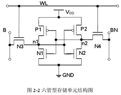

“静态”是指只要保持通电，里面存储的数据就可以恒常保持。但是断电后数据会发生丢失。SRAM最常见的结构是6管（6个场效应管）存储单元，由上图所示，有4个NMOS管和2个PMOS管。P1和N1、P2和N2分别为两对反相器，完成数据的存储，N3和N4作为读写管。

| 写操作                                                       | 读操作                                                       |
| ------------------------------------------------------------ | ------------------------------------------------------------ |
| **写“1”时**，初始状态是0，n1节点为0，n2节点为1，即N1和P2导通，P1和N2截止。将位线B为高电平1，反位线BN为低电平0，而字线WL为高电平，因此读写管N3和N4都导通。此时，位线B通过读写管N3对节点n1进行充电，反位线BN通过读写管N4对节点n2进行放电。当n1节点上升为高电平，n2节点放电为低电平时，完成写“1”操作。**写“0”时**，初始状态是1，n1节点为1，n2节点为0，即N1和P2截止，P1和N2导通。将位线B为低电平0，反位线BN为高电平1。字线WL也为高电平，读写管N3和N4都导通。此时，位线B通过读写管N3对节点n1放电，反位线BN对节点n2进行充电。当n1节点放电到低电平，n2节点充电至高电平时，完成写“0”操作。 | *读操作是指将存储在节点n1和n2中的数据“0”或“1”通过位线B和BN读出到外部端口。位线B和BN在进行读操作前都为高电平状态，当被选中的存储单元的字线WL为高时，两个读写管N3和N4都会导通，此时就相当于将存储节点n1和n2直接连在位线B和BN上。*
**读“1”时**，假设该存储节点n1原本存储的是“1”数据信号，N1管和P2管截止，而N2管和P1管导通。位线B还是原来的高电平状态，位线BN则通过N2管和N4管形成的通路进行放电，此时在B和BN上存在的压差为ΔV= VB-VBN>0，从而完成数据“1”的读操作。
**读“0”时**，若该存储节点n1原本存储的是“0”数据，N1管和P2管导通而N2管和P1管截止，位线BN还是原来的状态，位线B通过N1管和N3管形成的通路进行放电，此时在B和BN上存在压差为ΔV= VB-VBN< 0，完成数据“0”的读操作。 |

SRAM结构（如下图所示），由存储单元阵列、地址译码器（行和列）、敏感放大器和控制电路组成。

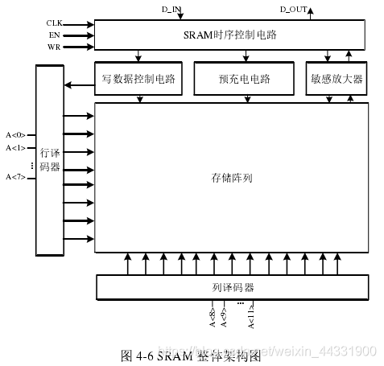

**DRAM：**

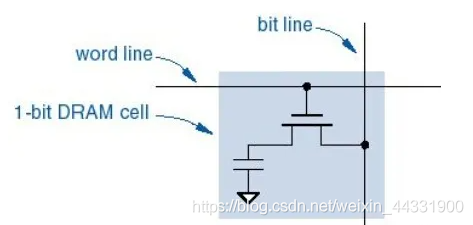

是一种半导体存储器，主要作用原理是利用电容内存储电荷的多少来代表一个二进制比特是1还是0。由于现实中电容会有漏电现象，导致电位差不足而使记忆消失，因此除非电容经常周期性充电，否则无法确保记忆长存。由于这种需要定时刷新的特性，因此被称为“动态”存储器。

与SRAM相比，**DRAM的优势在于结构简单**——每一个比特的数据都只需一个电容跟一个晶体管来处理。DRAM通常以一个电容和一个晶体管为一个单元排成二维矩阵，如下图所示。**相比之下，在SRAM上一个比特通常需要六个晶体管**。正因此缘故，DRAM拥有非常高的密度，单位体积的容量较高，因此成本较低。

在整个读或者写操作的周期中，计算机都会进行DRAM的刷新，通常的刷新周期是4ms-64ms，常用的刷新方法有：集中刷新、分散刷新、异步刷新。

DRAM结构图（如下图所示），相对于SRAM多了两个部分：由RAS（Row Address Strobe：行地址脉冲选通器）引脚控制的行地址门闩线路Row Address latch；由CAS（Column Address Strobe：列地址脉冲选通器）引脚控制的列地址门闩线路Column Address latch。

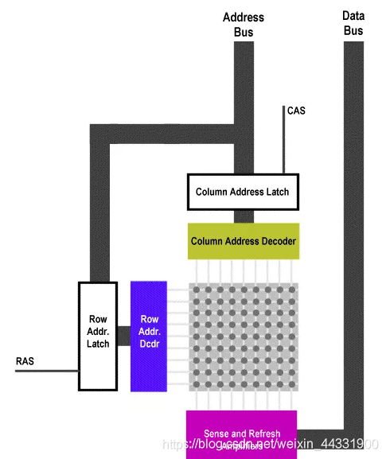

**总结SRAM和DRAM的区别：**

| 结构上                                                       | 功耗上                                               | 工作特点                                                     | 用途上                                                       |
| ------------------------------------------------------------ | ---------------------------------------------------- | ------------------------------------------------------------ | ------------------------------------------------------------ |
| SRAM存储一位需要花费6个晶体管，而DRAM只需要花费1个电容和1个晶体管 | SRAM集成度较低，功耗较大；DRAM集成度较高，功耗也较低 | SRAM中的存储单元相当于一个锁存器，只有0、1两个稳态；SRAM的特点是工作速度快，只要电源不撤除、写入SRAM的信息就不会消失，不需要刷新电路，同时在读出时不破坏原来存放的信息，一经写入可多次读出。DRAM则是利用电容存储电荷来保存0、1两种状态，读写会对原来的数据造成破坏，因此需要定时对其进行刷新，否则随着时间推移，电容中存储的电荷将会逐渐消失 | SRAM一般用作计算机中容量较小的高速缓冲存储器。DRAM一般用作计算机中的主存储器。采用DRAM必须配置动态刷新电路，防止信息丢失。 |

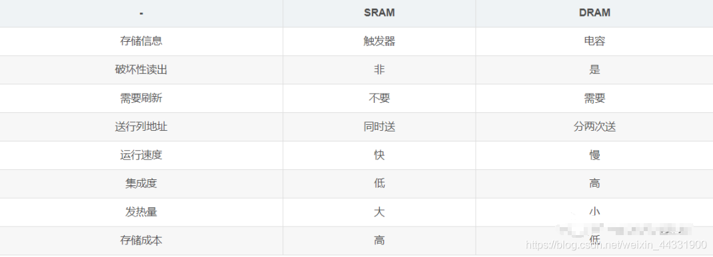

---

1. EDO DRAM（扩展数据输出内存）

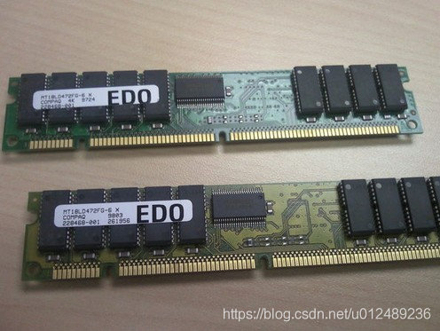

单条EDO内存容量从4MB到16MB不等，数据总线依然是32位，所以搭配拥有64位数据总线的奔腾CPU时基本成对使用。

2. SDR SDRAM（同步型动态存储器）

   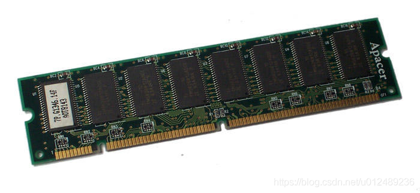

插座从原来的SIMM升级为DIMM（Dual In－line Memory Module），两边的金手指传输不同的数据，SDR SDRAM内存插座的接口是168Pin，单边针脚数是84，进入到了经典的**SDR SDRAM（Single Data Rate SDRAM）**时代。**SDRAM其实就是同步DRAM的意思**，“同步”是指内存工作需要同步时钟，内部命令的发送与数据的传输都以它为基准。内存频率与CPU外频同步，这大幅提升了数据传输效率，再加上64bit的数据位宽与当时CPU的总线一致，只需要一根内存就能让电脑正常工作了，这降低了采购内存的成本。

- DDR是Double Data Rate，双数据率的意思，DDR SDRAM就是双数据率同步动态随机存取存储器。SDRAM从发展到现在已经经历了四代，分别是：第一代SDR SDRAM，第二代DDR SDRAM，第三代DDR2 SDRAM，第四代DDR3 SDRAM，现在已经发展到DDR5 SDRAM。

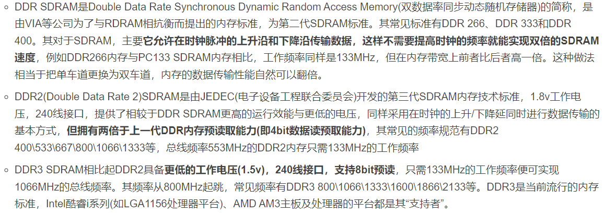

- 从DDR到DDR4主要的区别是在于传输速率的不同，随着时钟周期的不断降低，传输率也不断提高。还有电压也越来越低。有趣的是命名规则，大部分台式机DIMM厂商都会标注DDRx-yyy，x代表第几代，yyy代表数据传输率。而大部分的SO-DIMM和RDIMM等则标注PCx-zzzz，x还代表第几代，zzzz则代表最大带宽。因为DDR位宽为64位，8个字节，所以zzzz=yyy * 8,而yyy又是时钟的两倍。

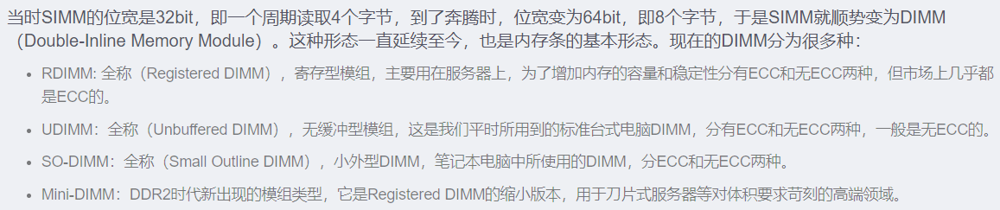

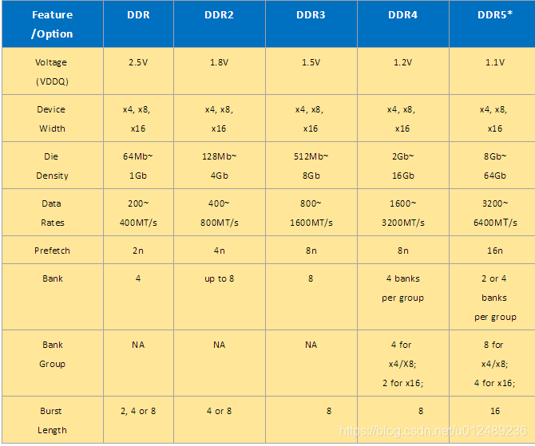

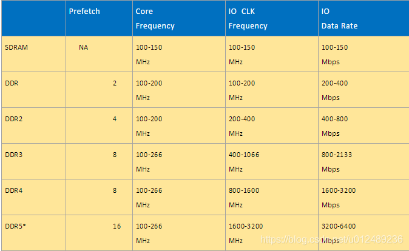

---

## 2.内存原理

其实从外观上就可以看出来小张的内存条由很多海力士的内存颗粒组成。从内存控制器到内存颗粒内部逻辑，笼统上讲从大到小为：channel＞DIMM＞rank＞chip＞bank＞row/column，如下图：

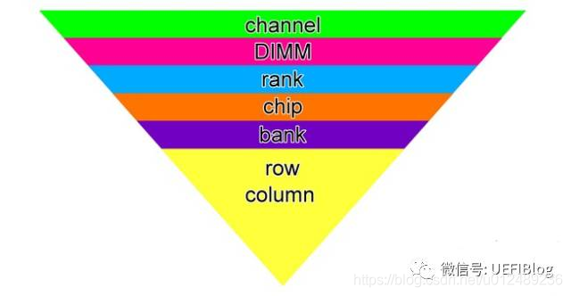

一个现实的例子是：

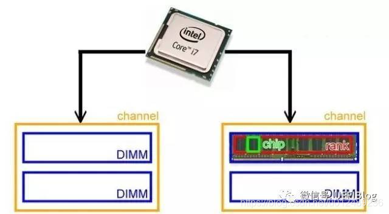

在这个例子中，一个i7 CPU支持两个Channel（双通道），每个Channel上可以插俩个DIMM,而每个DIMM由两个rank构成，8个chip组成一个rank。由于现在多数内存颗粒的位宽是8bit,而CPU带宽是64bit，所以经常是8个颗粒可以组成一个rank。所以小张的内存条2R X 8的意思是由2个rank组成，每个rank八个内存颗粒(为啥我们以后讲)。由于整个内存是4GB，我们可以算出单个内存颗粒是256MB。

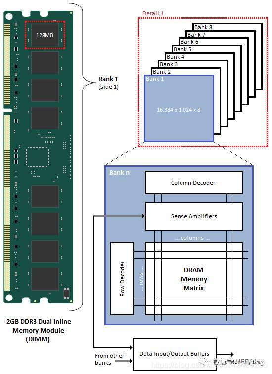

这是个DDR3一个Rank的示意图。我们把左边128MB Chip拆开来看，它是由8个Bank组成，每个Bank核心是个一个存储矩阵，就像一个大方格子阵。这个格子阵有很多列（Column）和很多行（Row），这样我们想存取某个格子，只需要告知是哪一行哪一列就行了，这也是为什么内存可以随机存取而硬盘等则是按块存取的原因。

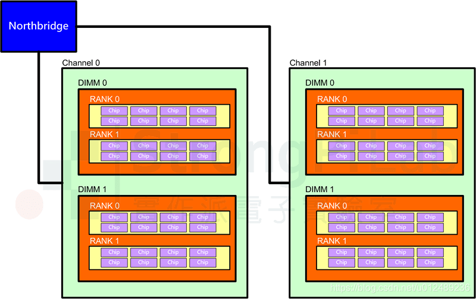

# （二）DDR工作原理

本章包括以下内容：

- DDR是如何完成Read、Write 等操作
- DDR的基本命令
- DDR的时序参数
- DDR的性能分析

![[外链图片转存失败,源站可能有防盗链机制,建议将图片保存下来直接上传(img-jaDpIvXh-1596372495928)(D:\学习总结\DDR\image-20200801221757068.png)]](深入浅出DDR系列.assets/watermark,type_ZmFuZ3poZW5naGVpdGk,shadow_10,text_aHR0cHM6Ly9ibG9nLmNzZG4ubmV0L3UwMTI0ODkyMzY=,size_16,color_FFFFFF,t_70#pic_center-1704287220793-40.png)

PS：到了4.DDR的时序参数这块就已经不想看了……说实话2.3.也没怎么看懂……

**CAS延迟**，数字越小，内存的性能越高。 但数字越小，对内存的稳定性要求越高，超频的话就越容易不稳定。 因此，在不超的状态下，CAS延迟数字越小越好；但超频之后，提高了内存工作频率后，往往需要增大CAS数值才能稳定。 相关知识如下： 内存的CAS延迟时间和存取时间之间有着密切的联系。 所谓CAS延迟时间，就是指内存纵向地址脉冲的反应时间。 CAS延迟时间是在一定频率下衡量支持不同规范内存的重要标志之一。 在Intel公司的PC100内存技术 白皮书 中指出：“符合PC100标准的 内存芯片 应该以CAS Latency（以下简称CL）= 2的情况稳定工作在100MHZ的频率下”。

就先到这里吧。2024/1/3 21:16