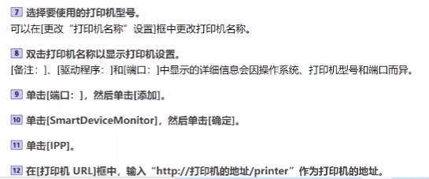

# 打印机综述

​	从打印机的相关基础讲起，慢慢深入理解打印机工作机制，与操作系统如何交互等，分多节课讲解，某方面具体知识没有深入展开，可针对某一块知识做深入学习。

## 打印机的基本概念

### 1.打印机的基本概念

相关介质：除了纸介质外，还有打印光盘封面的打印机。

### 2.打印机的分类

工作原理粗略分类为击打式和非击打式，击打式的如针式打印机，非击打式的可细分为串式点阵和行式点阵，串式的一串可能是半行行也可能是两行等。

按工作方式可分：针式打印机、喷墨式打印机、激光打印机、热敏打印机。

按用途分：家用打印机、商用打印机（如照片打印机）、专用打印机（如便携式打印机、底片打印机），便携打印机如快递员手中的“蓝牙快递面单”，照片打印机如医院的X光片和核磁共振片子。

按功能分：单用途打印机、多用途打印机（如打印、扫描、复印、传真一体机，但是并不是都包含这四个功能），如果多用途打印机做大则变成大型**复**合打**印**机（俗称复印机）。

按打印颜色分：单色（黑白）打印机、红黑双色打印机（中国特色，红头文件）、彩色打印机。

### 3.打印机的主要参数

分辨率：针式打印机分辨率低，彩打分辨率低会看到墨滴。

打印幅面：A3彩色打印机比较少，基本就是彩色复印机，家用打印机基本上是A4幅面。

打印输出时间：激光打印机有预热的过程，预热得快打印时间就比较短。

打印速度：ppm每分钟多少页；ipm每分钟多少英寸，该数值对于喷墨打印产品较为精准。ppm用于单面打印，ipm用于双面打印。

纸盒容量：有的打印机支持第二纸盒。

双面打印：手动需要用户翻面，其实就是不支持双面打印。

网络功能：早期打印机不支持，都是使用串口或并口/使用DOS系统（现在不多见），后来就使用USB（标配），USB下只支持一台计算机使用，为了使互联网中的计算机共用打印机，添加了有线网络支持，发展到无线网络支持（高低配选配）。

打印语言（打印协议）：操作系统与打印机交互的语言，不同的打印机有不同的语言，所以需要驱动程序让操作系统增加与打印机对话的能力。RAW（偏向于GDI的打印语言）。不同的打印机可能使用不同的打印语言。

### 4.打印机的型号

L:Lazer

C:Color

M:Multi

打印速度：如3325，商用中速偏低打印机，2s出一张纸

D:Double(auto)

L/N:LAN

W:WiFi

F:Fax

* 打印机系列产品：基础相同（均为激光、彩色或者喷墨），个别模块有增减，多以打印速度和结尾字母功能区分
* 数字相同或接近的大概率为同一系列产品

#### 举例

[佳能打印机官网](https://www.canon.com.cn/overview/printertoc.html)

[联想图像官网](https://www.lenovoimage.com/)

[富士施乐打印机官网](https://www.fujifilm-fb.com.cn/zh-CN/Products/CL-Printers)

输稿器:[自动输稿器](https://www.zhihu.com/search?q=自动输稿器&search_source=Entity&hybrid_search_source=Entity&hybrid_search_extra={"sourceType"%3A"answer"%2C"sourceId"%3A2640595015})又称ADF, 就是你买的这台打印机支持批量复印、扫描。 不需要一张一张去复印， 可以极大的提高工作效率。

### 5.打印机驱动安装

***（1）打印语言（打印协议）***

​	操作系统上安装的打印机驱动程序其实就是打印语言的转换器，通过打印机驱动程序把要打印的内容转换成打印机能够识别的语言发送给打印机，打印机就能进行打印工作。

图右是一台打印机所支持的协议。

协议中前三种协议用来管理打印机，基于通信的方式，以第一种HTTP协议的Web为主，后两种是监控上使用或远程管理指令输入，一般用户接触不到；中间六种是打印机支持的打印语言；后面七种是用于非打印语言，包括邮件、文件传输、计算机名到ip地址转换等等。

每台打印机支持的打印语言（打印协议）各不相同，可以分为两个大类，GDI与PDL。GDI位图（bmp格式）是在电脑上生成的，打印机按照发送过来的数据进行打印即可，而PDL位图是在打印机内部生成的，对打印机的处理能力需求比较高。

#### GDI：

GDI驱动除打印机外，还可以适用于显示器和传真机等，但凡可以输出位图图片的设备都可以通过GDI语言进行数据传送。

#### PDL：

#### 总结：

与UFR II不同，PCL虽然是惠普公司推出的，但是做了一定程度的开源，同样地，PostScript也有一定程度的开源，相对来说比较开放。

从打印语言的发展趋势来讲，GDI比较落后，趋向于使用PDL，下面是一些新型打印语言，主要考虑到1.网络的发展非常迅速，打印机与电脑的沟通方式也更具互联网的思维；2.加大便利性，不需要安装驱动就可以直接进行打印操作，最早有这种想法的是苹果公司。

AirPrint为了解决在苹果设备上连接支持AirPrint协议的打印机，不需要安装特定的驱动，连接即可用，但是这个协议不开源，IPP则是开源协议。如果打印机支持Mopria协议，安卓和微软Windows设备也可以支持连接即用，不需要安装驱动程序。免驱并不是不需要驱动，而是事先按照特定协议制造硬件，最终使得统一硬件标准的设备可以互通。基于通用的打印机驱动和探明的打印机配置信息，自动生成适合这台打印机的驱动。

互联网的出现使得打印机与电脑的距离越来越远，也就是二者之间数据传输距离越来越远。IPP让打印机只要连接英特网，就可以实现打印数据的传送（使用了HTTP协议），虽说是基于PDL，其实更多地解决了打印语言如何在新型网络环境下进行传输的问题，底层页面描述还是靠PDL支撑。

商场中的微信打印图像也是利用了IPP打印协议，通过互联网利用HTTP协议传输打印数据。

***（2）打印机假脱机服务≈打印子系统***

标题中二者是近似关系，并非完全相等。Windows和Linux操作系统都实现了打印机的假脱机服务，但是技术路线是不同的。任何一个操作系统要支持打印功能，必须要有一个打印子系统。打印子系统很重要的一个功能就是打印机脱机服务。

##### Windows：

维护了一个待打印文档的队列，后面等待打印的文档就被缓存起来了。这种机制也叫做打印机的假脱机服务。

​	如果是联机状态，计算机不仅要等待打印机完成打印后才可进行其他操作，其他用户也不可操作打印机（向打印机提交数据），假脱机的机制是讲打印数据发给Spooler（打印子系统）进行缓存、排队，如果操作系统有多个用户都在进行打印则接收多个用户的打印需求提交，之后用户可以进行其他操作。

在Windows系统上，打印机的工作流程如下：

应用程序如Word，用户在Word中点击”打印“之后，Word与操作系统联系，请求操作系统完成打印工作，选择打印机后，将待打印图文缓存到打印子系统中（在Win中式PrintSpooler），如果排队到了就发送到打印机的驱动程序（还有佳能的UFR II），之后回到操作系统层面调用操作系统的USB/网络等驱动（在操作系统层面称为找打印机端口），将打印数据发送给打印机。媒介只是提供一种数据传输的方法，但是传输的数据都是一样的，都是经过打印语言翻译之后的数据。

端口与驱动程序是分开的。SNMP是用来监控打印机状态的。

##### Linux：

*PPD文件类似于CUPS的配置文件。*

up主认为，现在打印机对Windows和Mac OS的支持比较好，对Linux的支持一般。因为CUPS开源的缘故，厂商不想开源打印机驱动程序，所以对CUPS的支持比较少。所以使用文本（Win、Linux均可打开）类型的PPD文件确保打印机在Linux系统中也可以使用，后台驱动程序使用的就是PostScript驱动程序。如果打印机支持PS打印语言，自然可以使用PPD文件驱动打印机进行打印，如果打印机不支持则不行。（后面会谈到，CUPS Filter是真正的驱动程序部分，挂钩有PPD文件没有合适的Filter还是无法打印的）CUPS也是苹果公司发明的。

此处假设应用程序是WPS（WPS有Linux版本）。CUPS排队缓存的是PDF文件，是因为CUPS默认使用的是PostScript语言，要求打印输出的标准文件是PDF文件。Filter就相当于打印语言的翻译器。如果打印机支持原生PDF文件的打印，也可以在PDF Filter处理后直接向打印机发送PDF文件。需要自己安装额外的Filter，支持PCL等语言。

**HPLIP：惠普针对PCL语言的开源项目，理论上惠普的打印机在Linux上都有开源的驱动提供。**

**开源CUPS Filter库：**

**CUPS的URI：**

ipp协议的通信端口固定为631，hostname或者是ip地址，涉及到兼容性，Linux中采用*%20表示空格*替换原URI中的空格，叫做转义引用。

CUPS是CS模式，Server/Client，Server是核心处理程序，后台连着打印机，Client调用server里的filter来进行转换。

无论是Windows的Print Spooler还是Linux上的CUPS，不仅能处理本地的打印请求，也能处理网络上的打印请求，有时候也叫做”打印服务器“。

***（3）驱动安装***

连接方式：

+ 单机方式连接：USB
+ 联网打印：
  + 有线网络**直连**打印（直连指不通过某PC的打印服务器中转）
  + 无线网络直连打印
  + 通过Samba网络共享打印（打印机没有网口的情况下，某台PC要作为服务器一直开着）

**不同的传输介质不影响打印协议**。如使用了PCL语言，传输矢量图数据，无论是通过数据线还是网线，传的都是PCL数据。

图中长条形多孔口为并口（LPT）。Samba情况下，如果做服务端，既要用网口（连接其他设备），也要用USB口（连接打印机）。

手动安装：

1. URI写对
2. CUPS的Filter装好

---

* 使用打印机自带安装程序安装（建议）。
* 连接好线缆，但是先不要打开打印机电源，待安装程序提示正在搜索打印机的时候再打开打印机电源。（如果提前打开打印机电源，Win可能会提前介入安装一个不合适的驱动，安装程序提示搜索不到）

---

综述其余部分，按照各p小标题描述：

**(20) 修改网络打印机IP地址的几种方法？**

​	出场时打印机的IP地址可能是默认的”192.168.1.1“，与当前局域网不在同一网段，所以需要修改网络打印机的IP地址。第一种方法是使用打印机面板按键进行修改；第二种方法是使用内置Web界面进行修改；第三种方法是使用厂商自带软件修改。

**（21）使用Windows自带打印机添加向导安装驱动**

”按名称选择共享打印机“就是通过ipp协议。

手动配置：

创建新端口：

**（22）Windows10自动安装打印机驱动的问题**

问题是通过WSD协议探查的打印机型号去云端匹配的驱动可能不是最佳的驱动，而是通用的驱动。可能无法实现”缩印“等打印机支持的打印功能。

**（23）利用Linux（Ubuntu）操作系统自带的打印机向导添加打印机**

这里的打印机驱动就是CUPS的filter。

下一步在选择设备中输入URI，哪种类型的URI参见上边的USB、并口、网络的URI知识。 

通过DNS-SD发现网络上的打印机。

只有自动匹配不上Filter才会手动选择，所以要提前把打印机的驱动（Filter）安装好。

**（24）打印机状态监视器的作用**

左边是爱普生的，右边是三星的，让电脑看到打印机的状态。状态监视器是驱动程序的一部分，不是必须装的，只装必要的PCL等打印协议也行。

**（25）补充：Windows操作系统点打印没反应怎么办？**

控制面板重启Print Spooler。

### 6.打印机的国产化

喷墨打印机：

惠普代工？

激光打印机：

注意联想后台右下角有兄弟公司的版权声明。

联想和三星打印机驱动程序的安装界面，比较相似。

