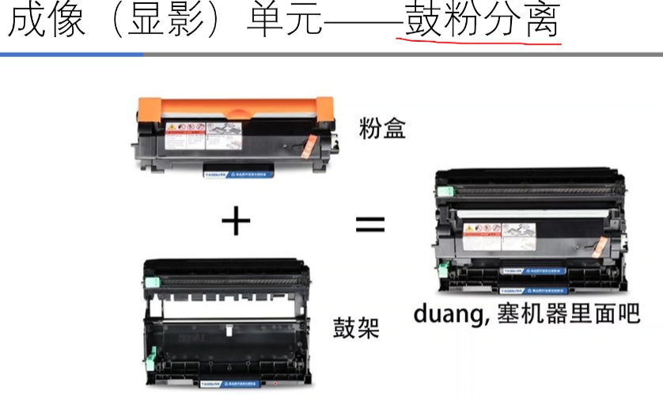
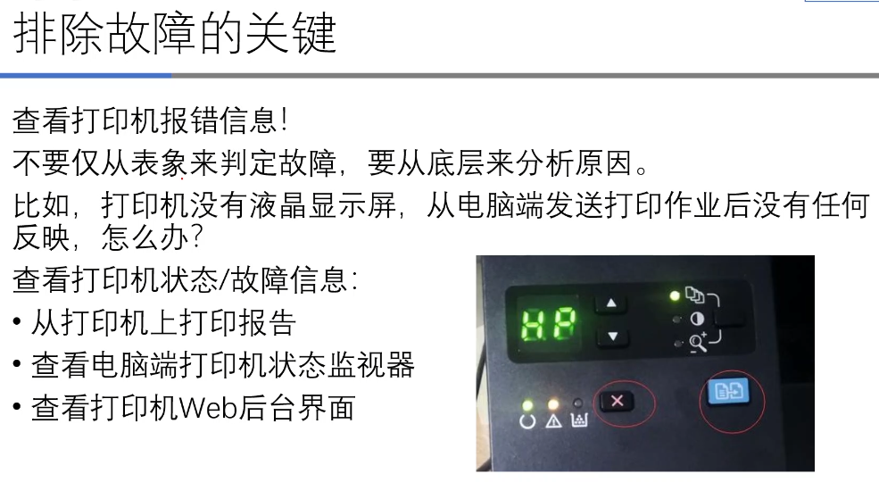
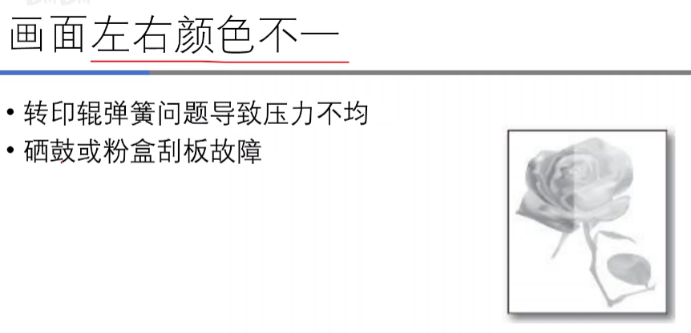
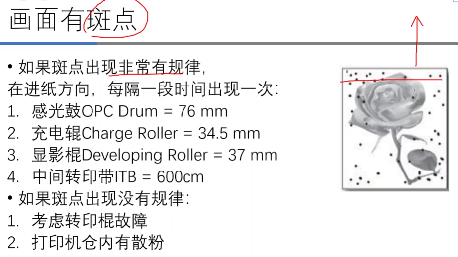

# 激光打印机

## （1）工作原理

​	激光通过照射感光鼓，改变感光鼓上的电荷分布，让感光鼓有些地方有电荷而有些地方没有，有电荷的部分可以通过电磁效吸附碳粉，最后转印到纸上形成了图案。

​	首先充电辊给感光鼓充电，感光鼓的表面可以吸附电荷（感光鼓俗称”硒鼓“，最早的感光鼓表面确实是硒元素，现在为了降低成本已采用替代原料，为有机材料介质），感光鼓表面被充电辊附上正电荷，经过激光照射有的地方正电荷消失。

​	显影辊上充满了碳粉颗粒，经过与感光鼓挤压，感光鼓上带正电荷的部分就会把墨粉颗粒吸引上去，转印滚轴带有负电荷，将原本粘在感光鼓上的碳粉吸附到了纸张上。但是无法保证所有的碳粉颗粒都被粘到纸上，所以安排废粉刮板（墨粉清除片）刮净感光鼓上的废粉，以便下一轮的充电操作，废粉会进入废粉仓。显影辊上方也有刮粉刀，但是刮下的粉会回到墨粉仓。

​	当纸上粘了墨粉颗粒后，墨粉颗粒很松散，用手一碰就会滑掉。接下来进入定影环节，把影像固定下来。通过加热，把墨粉融化到纸张上去，这样就实现了固定图案。

**总结激光打印机打印图案的关键步骤**：

1. 充电（对感光鼓附上均匀电荷）。
2. 激光扫描。
3. 显影。
4. 转印。
5. 定影。

**知识补充（修正上面的说法）：**

* OPC鼓：OPC鼓是光敏半导体，在黑暗的情况下是绝缘体，在被光照射的情况下是导体；在导体情况下，它表面的电荷就会被释放掉，而在黑暗情况下，可以保存充在上面的表面电荷。这就是光敏半导体特性。
* 首先，充电辊在OPC鼓表面施加**负电荷**，OPC鼓被激光照射后导通，电子被释放掉，照射时间越长电压越低，直至完全导通。显影辊上面也是充电的（充**负电荷**），而且碳粉并不是涂抹到感光鼓上的，而是吸附上去的，是显影辊”推“到感光鼓上的。原理是：假设opc鼓上充电电压为-2000v，被激光照射的地方就会低于-2000v（比如变为-1000v、-800v），而显影辊上的电压是-1500v，只要低于显影辊上的电压，显影辊上面的粉末就会被推到鼓上面的低电压位置。其余位置由于基准电压高于显影辊电压，显影辊推不动，所以没有墨粉颗粒。
* 显影辊后面的海绵辊不是上粉用的（？）。
* 转印辊上面带**正电荷**，从感光鼓上把碳粉吸附下来。不能带负电，否则会导致纸张被来回推，导致显影模糊。

## （2） 组成部件概述

    机械上的爆炸图

​	一个常规的激光打印机有哪些部件组成？首先是上下左右前后盖作为打印机这个长方体每个面的盖子。上盖同时还承担出纸接受盘的任务，下盖其实就是纸盒，前盖还承担多功能进纸盘的作用，还能让用户打开来更换硒鼓墨盒等耗材，后盖可以打开用来取出定影部分的卡纸。

​	硒鼓组件也叫成像单元，由碳粉盒和鼓组件两部分组成（有的是鼓粉一体的，有的是鼓粉分离的）。

​	打印机中还有几块关键的集成电路板，一块是负责交流电变压的变压器板，也叫电源基板；还有一块高压板把220V转成更高的电压，用于激光以及定影的高温产生都需要高压板来做支持。最关键的就是打印机的CPU以及控制逻辑都在数据基板上，数据基板还提供USB接口、网口、串并口等跟计算机相关的数据接口。（接口板、电源板、高压板）

​	风扇组用来会给定影部件散热，防止烧坏。整个走纸流程需要驱动器（马达齿轮组）来控制打印机进纸走纸方面的任务。激光扫描头一般在打印机的顶部，如果打印机支持双面打印，还有一个双面打印件。排纸组件负责将打印完成后的纸输出到上盖。纸盒是纸张的入口。

## （3）结构框图

​	最核心的部分就是”引擎控制模块“。上面两个虚线框都是偏DC控制板（数据板），既有控制马达、传感器的，还有控制数据的、与计算机连接的端口的。数据基板需要低压电源进行供电，它的低压电源来自电源基板（220v要转换成低压直流电），剩下的激光单元和定影模块都需要高压供电（高压基板用处所在），高压都是跟成像相关的，马达驱动的基本都是跟走纸有关的（进纸、出纸、纸在定影里面走）。

​	打印机上有可能还有扫描仪，扫描仪也是受CPU总控控制的。如果打印机还有液晶控制面板和按钮，还有操作面板模块也和数据控制模块直接相连的。

---

<b>接下来分组件介绍工作原理</b>

## （4）进纸单元

知乎上找的搓纸分页器原理：

进纸单元由搓纸轮、搓纸轮离合器和分离器构成。搓纸轮下面的分离器保证只有最上面的一张纸被送入打印机。主马达要同时驱动其他零部件，由于搓纸轮并不是一直在工作（具体取决于打印机的工作速度），除了为搓纸轮单独设计一个马达（成本高），为了让搓纸轮与其他零件共用马达， 给搓纸轮装一个电磁吸合的离合器。 

如图红圈中所示，随着纸盒由满到空，指示器位置也由上到下。原理是纸盒里金属片部分下面有一个弹簧一直顶着金属片，保证最上面的纸与搓纸轮紧密接触。金属片上有一个杠杆连着指示器。金属片位置最低的时候（也就是纸最多的时候）杠杆被金属板一端压下，指示器就保持在最高处。随着纸慢慢变少，金属片慢慢上移，给杠杆的压力逐渐减小，指示器的位置也逐渐下降。

## （5）成像单元：激光扫描单元

激光对感光鼓进行扫描，让感光鼓以电荷的方式产生要打印内容的图像，称为”静电潜像“。六面棱镜在高速旋转时，将点状激光变成”线“，再通过感光鼓旋转将”线“变成”面“，形成”潜像“。一方面要控制感光鼓的转速，一方面要控制扫描电动机的转速。还要控制发出激光的时机。

## （6）成像单元：感光鼓、墨粉盒、废粉盒

鼓粉一体在彩机上比较常见，因为体积比较小。图中蓝色部分是感光鼓，绿色部分的长辊就是显影辊。

鼓粉分离的设计则体积比较大。

## （7）定影单元

定影单元的原理就是高温，产生高温的技术有两种：定影膜和定影管。

分定影上辊和定影下辊，定影下辊提供挤压力。

## （8）排纸单元

一组滚轮将纸张引导排出打印机。

## （9）驱动单元

一般黑白激光打印机有两个马达（图上Main Drive Unit为主马达，还有Feed Drive Unit是走纸电机），一个管感光鼓、显影辊、显影辊等转动，另一个管纸走纸。此图已经是精简过后的了，实际上还要复杂。

## （10）传感器与离合器

总体而言，激光打印机中的传感器和离合器要比其他类型打印机多。激光打印机的机械结构要更复杂一些。

* 前盖打开传感器：给打印机拆装墨盒时，检测到前盖打开，打印机停止工作。
* 多功能进纸传感器：多路送纸，如果检测到有纸，优先从多功能进纸的地方搓纸进纸，否则从纸盒里搓纸。
* 出纸传感器：检测纸头过了定影辊之后有没有卡纸。
* 接受盘满传感器：检测出纸的地方纸张是否过多。
* 进纸盒缺纸传感器：报告缺纸情况。
* 进纸传感器：检测搓纸轮有没有正确搓纸，同时辅助检测搓纸轮在搓纸时有没有发生卡纸。
* **对位传感器：**一般是在纸即将进行转印之前，保证纸张进入转印部分的时机是正确的（前一张纸已经离开，且感光鼓已经做好准备）。怕路上出意外，所以在进入关键环节（转印）的时候还要确定一下时机，放一个对位辊再加一个对位传感器。类似喷墨打印机检测纸张边缘的传感器。

* 环境温度传感器：根据环境温度对风扇做散热方面的调整。

使用离合器是为了减少马达的使用数量，理论上最简易的方式是一对滚轴用一个马达驱动，但是成本很高，厂家尽量通过齿轮传递的方式，让很多滚轴可以用同一个马达驱动。可以用电信号控制齿轮的离合。 

对于一些大型机，传感器还要更多。

## （11）电路板

​	电源板产生低压，高压板产生高压。数据基板相当于台式机的主板，上面有CPU、内存、硬盘还有一些外围的接口、转接无线网络的小板、转接传真的小板等。

​	差一点的打印机仅仅是按钮跟指示灯，好一点的打印机会有液晶显示屏，再好一点的会有彩色触摸显示屏。

​	剩下的小板都是可选项，接在数据基板上的。数据基板控制着电机、离合器和传感器以及激光扫描系统。数据基板统筹协调打印机各个部件的工作。

## （12）双面单元

主要靠齿轮传动与走纸电机啮合起来传动，给纸张提供一个椭圆形的转弯空间以翻面。一旦双面打印就卡纸，重点检查双面单元是不是有问题。

## （13）纸路分析

* 红色路线：纸张来源于纸盒的单面打印

* 蓝色路线：自动双面打印，现实按照红色路线走，当纸排出到一半，到了排纸单元后又按蓝色路径返回，靠双面器引导纸进行翻面。假设先进入转印单元的纸头为A，在自动打印过程中被抽回时A点变为了纸尾（纸张被从出纸盘位置吐出又吞下），所以A是最后出来的。
* 紫色路线：手动进纸后部出纸有利于较厚的纸（铜版纸等）通过，尤其是打双面的时候，防止双面卡纸。高端一点的机器，手动进纸的地方是有搓纸轮的，如果没有说明同时只能放一张纸。

## （14）彩色激光打印机额外部件

​	彩色激光打印机一般比黑白激光打印机多3套成像组件，外加一根**中间转印皮带（ITB）**。有了黑白激光打印的基础知识，我们可以看出彩色激光打印机相当于是四个独立的黑白激光打印机，通过中间转印皮带（ITB）将四种颜色的墨粉进行混合，因此有了第一次转印和第二次转印的概念。

​	联想、惠普（其实是三星代工）的某几款彩色激光打印机，只有一个感光鼓，转印带转4圈完成一整纸的转印。

印刷领域的彩色由C（青色）M（洋红）Y（黄色）K（黑色）四色构成。

1. 感光鼓充电
2. 激光分别扫描每个鼓，生成静电潜像
3. 每个鼓触碰墨粉
4. 转印皮带旋转，将各个鼓上的粉转印到皮带上，称为**第一次转印**
5. 搓纸辊搓纸并对位
6. **第二次转印**
7. 加热定影并输出

## （15）技术参数

### 二、激光打印机特性

介绍激光打印机的技术参数，如打印幅面、分辨率、颜色、打印速度等。

打印速度对打印机感光鼓曝光速度和走纸速度等控制系统要求更高，分辨率越高打印质量越细腻。手动双面打印就是没有双面打印功能的意思……激光打印机由于发明较晚，很少有通过并口、串口连接的方式。月打印负荷评估打印头、感光鼓的寿命。首页输出时间的存在是因为打印机通过预热达到定影辊所需温度。

## (16) 激光打印机好还是喷墨打印机好？

用喷墨打印机打照片更合适。喷墨打印机的墨水起码是4色墨水，高端的有6色墨水，甚至12色墨水。激光打印机更适合办公场景下打印一些文件。彩色激光打印机适合打印一些简单的图表。

---

**以下内容是激光打印机的维护和常见故障，不再以标题记录，而是根据具体内容做陈述。**

### 激光打印机日常维护：

右上角是计数芯片，左边的黄色凸起是废粉盒开口。

打印机侧面实机图，型号原型是理光。

彩色激光打印机一般会有一个独立的废粉盒。

主要是加热辊（图中红色位置，加热辊可加热到200度？）出问题。

---

**激光打印机常见故障：**

<b>排除故障的最简单的方法：重启！同时清洁是非常重要的！</b>

一般USB是和主板在一起的，网络是一块分离的小板。

双手是防止纸张撕裂，产生纸屑。

相对于其他类型打印机，激光打印机纸路”急转弯“较多，部件也相对较多。

要确保纸路完全没有障碍物。

由上图可以看出在自动双面打印的情况下遇到卡纸的概率比单面要高。

大概率是进纸的时候就进歪了。要把2号挡片也顶住纸。

 

同时也要调节双面器的纸张挡板。

主板故障是指打印机转速不稳，经过定影辊时间不均匀。图上是定影膜出现破损。

如果是鼓粉分离的（兄弟打印机），先换粉盒再换鼓。

进灰使得六棱镜反射的光减弱。可以清洗光路。

如果电压不够，发出的激光会弱。

