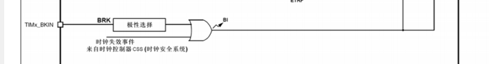

# 江协科技stm32教程
**本笔记从[5-1]EXTI外部（p12）开始记录，前面部分参见PPT（STM32入门教程.pptx，此PPT也是后续笔记的辅助文件）以及GoodNotes中STM32笔记本中的笔记（这个笔记本作为随手记录使用）。**
**2024/1/2 15:06 第一次记录**

---

## [5-1]EXTI外部中断

1. 主程序跳转到中断程序的过程是由**硬件电路**自动执行的。


- 中断执行前会对现场进行保护，C语言编程，编译器会自动做好保存和恢复工作。

- 中断跳转由于硬件的限制，只能跳转到固定的地址执行程序，为了能让硬件跳转到一个不固定的中断函数里，就需要在内存中定义一个地址的列表，列表地址是固定的，中断发生后，就跳到这个固定位置，然后再这个固定位置，由编译器加上一条跳转到中断函数的代码，这样中断函数就可以跳转到任意位置了，这个中断地址的列表，就叫**中断向量表**，相当于中断跳转的跳板。用C语言编程不需要管中断向量表，编译器帮我们做好了。

- 优先级数字越小，优先级越高，0是最高优先级。

- 外部中断有个功能：从低功耗模式的停止模式下唤醒STM32，如电源从电压过低恢复时，需要PVD借助外部中断退出停止模式；对于RTC闹钟，有时为了省电，RTC定了一个闹钟后，STM32会进入停止模式，等到闹钟响的时候再唤醒，这也需要借助外部中断，还有USB唤醒、以太网唤醒，也都是类似的作用。


- 到底什么样的设备需要外部中断呢？使用外部中断有什么好处呢？使用外部中断模块的特性：对于STM32来说，想要获取的信号是外部驱动的（STM32只能被动接收）很快的突发信号，如旋转编码器的输出信号；红外遥控接收头的输出；按键（不建议采用外部中断方式读取，不易处理按键抖动和松手检测的问题，按键的输出波形也不是转瞬即逝，如果不想用主循环读取得话，可以考虑定时器中断读取方式）。

## [5-2]对射式红外传感器计次&旋转编码器计次

- 只需要把外部中断从GPIO到NVIC出现的外设模块都配置好即可。
- **EXTI和NVIC不需要开启时钟。**RCC管理的都是内核外的外设，NVIC处于内核中所以管不到。
- AFIO的库函数和GPIO是一起的：


- 在主程序种查看和清除标志位用前两个函数，在中断函数中查看和清除标志位用后两个函数。后两个函数只能读取与中断有关的标志位，并且对中断是否允许做出了判断。
- 中断程序结束后，一定要调用清除中断标志位的函数，因为只要中断标志位置1程序就会跳到中断函数，如果不清除在中断标志位，那它就会一直申请中断：


- 最好不要在中断函数和主函数调用相同的函数或者操作同一个硬件，尤其是硬件相关的函数（比如OLED显示函数）。**在中断操作里操作变量或者标志位，当中断返回时再对这个变量进行显示和操作。**既能保证中断函数的简短快速，又能保证不产生冲突的硬件操作。

## [6-1]TIM定时中断

1. 定时器基本定时中断、内外时钟源选择
2. 定时器输出比较（产生PWM波形，用于驱动电机等设备）
3. 定时器输入捕获、主从触发模式
4. 定时器编码器接口

### 1.

16位计数器：用来执行计数定时的一个寄存器，每来一个时钟，计数器加1；

预分频器（16位）：对计数器时钟进行分频；

自动重装计时器（16位）：想要计多少个时钟申请中断；

这些寄存器构成了定时器最核心的部分，我们把这一块电路称为**时基单元**。

- **实际分频系数=预分频器的值+1**，预分频器时16位的，所以最大值可以写65535，也就是65536分频。对输入的基准频率提前进行分频操作。

- 
- 

​	计数值等于自动重装值产生的中断称为”**更新中断**“。更新中断之后就会通往NVIC，再配置好NVIC的定时器通道，那定时器的更新中断就能得到CPU的响应了。

​	向下的箭头代表会产生一个事件，这里对应的事件就叫做”**更新事件**“。更新事件不会触发中断，但可以触发内部其它电路的工作。

​	**主模式触发DAC实现硬件自动化，整个过程不需要软件的参与。**

- 关于三种定时器的计数模式：基本定时器只支持向上计数模式，通用定时器和高级定时器除了支持向上计数外还支持向下计数模式（从重装载寄存器向下自减，减到0回到重装值同同时申请中断）和中央对齐模式（先上到重装值申请中断，再向下自减到0申请中断）。


<center>三种计数方式的形象化说明</center>

**最常用的还是向上计数模式。**也是主要需要掌握的模式。

---


- 对于基本定时器而言，定时器只能选择内部时钟（也就是系统频率72MHz）。而对于通用定时器，不仅可以选择72MHz系统内部时钟，还可以选择外部时钟，具体有：来自TIMx_ETR引脚上（PA0）的外部时钟，滤波后的信号兵分两路，**ERTF又称作”外部时钟模式2“，TRGI又称作”外部时钟模式1“**。
- ITR0~3分别来自其他4个定时器的TRGO输出。通过这一路就可以实现定时器级联的功能。TI1F_ED表示通过这一路输入的时钟，上升沿和下降沿均有效。

总结一下就是，外部时钟模式1的输入可以是ETR引脚、其他定时器（ITR）、CH1引脚的边沿、CH1引脚和CH2引脚。一般情况下外部时钟通过ETR引脚就可以了。下面设置复杂的输入，不仅是为了扩大时钟的输入范围，更多还是为了某些特殊应用场景而设计的。比如为了定时器的级联而设计的ITR部分。对于时钟输入而言，最常用的还是内部的72MHz时钟。

对于高级定时器，主要改动的是右边的部分：


申请中断的地方增加了一个重复次数计数器，有了这个计数器以后，就可以实现每隔几个计数周期，才发生一次更新事件和更新中断，原来的结构式每个计数周期完成后都会发生中断，**相当于对输出的信号又做了一次分频**。

DTG（Dead Time Generate）是死区生成电路，为了防止互补输出的PWM驱动桥臂时在开关切换瞬间，由于器件不理想造成短暂的直通现象，所以前面就加上了死区生成电路，在开关切换瞬间，产生一定时长的死区，让桥臂的上下管全都关断，防止**直通现象**。右边的输出引脚由原来的一个变为了两个互补的输出，可以输出一对互补的PWM波。这些电路是为了驱动三相无刷电机的。三相无刷电机常用于四轴飞行器、电动车的后轮、电钻等。



最后一部分就是刹车输入的功能，给电机驱动提供安全保障。如果外部引脚BKIN（Break In）产生了刹车信号，或者内部时钟失效，产生了故障，那么控制电路就会自动切换电机的输出，防止意外发生。


中断信号会先在状态寄存器里置一个中断标志位，这个标志位会通过中断输出控制，到NVIC申请中断。为什么需要中断输出控制？因为这个定时器模块有很多地方都需要申请中断，不仅更新要申请中断，触发信号也会申请中断，还有下面的输入捕获和输出匹配时也会申请，所以这些中断都要经过中断输出控制，如果需要这个中断就允许，不需要就禁止。简单来说，这个中断输出控制就是一个中断输出的允许位，如果需要某个中断就记得允许一下。

* PPT58开始的时序图补充：预分频器为了防止计数中途更改数值造成错误，设计了缓冲寄存器，计数器也少不了这样的设计。**结构图中带黑色阴影的寄存器都是有影子寄存器这样的缓冲机制的**，包括预u分频器、自动重装寄存器（**ARR**）和下面的捕获比较寄存器。
* ARR的缓冲寄存器用与不用是可以自己设置的。计数器无预装时序就是没有缓冲寄存器的情况，有预装时序就是有缓冲寄存器的情况。**通过设置ARPE位，就可以选择是否使用预装功能。**引入影子寄存器的目的是为了同步，让值的变化和更新事件同步发生，防止在运行途中更改造成错误。

视频41：01讲了RCC时钟树相关内容。时钟是所有外设运行的基础，所以时钟也最先需要配置的东西。外部的石英振荡器（OSC，oscillator）比内部的RC振荡器更加稳定，所以一般都用外部晶振。

---

## [6-2]定时器定时中断和定时器外部时钟

- 因为定时器和中断系统的电路都在STM32内部，定时中断也是为程序设计提供服务的，所以芯片外面只插一个OLED显示数据就行了。


- 先在”Timer.c“文件中定时器进行初始化，创建`void Timer_Init(void)`函数。
  - RCC开启时钟，定时器基准时钟和整个外设的工作时钟就会同时打开了。
  - 选择时基单元的时钟源，这里选择RCC内部时钟。
  - 配置时基单元，这里用一个结构体就可以配置好了。
  - 配置输出中断控制，允许更新中断输出到NVIC。
  - 配置NVIC，在NVIC打开定时器中断的通道，并分配一个优先级。
  - **运行控制**，整个模块配置完后还需要使能一下计数器，不然计数器是不会运行的。

当定时器使能后，计数器就会开始计数了，当计数器更新时，触发中断；最后再写一个定时器的中断函数，这样这个中断函数每隔一段时间就能自动执行一次了。

> 
>
> 左上角的小棋子🚩是用来插书签用的，不影响代码的运行。

`void TIM_Cmd(TIM_TypeDef* TIMx, FunctionalState NewState);`用来使能计数器（也就是与运行控制相关），第一个参数选择定时器，第二个选择状态（使能、失能）。


* 注意预分频器的值和自动重装寄存器的值要比实际系数分频系数与溢出系数小1，所以在确定溢出频率后（比如此代码设定1Hz，即1s溢出一次）后，二者都要在原参数上-1，两个参数的最大值均不超过65535，也就是0xFFFF）。

- 配置时基单元中TIM_ClockDivision一项是用来决定ETR/TIx的输入滤波器采样频率相对于内部时钟（CK_INT）的分频系数的。采样频率可以由CK_INT直接得来（就是直接是CK_INT），或者由CK_INT分频而来，采样频率越高，采样点数越多，滤波效果越好。可见这个参数和时基单元关系并不大。这里配置为DIV1，即不分频。

- 如果想跨文件使用变量，有两种方式：

  - [ ] 在使用变量的文件（区分于定义变量的文件）的上面用**extern**声明一下要用的变量（如下图所示）。全局变量不是编译器在找，而是在链接时，链接器会进行符号的解析和重定位，将定义处的地址给到引用全局变量的位置。

  

  其实头文件的函数声明也是用extern实现的，在声明的函数前是有一个extern的，只不过这个extern可以省略，所以我们一般不写。

  - [x] 直接把TIM2的中断函数放在主函数里。对于定时中断而言，中断函数就是为别的文件服务的，所以中断函数可以放在使用它的地方。

---


上图是复位后计数器值从1开始的原因，在`TIM_TimeBaseInit(TIM2, &TIM_TimeBaseInitStructure);`函数最后一行。因为预分频器是有缓冲寄存器的，我们写的值只有在更新事件时才会真正起作用，这里为了让值立刻起作用，就在最后手动生成了一个更新事件。副作用是，更新事件和更新中断是同时发生的，更新中断会置更新中断标志位，之后一旦初始化完成，更新中断就会立刻进入。这就是刚一上电就立刻进中断的原因。

解决方案：


在TIM初始化后，开启中断之前，手动清除更新中断标志位。**⚠这里清除标志位后从0~1的计数时间实际上小于1s。要注意预分频器寄存器的更新时机。**

**接下来是定时器外部时钟部分：**

如果采用对射式红外计数器产生外部时钟波形时发现CNT和Num数字乱跳，适当提高外部触发滤波即可。


## [6-3] TIM输出比较

**主要是用来输出PWM波形的，PWM波形又是驱动电机的必要条件。**使用PWM波形，就可以在数字系统等效输出模拟量。就能够实现LED控制亮度、电机控速等功能了。

- OC：Output Compare输出比较
- IC：Input Capture输入捕获
- CC：Capture/Compare捕获/比较

1. 分辨率=占空比的步距：如果占空比以1%、2%、3%……这样的步距跳变，那么它的分辨率就是1%，如果能以1。1%、1.2%、1.3%……这样的步距跳变，那么分辨率就是0.1%。分辨率就是**占空比变化的细腻程度，分辨率大小看实际项目的需求。**
2. 改变定时器更新频率时，输出波形的频率也会随之改变，关系为：输出波形的频率=更新频率/2，因为更新两次输出才为一个周期。


- 4个初始化函数对应4个输出比较单元（输出比较通道），需要初始化哪个通道就调用哪个函数，不同的通道对应的GPIO口是不一样的，要按照GPIO口的需求来。这里使用PA0口，对应的就是第一个输出比较通道。
- 初始化结构体里面很多带N的参数都是高级定时器才需要使用的参数，使用通用定时器可以不对其进行初始化。
- **对于同一个定时器的不同通道输出的PWM**，由于不同通道共用同一个计数器，所以他们的频率是一样的（分辨率也就是一样的了），它们的占空比由各自的CCR决定。对于相位，由于计数器更新，所有PWM同时跳变，所以它们的相位是同步的。如果驱动多个舵机或者直流电机，使用同一个定时器不同通道的PWM就完全可以了。

---

## [6-5] TIM输入捕获 / [6-6]

- 对于STM32测频率而言，它只能测量数字信号，如果需要处理正弦波，还需要设计一个预处理电路将正弦波处理为数字信号，高电平3.3V低电平0V再输入给STM32，最简单的就是用运放搭一个比较器。如果输入的电压比较高还需要考虑隔离问题。

- 测频法适合测量高频信号，测周法适合测量低频信号。测频法在闸门时间内最好多出现一些上升沿，测周法在两个上升沿内最好多计一些次数。测频法要求信号频率要稍微高一些，在计次N很少时，误差会非常大；测周法要求信号频率低一些，低频信号周期比较长，计次就会比较多，有助于减小误差。测频法测量结果更新的慢一些，数值相对稳定；测周法更新的快，数据跳变也非常快。测频法测量的是在闸门时间内的多个周期，**所以它自带一个均值滤波**，如果在闸门时间内波形频率有变化，那么得到的是这段时间的平均频率，如果闸门时间选为1s，那么每隔1s才能得到一次结果，所以测频法结果更新慢，测量结果是一段时间的平均值；测周法测量一个周期就能出结果，结果值会受噪声影响，波动也比较大。

- 计次N可能会出现**“正负1误差”**，也就是计次不完整，上面两种方法都会出现，当计次N比较大时正负1对N的影响就会很小。

- 中界频率由以上两种方法联立N求出fm，当待测频率小于fm时用测周法，大于fm时用测频法。

- TI1FP2和TI2FP1交叉的目的主要有两个：1. 可以灵活切换后续捕获电路的输入，2. 可以把一个引脚的输入同时映射到两个捕获单元，这也是PWMI模式的经典结构。总结就是：一个通道灵活切换两个引脚和两个通道同时捕获一个引脚。

- TRC和异或门是为了无刷电机的驱动。

- **主从模式触发器是UP主自创的名词**，主模式用于定时器控制外设，从模式用于外设控制定时器。

- 先转运CNT的值到CCR中去，再触发从模式给CNT清零。

- `TIM_ICInitStructure.TIM_ICPrescaler`参数表示分频，不分频就是每次选定的时钟沿都触发，二分频就是每隔一个时钟沿触发一次，四分频就是每隔三个周期触发一次。

- 使用一个定时器同时监测一个输入的上升、下降沿有两种方法，可以用一个输入捕获单元初始化结构体分别初始化通道1和通道2，通道2使用交叉输入（如下图），另一种方法是使用`TIM_PWMIConfig`函数。

  

  

​	使用这个函数只需要传入一个通道的参数就行了，在函数里，会自动把剩下的一个通道初始化成相反的配置。**这个函数只支持通道1和通道2的配置，不要传入通道3和通道4。**

- 如果测得频率比预想值大1，可能是由于CNT从0开始计数，实际所记数值比写入到CCR的值要多1，所以通过测周法得到的待测频率要比实际值大。

---

## [6-7] [6-8] TIM编码器接口

- 使用定时器的编码器接口实现自动计次（之前的代码时通过触发外部中断，在中断函数里手动进行计次）的好处就是节约软件资源，如果使用外部中断计次，程序就得频繁进中断。
- 编码器的资源还是比较紧张的，如果定时器被配置为编码器基本上就干不了其他的活了。
- 采用正交信号的好处是：首先A、B相都可以计次，相当于几次频率提高了一倍，其次是正交信号可以抗噪声。
- 由查ppt中表可知，正转状态都向上计数，反转状态都向下计数，这就是编码器接口执行逻辑。一般都使用“在TI1和TI2上计数”的模式，精度高。
- 在编码器接口基本结构中，边沿检测极性选择不再是边沿的极性选择（因为上升沿下降沿都用于计次），而是高低电平的极性选择。上升沿参数代表的是高低电平极性不反转（反相），下降沿表示高低电平反相。
- **编码器接口可以看作是带方向控制的外部时钟**。


## [7-1] [7-2] ADC模数转换器

- 使用DAC可以将数字变量转换为模拟电压，另一个数字到模拟的桥梁是PWM，PWM只有完全导通和完全断开两种状态，在这两种状态上都没有功率损耗，所以在直流电机调速等大功率应用场景，使用PWM等效模拟量是比DAC更好的选择，并且PWM比DAC更加常用。**目前DAC的应用主要在波形生成领域：信号发生器、音频解码芯片。**DAC内部使用加权电阻网络实现转换。

- 12位逐次逼近型ADC，1us转换时间：涉及到ADC的两个关键参数，第一个是分辨率，一般用多少位来表示（12位AD值，表示范围是0~4095），量化结果的范围是0~4095，位数越高，量化结果越精细，对应分辨率越高；转换时间表示从AD转换开始到产生结果需要花1us，对应AD转阿欢频率就是1MHz，这就是STM32 ADC的最快转换频率。

- 内部参考电压是一个1.2V左右的基准电压，这个基准电压是不随外部供电电压变化而变化的。如果芯片供电不是标准的3.3V，测量外部引脚的电压可能就不对，这时就可以读取这个基准电压进行校准，这样就能得到正确的电压值了。

- Vref+和Vref-在内部就已经和Vdda和Vssa接在一起了：

  

​	所以与图示不同的是，实际上是没有Vref+和Vref-的引脚引出的。

- EOC是规则组的转换结束信号，JEOC是注入组的转换结束信号，[STM32 ADC的规则通道和注入通道有什么区别（转）_stm32adc转换时，有注入组和规则组，注入组最多由多少个通道数组成。每个通道专门用来管理来自于一-CSDN博客](https://blog.csdn.net/eryijimi/article/details/79788750)。
- 出发控制可以选择硬件触发和软件触发，硬件触发主要来自于定时器（TRGO），也可以选择外部中断引脚。
- ADC时钟来自RCC经过预分频后的时钟，由于ADCCLOCK最大限制14MHz，72MHz的内部时钟只能采用6分频或8分频。
- 双ADC模式就是ADC1、ADC2一起工作，他们配合可以组成同步模式、交叉模式（可以进一步提高采样频率）等等模式。
- 一般选择数据右对齐，左对齐的数据相当于比实际值大16倍。选择左对齐的目的是如果不需要12位的分辨率，就可以采用左对齐的方式并读取寄存器的高8位，这样就舍弃掉了后面4位的精度，12位的ADC就退化为8位的ADC。
- 在ADC开启后，可以调用校准函数对ADC进行校准，注意，F4系列不需要校准。


## [8-1] [8-2]DMA直接存储器存取/DMA数据转运/+AD多通道

- ”直接存储器存取“包括运行内存SRAM、测u那个需存储器Flash和寄存器等等。
- 特定的硬件触发：**每个DMA通道的硬件触发源是不一样的**，要使用某个外设的硬件触发源，就得使用它连接的那个通道。
- 存储器映像中的各类型存储器终止地址取决于存储器的容量，彼岸到哪里，那里就是终止地址。
- 系统存储器和选项字节也是flash，只是平时提到flash是说得一般是程序存储器flash（主闪存flash）。外设寄存器和内核外设寄存器于运行内存RAM同理。
- 0地址实际上是没有存储器的，别名到Flash存储器或者系统存储器，取决于BOOT引脚。需要把我们想要执行的程序，映射到0地址来。
- DMA框图中，总线矩阵的左端是主动单元，也就是拥有存储器的访问权，右边是被动单元，他们是存储器，只能被左边的主动单元读写。
- DCode总线是专门访问flash的，系统总线是访问其他东西的，由于DMA要转运数据，所以DMA也必须要有访问的主动权，主动单元除内核CPU外，剩下的就是DMA总线了。
- DMA各个通道可以分别设置它们转运数据的源地址和目的地址，这样它们就可以各自独立工作了。仲裁器根据通道优先级决定通道对DMA总线的使用顺序。总线矩阵也有DMA仲裁器，如果DMA和CPU都要访问同一个目标，那么DMA就会暂停CPU的访问以防止冲突，不过总线仲裁器仍然会保证CPU得到一般的总线带宽，使CPU正常工作。
- DMA既是总线矩阵的主动单元，可以读写各种存储器，也是AHB总线上的被动单元，CPU通过“系统->总线矩阵->AHB从设备”这条线路就可以对DMA进行配置了。
- DMA请求就是触发的意思，触发源是各个外设，框图上的DMA请求就是DMA硬件触发源。
- **CPU或者DMA直接访问Flash得话是只可以读不可以写的**，如果要写Flash需要配置Flash接口控制器，要先对Flash按页进行擦除，再写入数据。
- 外设寄存器有的是只读的，有的是只写的，不过外设的数据寄存器都是可以正常读写的。
- **STM32中谈到存储器一般是指Flash和SRAM，外设寄存器一般称作外设**，这是描述方法上的区别。
- 外设和存储器的三个参数中，起始地址指定了数据从哪里来到哪里去；数据宽度指定一次转运要按多大的数据宽度来进行；可以选择Byte、Half Word、Word；地址是否自增是p++的意思，地址指针需要指向下一个地址。
- **外设存储器并不是只能写寄存器地址，也可以写存储器地址，只是名字这样叫而已**。
- 传输计数器是自减计数器，用来指定转运次数。归零后之前自增的地址也会恢复到起始地址的位置，以方便之后DMA开始新一轮的转换。
- 软件触发：执行逻辑是以最快的速度连续不断地触发DMA，争取早日把传输计数器清零，完成这一轮的转换。和之前外部中断和ADC的软件触发不太一样。**可以理解为连续触发**。软件触发和循环模式不能同时用。软件触发一般适用于存储器到存储器的转运。
- DMA进行转运的三个条件：1.开关控制（DMA_Cmd必须使能），2. 传输计数器必须大于0，3. 触发源必须有触发信号。当传输计数器等于0且没有自动重装时，这时无论是否触发，DMA都不会再进行转运了。写传输计数器时必须先DISABLE DMA再进行，不能在DMA开启时写传输计数器，这时手册里的规定。
- 数据转运是一种复制转运，转运完成后DataA的数据并不会消失。
- ADC扫描模式，在每个单独的通道转换完成后，没有任何标志位也不会触发中断，所以程序不太好判断某一个通道转换完成的时机是什么时候，**但是每个通道转换完成后会产生DMA请求触发DMA转运**。
- 关于位带、位段：[STM32 位段详解_stm32位段-CSDN博客](https://blog.csdn.net/Firefly_cjd/article/details/107351639)。
- 在STM32中，使用const定义的“变量”是存储在Flash里面的。对于变量或者常量的地址是由编译器决定的，不同的程序地址可能不一样，是不固定的，对于外设寄存器来说地址是固定的（手册里有写），在程序中也可以用结构体访问寄存器。
- `ADC1->DR`，起始地址加偏移，就是指定的寄存器，因为ADC1是一个结构体指针，所以要用->来取成员，之后用&来取成员地址。
- 自动重装和软件触发不能同时使用，如果同时使用，DMA就会连续触发，永远也不会停下来。
- 结构体中M2M结构体成员指定是否开启软件触发，也就是存储器到存储器的转运。


## 	第九节 USART串口

### [9-1]USART串口协议

* 在串口中只能发射二进制数，也就是16进制的最直接的数据。
* 一般来说，全双工的通信都有两根通信线，发送线路和接收线路互不影响——全双工。有单独的时钟线——时钟特性为同步，接收双方可以在时钟信号的指引下进行采样（如I2C、SPI等）；剩下的串口、CAN、USB等没有时钟线，所以需要双方约定一个采样频率，这就是异步通信，并且还需要加一些帧头帧尾等，进行采样位置的对齐。
* 单端信号的高低电平都是相对于GND引脚的，所以严格上来说GND也算是通信线。
* VCC如果两个设备都有独立供电，那VCC可以不接，如果其中一个设备没有供电，则其中一个模块通过VCC连接线向另一个模块供电，供电电压要按照子模块的要求来（如STM32与蓝牙模块的通信）。
* 串口也有很多电平标准，直接从控制器出来的信号，一般都是TTL电平，相同的电平才能相互通信，不同的电平信号需要加一个电平转换芯片进行转接。

### [9-2] USART串口外设

- STM32的USART同步模式只支持时钟输出不支持时钟输入，这个同步模式更多地是为了兼容别的协议或者特殊用途而设计的，并不支持两个USART之间进行同步通信。主要还是学习异步通信（从这一点上看USART和UART也没什么区别）。
- USART外设就是串口通信的硬件支持电路。
- 波特率发生器其实就是一个分频器，比如APB2总线给一个72MHz的频率，然后波特率发生器进行一个分频，得到我们想要的波特率时钟，最后在这个时钟下进行首发，就是我们指定的通信波特率。
- 在进行连续发射时，停止位长度决定了帧的间隔。最常用的是一位停止位。
- 在STM32中USART的所有参数都可以通过配置寄存器来完成，使用库函数配置就更简单了，直接给结构体赋值即可。
- 硬件流控制：在硬件电路上会多出一根线，如果B没准备好接收就置高电平；如果准备好了，就置低电平。A接收到了B反馈的准备信号，就只会在B准备好的时候，才发数据。硬件流控股之可以防止因为B处理慢而导致数据丢失的问题。
- 智能卡、IrDA（用于红外通信）、LIN（局域网通信协议）：这是其他的一些协议，因为这些协议和串口非常类似，STM32对USART增加了一些小改动，就能兼容这些协议了。
- 

​	发送移位寄存器：当数据从TDR移动到移位寄存器时，会置一个标志位TXE(TX Empty，发送数据寄存器空)，如果该标志位置1，就可以在TDR写入下一个数据了（此时数据还没有发送），然后发送移位寄存器就会在下面的发送器控制的驱动下向右移位，然后一位一位地，把数据输出到TX引脚。


**有了TDR和发送移位寄存器的双重缓存，可以保证连续发送数据的时候，数据帧之间不会有空闲，提高了工作效率。**

- 接收移位寄存器在转移的过程中，也会置一个标志位，叫RXNE（RX Not Empty，接收数据寄存器非空），当检测到RXNE置1之后，就可以把数据读走了。
- 

​	nRTS：Request To Send是请求发送，输出脚，n表示低电平有效；nCTS：Clear To Send是清除发送，输入脚，用于接收别人nRTS信号。需要双方都支持硬件数据流控制，本器件nRTS接对方nCTS，即nCTS和nRTS也要交叉连接。TX和nCTS是一对的，RX和nRTS是一对的。


- 

​	时钟信号是配合发送移位寄存器输出的，发送寄存器每移位一次，同步时钟电平就跳变一个周期。**这个时钟只支持输出，不支持输入，所以两个USART之间实现同步的串口通信。**这个时钟信号的作用有：兼容别的协议，如串口加上时钟后，就跟SPI协议非常像，所以有了时钟输出的串口就可以兼容SPI；另外这个时钟也可以做自适应波特率，比如接收设备不确定发送数据给的什么波特率，就可以测量一下这个时钟的周期，然后再计算得到波特率。

- 

​	唤醒单元用于实现串口挂载多设备，当发送指定地址时，此设备唤醒开始工作，当发送别的设备地址时，别的设备就唤醒工作，这个设备没有收到地址就保持沉默，这样就可以实现多设备串口通信了。

- RXNE标志位可以去申请中断，这样就可以在收到数据是直接进入中断函数，然后快速读取和保存数据。
- 

​	电路中实际上有四个寄存器，但是在软件层面，只有一个“DR寄存器”可以供我们读写，写入DR时数据走发送的两个寄存器进行发送；读取DR时，数据走下面的这条路，进行接收。

- 去原视频看起始位侦测的内容：[[9-2\] USART串口外设_哔哩哔哩_bilibili](https://www.bilibili.com/video/BV1th411z7sn?p=26&spm_id_from=pageDriver&vd_source=a257f8dabd79e42df87ac513807afcef)26:00左右。有噪声标志位NE的产生规则。
- 波特率 = `fPCLK2/1` / `(16 * DIV)`：输入时钟/DIV要等于16倍的波特率，因为采样时钟要是16倍的波特率。
- 寄存器经典分类：状态寄存器SR（Status Register）存放各种标志位；数据寄存器DR（Data Register）存放关键数据；配置寄存器CR（Config Register），存放各种配置参数。这三类寄存器基本每个外设都有。


### [9-3] 串口发送&串口发送+接收

- 多个系统之间互联，都要进行共地，这样电平才能有高低的参考（就像两个人比较身高，必须站在同意地平面上，才能比较）。
- 串口模块和STLINK都插在电脑上，这样STM32模块和串口模块都有独立供电，所以USB转串口模块的电源正极就不需要接了（由跳线帽将USB输入5V通过稳压管转为3.3V后的电源接入模块即可）。
- `USART_InitStructure.USART_BaudRate = 9600;`写好波特率之后USART_Init()函数内部会自动算好9600波特率对应的分频系数并装入到USART_BRR波特比率寄存器中。
- `USART_InitStructure.USART_Mode = USART_Mode_Tx;`，如果USART模块即需要发送也需要接收，就把两个参数或起来。
- 

​	MicroLIB是Keil为嵌入式平台优化的一个精简库，程序中移植的printf函数可以用MicroLIB。**注意，要在串口上显示移植后printf打印的数据，必须要勾选该库。**


​	`fputc()`函数在`stdio.h`库中，重写fputc函数需要引入该库。这样，printf函数就移植好了。

- 在STM32中发送回车换行符要输入`\r\n`而不仅仅是写`\n`。
- 第二种printf函数的移植方法：刚才的方法由于printf只能有一个，重定向到串口1，那串口2再用就没有了，**如果多个串口都想用printf那怎么办呢？**这时可以用sprintf，sprintf可以把格式化字符输出到一个字符串里。


​	因为sprintf可以指定打印位置，不涉及重定向的东西，所以每个串口都可以用sprintf进行格式化打印。

- 第三种方法就是封装sprintf：

``` c
//封装可变参数格式，...用来接收后面的可变参数列表
void Serial_Printf(char *format, ...)
{
	char String[100];
	va_list arg;
	va_start(arg, format);
	//sprintf函数只能用来接收固定的参数列表，这里用vsprintf
	vsprintf(String, format, arg);
	va_end(arg);
	Serial_SendString(String);
}
```

- 显示汉字的操作方法：如果printf打印汉字会乱码，则在下图位置输入`--no-multibyte-chars`。


- UTF-8可能有些软件的兼容性不好，第二种显示汉字的方法是切换为GB2312编码方式，这时不用加上边的参数：**⚠这种方法没成功，似乎无法切换编码格式**


- **对于串口的接收，可以使用查询和中断两种方法**。如果使用查询，则初始化函数为下面的代码：

``` c
void Serial_Init(void)
{
	RCC_APB2PeriphClockCmd(RCC_APB2Periph_USART1, ENABLE);
	RCC_APB2PeriphClockCmd(RCC_APB2Periph_GPIOA, ENABLE);
	
	GPIO_InitTypeDef GPIO_InitSturcture;
	GPIO_InitSturcture.GPIO_Mode = GPIO_Mode_AF_PP;
	GPIO_InitSturcture.GPIO_Pin = GPIO_Pin_9;
	GPIO_InitSturcture.GPIO_Speed = GPIO_Speed_50MHz;
	GPIO_Init(GPIOA, &GPIO_InitSturcture);

	GPIO_InitSturcture.GPIO_Mode = GPIO_Mode_IPU;
	GPIO_InitSturcture.GPIO_Pin = GPIO_Pin_10;
	GPIO_InitSturcture.GPIO_Speed = GPIO_Speed_50MHz;
	GPIO_Init(GPIOA, &GPIO_InitSturcture);

	USART_InitTypeDef USART_InitStructure;
	USART_InitStructure.USART_BaudRate = 9600;
	USART_InitStructure.USART_HardwareFlowControl = USART_HardwareFlowControl_None;
	USART_InitStructure.USART_Mode = USART_Mode_Tx | USART_Mode_Rx;
	USART_InitStructure.USART_Parity = USART_Parity_No;
	USART_InitStructure.USART_StopBits = USART_StopBits_1;
	USART_InitStructure.USART_WordLength = USART_WordLength_8b;
	USART_Init(USART1, &USART_InitStructure);
	
	USART_Cmd(USART1, ENABLE);
}
```

如果使用中断，则:

``` c
void Serial_Init(void)
{
	RCC_APB2PeriphClockCmd(RCC_APB2Periph_USART1, ENABLE);
	RCC_APB2PeriphClockCmd(RCC_APB2Periph_GPIOA, ENABLE);
	
	GPIO_InitTypeDef GPIO_InitSturcture;
	GPIO_InitSturcture.GPIO_Mode = GPIO_Mode_AF_PP;
	GPIO_InitSturcture.GPIO_Pin = GPIO_Pin_9;
	GPIO_InitSturcture.GPIO_Speed = GPIO_Speed_50MHz;
	GPIO_Init(GPIOA, &GPIO_InitSturcture);

	GPIO_InitSturcture.GPIO_Mode = GPIO_Mode_IPU;
	GPIO_InitSturcture.GPIO_Pin = GPIO_Pin_10;
	GPIO_InitSturcture.GPIO_Speed = GPIO_Speed_50MHz;
	GPIO_Init(GPIOA, &GPIO_InitSturcture);

	USART_InitTypeDef USART_InitStructure;
	USART_InitStructure.USART_BaudRate = 9600;
	USART_InitStructure.USART_HardwareFlowControl = USART_HardwareFlowControl_None;
	USART_InitStructure.USART_Mode = USART_Mode_Tx | USART_Mode_Rx;
	USART_InitStructure.USART_Parity = USART_Parity_No;
	USART_InitStructure.USART_StopBits = USART_StopBits_1;
	USART_InitStructure.USART_WordLength = USART_WordLength_8b;
	USART_Init(USART1, &USART_InitStructure);

	USART_ITConfig(USART1, USART_IT_RXNE, ENABLE);

	NVIC_PriorityGroupConfig(NVIC_PriorityGroup_2);

	NVIC_InitTypeDef NVIC_InitStructure;
	NVIC_InitStructure.NVIC_IRQChannel = USART1_IRQn;
	NVIC_InitStructure.NVIC_IRQChannelCmd = ENABLE;
	NVIC_InitStructure.NVIC_IRQChannelPreemptionPriority = 0;
	NVIC_InitStructure.NVIC_IRQChannelSubPriority = 0;
	NVIC_Init(&NVIC_InitStructure);
	
	USART_Cmd(USART1, ENABLE);
}
```


### [9-5] USART串口数据包

- 数据包的意义在于，接收方可能从任意位置开始接收，可能会出现数据错位的现象，需要一种方式将数据进行分割。数据包的任务就是把属于同一批的数据进行打包和分割，方便进行分割和识别。
- 存在的几个问题：
  1. 包头包尾和数据载荷重复的问题：假设定义FF为包头FE为包尾，可以在发送的时候**对发送数据限幅**；如果无法避免，还可以**尽量使用固定长度的数据包**，这样只要包头包尾对齐，就可以知道哪个数据应该是包头包尾，哪个数据应该是载荷数据；第三种方法是增加包头包尾的数量，比如使用两个字节作为包头，两个字节作为包尾。
  2. 可以只用一个包头，不用包尾。不过这样的话，载荷和包头重复问题会更严重一些。
- 文本数据包基本不用担心载荷和包头包尾重复问题，由于数据译码成了字符形式，存在大量的字符可以作为包头包尾，可以有效避免载荷和包头包尾重复问题。
- HEX数据包发送方便，适合发送原始数据，但是灵活性不足，载荷和包头包尾容易；文本数据包数据直观易理解、灵活，适合输入指令进行人机交互的场合（比如蓝牙模块常用的AT指令，CNC和3D打印机常用的G代码，都是文本数据包的格式），缺点就是解析效率低。
- 由于这个程序中Serial_RxPacket[]数组是一个写入又读出的数组，如果读出数据较慢可能会被写出覆盖，具体情况要注意这里。可以在接收部分加入判断，在每个数据包读取处理完毕后再接收下一个数据包。
- 对于发送文字数据包，如果连续发送数据包，程序处理不及时，可能导致数据包错位。在这里文本数据包每个数据包是独立的（不像Hex数据包可能是连续的），如果错位问题就比较大，可以改变读取之后立即清除标志位的策略。还可以定义一个指令缓冲区，把接收好的字符串放在指令缓冲区进行排队。


### [9-6] FlyMcu串口下载&STLINK Utility

- 了解STM32一键下载电路
- 题目提到的两个软件


## 第十节 I2C协议

### [10-1] I2C通信协议

- 异步时序的缺点是非常依赖外设硬件的支持。**使用同步时序可以极大地降低单片机对硬件电路的依赖**。同时同步时序的稳定性也比异步时序更高。

- 使用I2C的器件，都有SCL和SDA这两个引脚。

- 多主多从模式下，在总线冲突时，I2C协议会进行仲裁，仲裁胜利的一方取得总线控制权，失败的一方自动变回从机。由于时钟线也是由主机控制的，所以在多主机模式下还要进行时钟同步。

- 本课程关注一主多从模式。该模式下主机完全掌控SCL线，从机不允许控制。对于SDA数据线，从机不允许主动发起对SDA的控制。

- 关于电路中采用开漏输出上下拉的意思，参见视频中21分钟位置的内容：[[10-1\] I2C通信协议_哔哩哔哩_bilibili](https://www.bilibili.com/video/BV1th411z7sn?p=31&vd_source=a257f8dabd79e42df87ac513807afcef)。“无论所有人怎么拉杆子或者放手，杆子都不会处于一个被同时强拉或强推的状态。”

- 采用开漏输出模式有几大好处：

  1. 完全杜绝了电源短路现象，保证了电路的安全（在高电平与低电平相连的情况下，由于上拉电阻的存在，不会出现推挽模式下的短路问题。）；[GPIO的推挽与开漏，你真的理解吗？ (qq.com)](https://mp.weixin.qq.com/s/dCdqOEqYzoTmscwnXudYNQ)；[STM32--GPIO（8种工作模式）-CSDN博客](https://blog.csdn.net/m0_56399733/article/details/134675847)；[NMOS管与PMOS管的区别与总结_pmos和nmos的区别-CSDN博客](https://blog.csdn.net/weixin_43491077/article/details/109721185#:~:text=NMOS是栅极高电平（|VGS| > Vt）导通%2C低电平断开%2C可用来控制与地之间的导通。 PMOS是栅极低电平（|VGS| > Vt）导通%2C高电平断开%2C可用来控制与电源之间的导通。,NMOS的特性 ， Vgs大于一定的值就会导通 ， 适合用于源极接地时的情况（低端驱动） ，只要栅极电压达到4V或10V就可以了。)
  2. 避免了引脚模式的频繁切换，开漏加弱上拉的模式，同时兼具了输入和输出的功能。因为开漏模式下，输出高电平就相当于断开引脚，所以在输入之前可以直接输出高电平，不需要再切换成输入模式了。[STM32 IO口双向问题 - IAmAProgrammer - 博客园 (cnblogs.com)](https://www.cnblogs.com/shangdawei/p/3246688.html)

  

  ​	”**在图的上半部，施密特触发器处于开启状态，这意味着CPU可以在“输入数据寄存器”的另一端，随时监控I/O端口的状态**；通过这个特性，还实现了虚拟的I/O端口双向通信……“。所以在GPIO配置为推挽输出的模式下，施密特触发器的开启是用来监视IO口的状态的，不是用来实现双向通信的。

  3. 这个模式会有一个“线与”的现象，只要有任意一个或多个设备输出了低电平，总线就处于低电平，只有所有设备都输出高电平，总线才处于高电平，I2C可以利用这个特性，执行多主机模式下的时钟同步和总线仲裁（这也就是SCL采用开漏输出的原因）。

- 在I2C总线空闲时，SCL和SDA都处于高电平状态（没有任何设备触碰IIC，总线被上拉电阻上拉为高电平状态）。

- 因为SCL是由主机控制的，所以从机的数据变换基本上都是贴着SCL下降沿进行的。

- 所有设备都会收到主机发送的地址（1字节），并与自己的地址相比较，地址相同则应答不同则沉默，同一IIC总线里挂载的每个设备地址必须不一样。从机设备地址在IIC协议标准里分为7位地址和10位地址（目前只讲7位地址）。如果有相同芯片挂载同一条总线就要用到地址中的可变部分了，一般器件地址的最后几位是可以在电路中改变的（如MPU6050地址的最后一位）。

- 在从机中，所有的寄存器被分配到一个线性区域中，并且会有单独的指针变量指示其中一个寄存器（上电默认指向0地址），并且每写入和读出一个寄存器值指针就自增一次，移动到下一个位置。主机发送的写地址会写入到这个指针里。写入的地址会存放在地址指针里，并不会因为时序的停止而消失。

- 因为指定读写标志位只能是跟着起始条件的第一个字节，所以如果想切换读写方向，只能再来一个起始条件（**Sr**），然后起始条件后，重新寻址并指定读写标志位。


### [10-2] MPU6050简介

- MPU6050的从机地址有两种表示方式：
  - 把1101000（AD0 = 0）直接转换为16进制，这样在IIC发送时就要先左移一位再或上0x01（如果要读得话）。
  - 把11010000整体看作是地址（0xD0），其实就是IIC在当前地址下采取写策略，这就是融入了读写位的从机地址。
- INT引脚，也就是中断输出引脚，可以配置芯片内部的一些事件，来触发中断引脚的输出：比如数据准备好了，I2C主机错误等，芯片内部内置了一些实用小功能，如自由落体检测、运动检测、零运动检测等，这些信号都可以触发INT引脚产生电平跳变。STM32可以用外部中断来接收这个跳变。
- 芯片默认上电是睡眠模式，操作之前要解除睡眠模式。


### [10-3] 软件读写MPU6050

- 软件I2C用普通的GPIO口手动翻转电平实现协议，不需要STM32内部的外设支持。 
- C语言不支持多返回值，实现多返回值的方法有如下3种：
  - 在源文件声明全局变量，函数将返回值写入全局变量即可；
  - 使用指针进行变量地址传递实现多返回值；
  - 使用结构体对多个变量进行打包后统一进行传递。
- **这个程序可以扩充MyI2C中一次性读取多个字节的操作**。

- 这一节使用多层模块架构，最底层是I2C协议层，主要关注引脚是哪两个，什么配置，时序什么时候是高电平，什么时候是低电平这些协议相关的内容；协议层之上是MPU6050的驱动层，主要关注点是如何读写寄存器、怎么配置寄存器、怎么读取数据这些驱动相关的内容；最后就是主函数的应用层，在这里只需要调用getData函数得到数据即可，剩下的主要关注点是如何用这些数据来完成程序的功能设计。


### [10-4] [10-5] I2C通信外设/硬件读写MPU6050

- 多主机模式分为固定多主机和可变多主机。对于STM32的I2C而言，是按照可变多主机的模式设计的。
- 如果I2要是用10位地址模式，发送的第一个字节必须以“11110”开头作为10位地址模式的标志位，这样11110之后的两位和下一个字节的8位就组成了10位地址，当然，11110开头的地址在7位地址模式下不会出现。
- SMBus系统管理总线基于I2C总线改进而来，主要用于电源管理系统。
- 硬件I2C只能使用连接好的固定引脚，对引脚限制比较大。
- 自身地址寄存器可以指定自身的从机地址，STM32支持同时响应两个从机地址，所以有双地址寄存器。


- **I2C协议只规定了起始之后必须是寻址，后面数据的用途未作规定。**后续数据可以由各个芯片厂商自己规定，比如MPU6050的规定是：寻址之后，数据1为指定寄存器地址，数据2为指定寄存器地址下的数据等等。
- **STM32默认是从模式**，为了产生起始条件，STM32需要写入控制寄存器（I2C_CR1中的START位）。
- EVx（Event）事件可以当成是标志位，因为有的状态会同时产生多个标志位，所以EVx就是组合了多个标志位的一个**大标志位**，在库函数中也有对应的检查EVx事件是否发生的函数。
- 写入控制寄存器CR，读取数据寄存器DR产生时序单元，然后等待相应的事件，来确保时序单元完成，这就是主机接收的时序流程。
- SCL低电平写高电平读，最然整个电平的任意时候都可以读写，但是一般要求保证尽早的原则，所以可以直接认为是SCL下降沿写，上升沿读。同步时序可以容忍不标准的波形。
- [[10-5\] 硬件I2C读写MPU6050_哔哩哔哩_bilibili](https://www.bilibili.com/video/BV1th411z7sn?p=35&spm_id_from=pageDriver&vd_source=a257f8dabd79e42df87ac513807afcef)视频第23分钟左右解释了为什么I2C在快速通信速度（100KHz~400KHz）下，要对时钟的占空比进行调整：在快速传输状态下要给低电平多分配一些资源，因为开漏从高电平到低电平的变化是迅速的（强下拉），而低电平到高电平是外部上拉，所以时间上要缓慢一些，故而要给低电平多分配一些事件，让信号有充足的时间转为高电平。STM32F1提供了低高电平16/9、2/1两种模式。


- 关于接收应答：硬件I2C在发送地址后并不需要一个函数来操作接收应答，在库函数中发送数据都自带了接收应答的过程，同样，接收数据也自带了发送应答的过程。如果应答错误，硬件会通过标志位和中断来提示我们。

- 在主机接收模式下，在最后一个字节接收之前就要给ACK置零。也就是EV6_1中所说的“清除响应和停止条件的产生位”。

- 一种手动实现程序防卡死退出的机制（超时退出），由于后面要学看门狗，这里就没有在程序中写出来，以下是截图：


​	或者将CheckEvent做进一步的封装。

- 由于I2C开漏外加上拉电阻的电路结构，使得通信线高电平的驱动能力比较弱，这就会导致，通信线由低电平变到高电平的时候上升沿耗时比较长，这回限制I2C的最大通信速度（标准<100KHz,快速<400KHz），虽然之后后通过改进电路的方式设计出了高速模式，可以达到3.4MHz，但是告诉模式目前普及程度不是很高。

# 第十一节 SPI协议

## [11-1] SPI通信协议

- 相较于I2C：
  - SPI传输更快，SPI协议并没有严格规定最大传输速度，最大传输速度取决于芯片厂商的设计需求。
  - SPI设计简单，实现的功能比I2C简单许多。
  - SPI的硬件开销比较大，通信线个数比较多，通信过程中经常会有资源浪费的情况（多了一根线）。（SPI抗干扰也比I2C强很多，可以用很长的数据线）
- SPI没有发送应答的机制，发送就发送，接收就接收，至于对面是否存在，SPI是不管的。
- SPI所有通信线都是单端信号，他们的高低电平都是相对GND的电压差，所以单端信号所有设备还需供地。
- SPI协议规定当从机的SS引脚为高电平，也就是从机未被选中时，它的MISO引脚必须切换为高阻态，这样就可以防止一条线有多个输出而导致的电平冲突问题了。在SS为低电平时，MISO才允许变为推挽输出。（当然这个切换过程都是在从机里，主机的程序中并不需要关注这个问题）对MOSI在SS上升沿时要置的电平没有规定。
- [[11-1\] SPI通信协议_哔哩哔哩_bilibili](https://www.bilibili.com/video/BV1th411z7sn?p=36&spm_id_from=pageDriver&vd_source=a257f8dabd79e42df87ac513807afcef)21分钟左右详细解释了移位寄存器的工作原理。**SPI的数据收发都是基于字节交换这个基本单元来进行的。**有只发送、只接收和发送且接收三种情况。全双工存在资源浪费的情况。
- SPI对于时序基本单元没有限制何时开始移位、是上升沿移位还是下降沿移位，给了配置选择（通过时钟极性‘CPOL’和时钟相位‘CPHA’两个位来配置）。
- 模式0在SCK第一个边沿之前就要提前开始移出数据了，因为CPHA=0要求第一个边沿移入数据，没有移出如何移入？或者可以把它称作是在第0个边沿移出，第一个边沿移入。所以趁SCK还没有变化，在SS下降沿时就立刻触发移位输出。所以第一次MOSI和MISO的输出是对齐到SS的下降沿的，或者说把SS的下降沿也当作了时钟的一部分。


- **模式0是最常见的模式**，很多SPI设备都支持这种模式，因此兼容性最好；模式0可以实现较高的传输速率，因为数据子时钟的上升沿就被采样，不需要等待下降沿。
- 模式0和模式1的区别在于**“模式0把数据变化的时机提前了”**，在模式0中最后一个字节的传送SCK下降沿时，从机的下一个数据的B7会露一下头，这是因为如果后续不是停止而是继续发得话时序可以拼接得上。


- 模式2就是模式0的SCK极性取反，模式3就是模式1的SCK极性取反，剩下的流程上的东西完全一致。

- CPHA是决定第几个边沿采样，**并不能单独决定是上升沿还是下降沿。**
- 与I2C读写寄存器的模型不同，SPI通常采用的是指令码加读写数据的模型，这个过程是SPI起始后第一个交换发送给从机的数据一般叫做指令码，从机中会有对应的指令集。
- SPI里也有和I2C一样的地址指针，每读写一个字节地址指针自动+1，如果发送一个字节之后不终止，继续发送的字节就会依次写入到后续的存储空间里，这样就可以实现从指定地址开始写入多个字节了。

- MISO由于是硬件控制的波形，所以它的数据变化都可以紧贴时钟下降沿。


## [11-2] W25Q64

- 固件程序存储相当于直接把程序文件下载到外挂芯片里，需要执行程序的时候直接读取外挂芯片的程序文件来执行，这就是**XIP（eXecute In Place）就地执行**。

- Nor Flash和Nand Flash区别：[NAND flash和NOR flash的区别详解_nand flash vs nor flash-CSDN博客](https://blog.csdn.net/qq_38880380/article/details/78884522)

- Dual SPI是一个时钟发2位，实际上最大频率还是80MHz，另一根数据线也也用来同时首发数据。
- Quad SPI是W25Q64的WP和HOLD引脚也可以充当书籍传输引脚，这样就可以四个数据位同时传输了。

- W25Q64的HOLD引脚：当芯片进行正常读写时突然产生中断，然后想用SPI通信线去操控其他器件，这时如果把CS置高电平时序就终止了，如果又不想终止总线，又想操作其他器件就可以HOLD引脚置低电平，此时**芯片释放总线，但是芯片时序也不会终止，他会记住当前状态，当操作完其他器件时，可以回过来，HOLD置回高电平然后继续HOLD之前的时序。**相当于SPI总线进了一次中断，并且在中断里还可以用SPI干别的事情。

- 地址划分到扇区就结束了，但是当我们在写入数据时，还有个更细的划分，就是**页Page**，页是对整个存储空间划分的（当然也可以把它看作在山区里进行划分），**页的大小是256B**，4KB的扇区可以分为16页。一页内的地址变化仅限于地址的最低一个字节。
- 三个字节的地址中，最低字节对应的是一页内的字节地址，高位的两个字节对应页地址。
- 由于外部写入数据的速度快而Flash存储数据的速度慢，所以设计一个页缓存区（是RAM），将写入的数据先存到其中，由于RAM的读写速度非常快，可以跟的上SPI总线的速度，但是该RAM的容量只有256字节，所以写入的一个时序连续写入的数据量不能超过256字节。在写入结束后芯片会进入一段忙的状态（从图上看，有一条线进入到Status Register中），给状态寄存器BUSY位置1，在忙时芯片不会响应新的读写时序。
- 在Flash中，FF代表空白，而不是00。

- 最小擦除单元可以选择：芯片整个擦除、按块擦除、按扇区擦除、再小就没有了。所以最小的擦除单元就是一个扇区。**芯片进行擦除时也会进入忙状态，要等待忙状态结束后才能进行后续操作。**
- 写入操作后会顺便进行写失能，相当于”顺手关门“的操作，同时也表明在进行任何写入操作之前都得来一遍写使能。**一个写使能只能保证后续的一条写指令可以执行。**


​	其中页编程就是写操作。

- Read Status Register-1这条指令主要是用来查看忙状态的。


## [11-3] 软件SPI读写W25Q64

- 软件SPI没法做到主设备在出现下降沿立即触发操作（从设备可以，因为从设备是硬件进行响应），只能在出现了低电平之后进行下一步操作。
- `MySPI_W_MOSI(ByteSend & (0x80 >> i));`0x80是掩码，通过掩码依次提取数据的每一位，这种方法需要再定义一个变量用于接收数据，**好处就是不会改变传入参数本身**；还有一种方法是用移位数据本身来进行擦操作，好处就是效率更高，但是ByteSend这个数据再移位过程中改变了。代码如下：

``` c
uint8_t MySPI_SwapByte(uint8_t ByteSend)
{
	uint8_t i, ByteReceive = 0x00;
	
	for(i = 0; i < 8; i++)
	{
		MySPI_W_MOSI(ByteSend & (0x80 >> i));// 0x80是掩码，通过掩码依次跳出每一位进行操作
		MySPI_W_SCK(1);
		if(MySPI_R_MISO() == 1){ByteReceive |= (0x80 >> i);}
		MySPI_W_SCK(0);
	}

	return ByteReceive;
}

uint8_t MySPI_SwapByte_shift_register(uint8_t ByteSend)
{
    uint8_t i;
    for(i = 0; i < 8; i++)
    {
        MySPI_W_MOSI(ByteSend & 0x80);
        ByteSend <<= 1;
        MySPI_W_SCK(1);
        if(MySPI_R_MISO == 1){ByteSend |= 0x01;}
        MySPI_W_SCK(0);
    }
    
    return ByteSend;
}
```

- 视频45分钟左右说明了事前等待（等待BUSY清零）和事后等待的区别。事前等待在读写函数中都要调用（放在函数体的第一句），在进行函数操作之前先等待BUSY清零，优点是在上一个函数执行之后的空隙里，接下来程序的运行时间正好填补了BUSY复位的时间，再进行读写操作时调用`W25Q64_WaitBusy `函数可能只需要等待很短的时间；事后等待则不需要再读取相关函数体中调用等待函数，只需要在写相关函数的末尾调用即可（见下面代码），好处是BUSY位清零再退出函数，下一个读\写操作函数一定不用等待，缺点是没有充分利用时间。

``` c
void W25Q64_WaitBusy(void)
{
	uint32_t Timeout = 1000000;
	MySPI_Start();
	MySPI_SwapByte(W25Q64_READ_STATUS_REGISTER_1);
	while((MySPI_SwapByte(W25Q64_DUMMY_BYTE) & 0x01) == 0x01)// If the Busy bit remains '1'
	{
		Timeout --;
		if(Timeout == 0)
		{
			break;
		}
	}
	MySPI_Stop();
}

void W25Q64_PageProgram(uint32_t Address, uint8_t *DataArray, uint16_t Count)
{
	W25Q64_WriteEnable();
	
	uint16_t i;
	MySPI_Start();
	MySPI_SwapByte(W25Q64_PAGE_PROGRAM);
	MySPI_SwapByte(Address >> 16);
	MySPI_SwapByte(Address >> 8);
	MySPI_SwapByte(Address);
	for(i = 0; i < Count; i++)
	{
		MySPI_SwapByte(DataArray[i]);
	}
	MySPI_Stop();
	// Afterwards waiting.
	W25Q64_WaitBusy();
}
```

- 如果不对存储器进行擦除就写入，那么**读取数据=原始数据&写入数据**。⚠写入数据之前必须擦除，否则，直接覆盖改写的数据带概率是错的。
- 写入是不能跨页的（数据写入最后一个地址后，如果后面还有数据，将返回到页首地址继续写入），而读取是可以跨页
- 关于W25Q64的SR1中最重要的BUSY位和WEL位的置为和复位条件在**W25Q64BV.pdf**手册中11.1.1与11.1.2有详细描述。


## [11-4] SPI通信外设

- I2S是一种音频传输协议，与I2C的区别比较大，除了名字差不多，都是飞利浦公司提出的外，其他地方基本是完全不一样的。因为I2S和SPI有一些共同特征，所以STM32把两者做到了一起，电路共用。
- NSS的功能一般可以继续使用软件模拟的方式实现，所以NSS没必要必须接在PA4上，其它三个引脚就必须得是PA5、6、7了。


## [11-5] 硬件SPI读写W25Q64

- TXE和RXNE标志位在手册上的描述为“由硬件设置，由软件清除”，但是实际上在标志位置1之后并不需要我们手动调用ClearFlag函数清除。


- STM32中大多数标志位还是需要我们手动清除的，比如中断标志位，进中断之后必须得清除，否则中断就会一直进入，导致主程序不能执行，而少部分标志位，在执行顺序操作的时候，可以顺便清除。


## [12-1]Unix时间戳

- Flash的数据是真正的掉电不丢失，BKP是需要VBAT引脚接上备用电池来维持的。

- 在计算机的底层使用秒计数器来计数，需要观看时，就转换为年月日时分秒的格式。

- 使用一个很大的秒数来表示时间有很多好处：

  1. 设计RTC硬件电路时，直接使用一个很大的秒寄存器即可，不用考虑平闰年，对硬件带你路的设计非常友好；
  2. 在进行一些时间间隔的计算时，非常方便；
  3. 存储方便；

  坏处是比较占用软件资源。


## [12-2]BKP备份寄存器&RTC实时时钟

- 备用电池正极接在VBT脚，电池负极和主电源的负极接在一起共地。
- STM32后备区域的特性是：当VDD主电源掉电时，后备区域仍然可由VBAT的备用电池供电；当VDD主电源上电时，后备区域供电会由VBAT切换到VDD。**主电源有电时VBAT不会用到，这样可以节省电量。**
- 在库函数中，每个写寄存器的函数都自动帮我们加上了”设置RTC_CRL寄存器中的CNF位，使RTC进入配置模式“的操作，所以我们就不用再单独调用代码进入配置模式了。


## [12-3] 读写备份寄存器&实时时钟

- `void BKP_DeInit(void);`的作用是手动清空备份寄存器。
- STM32中使用time.h头文件与PC环境有几点不同：
  1. time_t的定义是`unsigned int`，unsigned int在STM32里是无符号32位整型的意思。
  2. 结构体`struct tm`里的秒，范围是0~60且允许偶尔的闰秒。
  3. time函数本来是用来获取系统时钟的，但是在STM32里没有系统时钟，或者说RTC本身就是系统时钟，所以在RTC程序里time函数无法使用。
  4. STM32不知道当前处于哪个时区，所以gmtime和localtime就没有区分了，目前程序的做法是弃用gmtime()只用localtime()来实现秒计数器转换日期时间的功能。并且localtime始终都是0时区（伦敦时间），mktime也始终都是0时区。如果需要更换时区，自己添加偏移就行（在获取的秒数上+8 * 60 *60）就得到东八区北京时间对应的秒数。

- 单个变量要加extern关键字进行声明，数组不加也行：


- 获取DIV的作用：可以通过对获取到的DIV值进行线性变换获取小于s的单位时间如ms：`(32767 - RTC_GetDivider()) / 32767 * 999`。


## [13-1] 电源控制

- STM32中CPU核心、存储器、内置数字外设等都是以1.8V的低电压运行的，是通过VDD供电区域中的电压调节器降压得到的。当这些外设需要与外界进行交流时，才会通过IO电路转换到3.3V。
- 

- PDDS设置为0进入停机模式，PDDS设置为1进入待机模式。详细情况参见ppt183页。
- GPIO引脚的高低电平在睡眠时是维持原样的。
- 修改主频后，很多涉及精准计时的计算都要做好匹配的工作。
- 直接执行`__WFI()`函数，参数`SLEEPDEEP=0, SLEEPONEXIT=0`，默认进入睡眠模式（立刻睡眠）。如果想进行进一步配置需要用操作寄存器的方式完成。
- ⚠芯片在三种低功耗模式下是无法直接再下载程序的，需要按住复位键的同时点击下载按钮，然后及时放开复位键。
- `PWR_EnterSTOPMode()`函数的两个参数中，第一个参数指定电压调节器在停止模式里的状态（开启或者低功耗），第二个参数是指定停止模式的入口参数（WFI或者WFE）。
- 当一个中断或者唤醒事件导致退出停止模式时，HSI（8MHz）被选为系统时钟，所以唤醒之后的程序运行就会明显变慢，解决方法是在退出停止模式之后重新调用`SystemInit()`，重新启动HSE，配置72MHz的主频就行了。

``` C
int main(void)
{
	OLED_Init();
	CountSensor_Init();
	
	RCC_APB1PeriphClockCmd(RCC_APB1Periph_PWR, ENABLE);
	
	OLED_ShowString(1, 1, "Count:");
	
	while (1)
	{
		OLED_ShowNum(1, 7, CountSensor_Get(), 5);
		
		OLED_ShowString(2, 1, "Running");
		Delay_ms(100);
		OLED_ShowString(2, 1, "       ");
		Delay_ms(100);
		
		PWR_EnterSTOPMode(PWR_Regulator_ON, PWR_STOPEntry_WFI);
		SystemInit();
	}
}
```

- 执行到WFI指令后，程序立刻暂停；等外部中断发生时，芯片从**睡眠或停机模式唤醒**，此时程序先进入到外部中断函数里执行一遍，中断函数退出后，程序在到WFI调用后的部分继续执行。

- 为了避免写入一些只写的寄存器后无法读出值，可以在写入之前用一个变量将待写入值保存下来。

``` c
uint32_t Alarm = RTC_GetCounter() + 10;
RTC_SetAlarm(Alarm);
```

- 模块之间的时钟开启最好独立，即使在某模块（如A）中已经开启时钟，在调用该模块的函数也可以出于减小耦合的目的再次开启，这样当A模块修改后不再开启某个时钟也不会出现很隐蔽的bug。
- 芯片从**待机模式**唤醒时，程序从main函数的开始进行执行，也就是从头执行，执行到进入待机模式的语句为止，之后的语句永远不会被执行。其实while循环也只被执行了一次。
- STM32在进入待机模式之前要尽量把外挂模块都关掉，有些外挂模块的耗电量远超STM32本身。这样才能最大化省电。
- 使能WKUP后，WKUP引脚被强置为输入下拉的配置，不需要进行GPIO初始化了。


## [14-1] WDG看门狗

- 看门狗的作用是及时复位程序，其中窗口看门狗的喂狗时间是精确要求的，在窗口时间之内没有喂狗就会复位，提前后延后都不行；独立看门狗则对事件精度要求较低；用LSI即可，不受主时钟影响，这也是独立看门狗的名字来源。窗口看门狗使用APB1的时钟，所以不算独立。
- 看门狗实际上就是定时器。喂狗操作其实就是重置递减计数器。
- 看门狗控制寄存器（WWDG_CR）就是窗口看门狗的计数器，没有重装寄存器，直接写入就是实现了重装；看门狗配置寄存器(WWDG_CFR)用来配置窗口值，也就是喂狗的最早时间界限；WWDG_CR的最高位T6是溢出标志位，为0时计数器溢出，T5~T0是6位递减计数器（CNT）；
- 早期唤醒中断（WEI）也称“死前中断”。
- ⚠PCLK1进入看门狗预分频器（WDGTB）之前进行了一个固定的4096分频。

## 参考资料

[STM32入门教程.pdf](stm32_jxkj.assets/STM32入门教程.pptx)
