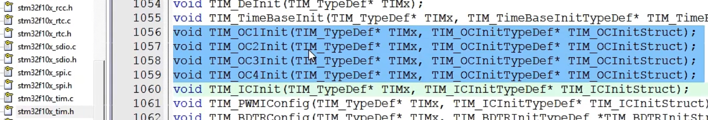
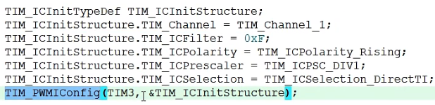

# 江协科技stm32教程
**本笔记从[5-1]EXTI外部（p12）开始记录，前面部分参见PPT（STM32入门教程.pptx，此PPT也是后续笔记的辅助文件）以及GoodNotes中STM32笔记本中的笔记（这个笔记本作为随手记录使用）。**
**2024/1/2 15:06 第一次记录**

---

## [5-1]EXTI外部中断

1. 主程序跳转到中断程序的过程是由**硬件电路**自动执行的。

- 中断执行前会对现场进行保护，C语言编程，编译器会自动做好保存和恢复工作。

- 中断跳转由于硬件的限制，只能跳转到固定的地址执行程序，为了能让硬件跳转到一个不固定的中断函数里，就需要在内存中定义一个地址的列表，列表地址是固定的，中断发生后，就跳到这个固定位置，然后再这个固定位置，由编译器加上一条跳转到中断函数的代码，这样中断函数就可以跳转到任意位置了，这个中断地址的列表，就叫**中断向量表**，相当于中断跳转的跳板。用C语言编程不需要管中断向量表，编译器帮我们做好了。

- 优先级数字越小，优先级越高，0是最高优先级。

- 外部中断有个功能：从低功耗模式的停止模式下唤醒STM32，如电源从电压过低恢复时，需要PVD借助外部中断退出停止模式；对于RTC闹钟，有时为了省电，RTC定了一个闹钟后，STM32会进入停止模式，等到闹钟响的时候再唤醒，这也需要借助外部中断，还有USB唤醒、以太网唤醒，也都是类似的作用。

- 到底什么样的设备需要外部中断呢？使用外部中断有什么好处呢？使用外部中断模块的特性：对于STM32来说，想要获取的信号是外部驱动的（STM32只能被动接收）很快的突发信号，如旋转编码器的输出信号；红外遥控接收头的输出；按键（不建议采用外部中断方式读取，不易处理按键抖动和松手检测的问题，按键的输出波形也不是转瞬即逝，如果不想用主循环读取得话，可以考虑定时器中断读取方式）。

## [5-2]对射式红外传感器计次&旋转编码器计次

- 只需要把外部中断从GPIO到NVIC出现的外设模块都配置好即可。
- **EXTI和NVIC不需要开启时钟。**RCC管理的都是内核外的外设，NVIC处于内核中所以管不到。
- AFIO的库函数和GPIO是一起的：

- 在主程序种查看和清除标志位用前两个函数，在中断函数中查看和清除标志位用后两个函数。后两个函数只能读取与中断有关的标志位，并且对中断是否允许做出了判断。
- 中断程序结束后，一定要调用清除中断标志位的函数，因为只要中断标志位置1程序就会跳到中断函数，如果不清除在中断标志位，那它就会一直申请中断：

- 最好不要在中断函数和主函数调用相同的函数或者操作同一个硬件，尤其是硬件相关的函数（比如OLED显示函数）。**在中断操作里操作变量或者标志位，当中断返回时再对这个变量进行显示和操作。**既能保证中断函数的简短快速，又能保证不产生冲突的硬件操作。

## [6-1]TIM定时中断

1. 定时器基本定时中断、内外时钟源选择
2. 定时器输出比较（产生PWM波形，用于驱动电机等设备）
3. 定时器输入捕获、主从触发模式
4. 定时器编码器接口

### 1.

16位计数器：用来执行计数定时的一个寄存器，每来一个时钟，计数器加1；

预分频器（16位）：对计数器时钟进行分频；

自动重装计时器（16位）：想要计多少个时钟申请中断；

这些寄存器构成了定时器最核心的部分，我们把这一块电路称为**时基单元**。

- **实际分频系数=预分频器的值+1**，预分频器时16位的，所以最大值可以写65535，也就是65536分频。对输入的基准频率提前进行分频操作。

- 
- 

​	计数值等于自动重装值产生的中断称为”**更新中断**“。更新中断之后就会通往NVIC，再配置好NVIC的定时器通道，那定时器的更新中断就能得到CPU的响应了。

​	向下的箭头代表会产生一个事件，这里对应的事件就叫做”**更新事件**“。更新事件不会触发中断，但可以触发内部其它电路的工作。

​	**主模式触发DAC实现硬件自动化，整个过程不需要软件的参与。**

- 关于三种定时器的计数模式：基本定时器只支持向上计数模式，通用定时器和高级定时器除了支持向上计数外还支持向下计数模式（从重装载寄存器向下自减，减到0回到重装值同同时申请中断）和中央对齐模式（先上到重装值申请中断，再向下自减到0申请中断）。

三种计数方式的形象化说明

**最常用的还是向上计数模式。**也是主要需要掌握的模式。

---

- 对于基本定时器而言，定时器只能选择内部时钟（也就是系统频率72MHz）。而对于通用定时器，不仅可以选择72MHz系统内部时钟，还可以选择外部时钟，具体有：来自TIMx_ETR引脚上（PA0）的外部时钟，滤波后的信号兵分两路，**ERTF又称作”外部时钟模式2“，TRGI又称作”外部时钟模式1“**。
- ITR0~3分别来自其他4个定时器的TRGO输出。通过这一路就可以实现定时器级联的功能。TI1F_ED表示通过这一路输入的时钟，上升沿和下降沿均有效。

总结一下就是，外部时钟模式1的输入可以是ETR引脚、其他定时器（ITR）、CH1引脚的边沿、CH1引脚和CH2引脚。一般情况下外部时钟通过ETR引脚就可以了。下面设置复杂的输入，不仅是为了扩大时钟的输入范围，更多还是为了某些特殊应用场景而设计的。比如为了定时器的级联而设计的ITR部分。对于时钟输入而言，最常用的还是内部的72MHz时钟。

对于高级定时器，主要改动的是右边的部分：

申请中断的地方增加了一个重复次数计数器，有了这个计数器以后，就可以实现每隔几个计数周期，才发生一次更新事件和更新中断，原来的结构式每个计数周期完成后都会发生中断，**相当于对输出的信号又做了一次分频**。

DTG（Dead Time Generate）是死区生成电路，为了防止互补输出的PWM驱动桥臂时在开关切换瞬间，由于器件不理想造成短暂的直通现象，所以前面就加上了死区生成电路，在开关切换瞬间，产生一定时长的死区，让桥臂的上下管全都关断，防止**直通现象**。右边的输出引脚由原来的一个变为了两个互补的输出，可以输出一对互补的PWM波。这些电路是为了驱动三相无刷电机的。三相无刷电机常用于四轴飞行器、电动车的后轮、电钻等。

最后一部分就是刹车输入的功能，给电机驱动提供安全保障。如果外部引脚BKIN（Break In）产生了刹车信号，或者内部时钟失效，产生了故障，那么控制电路就会自动切换电机的输出，防止意外发生。

中断信号会先在状态寄存器里置一个中断标志位，这个标志位会通过中断输出控制，到NVIC申请中断。为什么需要中断输出控制？因为这个定时器模块有很多地方都需要申请中断，不仅更新要申请中断，触发信号也会申请中断，还有下面的输入捕获和输出匹配时也会申请，所以这些中断都要经过中断输出控制，如果需要这个中断就允许，不需要就禁止。简单来说，这个中断输出控制就是一个中断输出的允许位，如果需要某个中断就记得允许一下。

* PPT58开始的时序图补充：预分频器为了防止计数中途更改数值造成错误，设计了缓冲寄存器，计数器也少不了这样的设计。**结构图中带黑色阴影的寄存器都是有影子寄存器这样的缓冲机制的**，包括预u分频器、自动重装寄存器（**ARR**）和下面的捕获比较寄存器。
* ARR的缓冲寄存器用与不用是可以自己设置的。计数器无预装时序就是没有缓冲寄存器的情况，有预装时序就是有缓冲寄存器的情况。**通过设置ARPE位，就可以选择是否使用预装功能。**引入影子寄存器的目的是为了同步，让值的变化和更新事件同步发生，防止在运行途中更改造成错误。

视频41：01讲了RCC时钟树相关内容。时钟是所有外设运行的基础，所以时钟也最先需要配置的东西。外部的石英振荡器（OSC，oscillator）比内部的RC振荡器更加稳定，所以一般都用外部晶振。

---

## [6-2]定时器定时中断和定时器外部时钟

- 因为定时器和中断系统的电路都在STM32内部，定时中断也是为程序设计提供服务的，所以芯片外面只插一个OLED显示数据就行了。

- 先在”Timer.c“文件中定时器进行初始化，创建`void Timer_Init(void)`函数。
  - RCC开启时钟，定时器基准时钟和整个外设的工作时钟就会同时打开了。
  - 选择时基单元的时钟源，这里选择RCC内部时钟。
  - 配置时基单元，这里用一个结构体就可以配置好了。
  - 配置输出中断控制，允许更新中断输出到NVIC。
  - 配置NVIC，在NVIC打开定时器中断的通道，并分配一个优先级。
  - **运行控制**，整个模块配置完后还需要使能一下计数器，不然计数器是不会运行的。

当定时器使能后，计数器就会开始计数了，当计数器更新时，触发中断；最后再写一个定时器的中断函数，这样这个中断函数每隔一段时间就能自动执行一次了。

> 
>
> 左上角的小棋子🚩是用来插书签用的，不影响代码的运行。

`void TIM_Cmd(TIM_TypeDef* TIMx, FunctionalState NewState);`用来使能计数器（也就是与运行控制相关），第一个参数选择定时器，第二个选择状态（使能、失能）。

* 注意预分频器的值和自动重装寄存器的值要比实际系数分频系数与溢出系数小1，所以在确定溢出频率后（比如此代码设定1Hz，即1s溢出一次）后，二者都要在原参数上-1，两个参数的最大值均不超过65535，也就是0xFFFF）。

- 配置时基单元中TIM_ClockDivision一项是用来决定ETR/TIx的输入滤波器采样频率相对于内部时钟（CK_INT）的分频系数的。采样频率可以由CK_INT直接得来（就是直接是CK_INT），或者由CK_INT分频而来，采样频率越高，采样点数越多，滤波效果越好。可见这个参数和时基单元关系并不大。这里配置为DIV1，即不分频。

- 如果想跨文件使用变量，有两种方式：

  - [ ] 在使用变量的文件（区分于定义变量的文件）的上面用**extern**声明一下要用的变量（如下图所示）。全局变量不是编译器在找，而是在链接时，链接器会进行符号的解析和重定位，将定义处的地址给到引用全局变量的位置。

  

  其实头文件的函数声明也是用extern实现的，在声明的函数前是有一个extern的，只不过这个extern可以省略，所以我们一般不写。

  - [x] 直接把TIM2的中断函数放在主函数里。对于定时中断而言，中断函数就是为别的文件服务的，所以中断函数可以放在使用它的地方。

---

上图是复位后计数器值从1开始的原因，在`TIM_TimeBaseInit(TIM2, &TIM_TimeBaseInitStructure);`函数最后一行。因为预分频器是有缓冲寄存器的，我们写的值只有在更新事件时才会真正起作用，这里为了让值立刻起作用，就在最后手动生成了一个更新事件。副作用是，更新事件和更新中断是同时发生的，更新中断会置更新中断标志位，之后一旦初始化完成，更新中断就会立刻进入。这就是刚一上电就立刻进中断的原因。

解决方案：

在TIM初始化后，开启中断之前，手动清除更新中断标志位。**⚠这里清除标志位后从0~1的计数时间实际上小于1s。要注意预分频器寄存器的更新时机。**

**接下来是定时器外部时钟部分：**

如果采用对射式红外计数器产生外部时钟波形时发现CNT和Num数字乱跳，适当提高外部触发滤波即可。

## [6-3] TIM输出比较

**主要是用来输出PWM波形的，PWM波形又是驱动电机的必要条件。**使用PWM波形，就可以在数字系统等效输出模拟量。就能够实现LED控制亮度、电机控速等功能了。

- OC：Output Compare输出比较
- IC：Input Capture输入捕获
- CC：Capture/Compare捕获/比较

1. 分辨率=占空比的步距：如果占空比以1%、2%、3%……这样的步距跳变，那么它的分辨率就是1%，如果能以1。1%、1.2%、1.3%……这样的步距跳变，那么分辨率就是0.1%。分辨率就是**占空比变化的细腻程度，分辨率大小看实际项目的需求。**
2. 改变定时器更新频率时，输出波形的频率也会随之改变，关系为：输出波形的频率=更新频率/2，因为更新两次输出才为一个周期。

- 4个初始化函数对应4个输出比较单元（输出比较通道），需要初始化哪个通道就调用哪个函数，不同的通道对应的GPIO口是不一样的，要按照GPIO口的需求来。这里使用PA0口，对应的就是第一个输出比较通道。
- 初始化结构体里面很多带N的参数都是高级定时器才需要使用的参数，使用通用定时器可以不对其进行初始化。
- **对于同一个定时器的不同通道输出的PWM**，由于不同通道共用同一个计数器，所以他们的频率是一样的（分辨率也就是一样的了），它们的占空比由各自的CCR决定。对于相位，由于计数器更新，所有PWM同时跳变，所以它们的相位是同步的。如果驱动多个舵机或者直流电机，使用同一个定时器不同通道的PWM就完全可以了。

---

## [6-5] TIM输入捕获 / [6-6]

- 对于STM32测频率而言，它只能测量数字信号，如果需要处理正弦波，还需要设计一个预处理电路将正弦波处理为数字信号，高电平3.3V低电平0V再输入给STM32，最简单的就是用运放搭一个比较器。如果输入的电压比较高还需要考虑隔离问题。

- 测频法适合测量高频信号，测周法适合测量低频信号。测频法在闸门时间内最好多出现一些上升沿，测周法在两个上升沿内最好多计一些次数。测频法要求信号频率要稍微高一些，在计次N很少时，误差会非常大；测周法要求信号频率低一些，低频信号周期比较长，计次就会比较多，有助于减小误差。测频法测量结果更新的慢一些，数值相对稳定；测周法更新的快，数据跳变也非常快。测频法测量的是在闸门时间内的多个周期，**所以它自带一个均值滤波**，如果在闸门时间内波形频率有变化，那么得到的是这段时间的平均频率，如果闸门时间选为1s，那么每隔1s才能得到一次结果，所以测频法结果更新慢，测量结果是一段时间的平均值；测周法测量一个周期就能出结果，结果值会受噪声影响，波动也比较大。

- 计次N可能会出现**“正负1误差”**，也就是计次不完整，上面两种方法都会出现，当计次N比较大时正负1对N的影响就会很小。

- 中界频率由以上两种方法联立N求出fm，当待测频率小于fm时用测周法，大于fm时用测频法。

- TI1FP2和TI2FP1交叉的目的主要有两个：1. 可以灵活切换后续捕获电路的输入，2. 可以把一个引脚的输入同时映射到两个捕获单元，这也是PWMI模式的经典结构。总结就是：一个通道灵活切换两个引脚和两个通道同时捕获一个引脚。

- TRC和异或门是为了无刷电机的驱动。

- **主从模式触发器是UP主自创的名词**，主模式用于定时器控制外设，从模式用于外设控制定时器。

- 先转运CNT的值到CCR中去，再触发从模式给CNT清零。

- `TIM_ICInitStructure.TIM_ICPrescaler`参数表示分频，不分频就是每次选定的时钟沿都触发，二分频就是每隔一个时钟沿触发一次，四分频就是每隔三个周期触发一次。

- 使用一个定时器同时监测一个输入的上升、下降沿有两种方法，可以用一个输入捕获单元初始化结构体分别初始化通道1和通道2，通道2使用交叉输入（如下图），另一种方法是使用`TIM_PWMIConfig`函数。

  

  

​	使用这个函数只需要传入一个通道的参数就行了，在函数里，会自动把剩下的一个通道初始化成相反的配置。**这个函数只支持通道1和通道2的配置，不要传入通道3和通道4。**

- 如果测得频率比预想值大1，可能是由于CNT从0开始计数，实际所记数值比写入到CCR的值要多1，所以通过测周法得到的待测频率要比实际值大。

---

## [6-7] [6-8] TIM编码器接口

- 使用定时器的编码器接口实现自动计次（之前的代码时通过触发外部中断，在中断函数里手动进行计次）的好处就是节约软件资源，如果使用外部中断计次，程序就得频繁进中断。
- 编码器的资源还是比较紧张的，如果定时器被配置为编码器基本上就干不了其他的活了。
- 采用正交信号的好处是：首先A、B相都可以计次，相当于几次频率提高了一倍，其次是正交信号可以抗噪声。
- 由查ppt中表可知，正转状态都向上计数，反转状态都向下计数，这就是编码器接口执行逻辑。一般都使用“在TI1和TI2上计数”的模式，精度高。
- 在编码器接口基本结构中，边沿检测极性选择不再是边沿的极性选择（因为上升沿下降沿都用于计次），而是高低电平的极性选择。上升沿参数代表的是高低电平极性不反转（反相），下降沿表示高低电平反相。
- **编码器接口可以看作是带方向控制的外部时钟**。

## [7-1] [7-2] ADC模数转换器

- 使用DAC可以将数字变量转换为模拟电压，另一个数字到模拟的桥梁是PWM，PWM只有完全导通和完全断开两种状态，在这两种状态上都没有功率损耗，所以在直流电机调速等大功率应用场景，使用PWM等效模拟量是比DAC更好的选择，并且PWM比DAC更加常用。**目前DAC的应用主要在波形生成领域：信号发生器、音频解码芯片。**DAC内部使用加权电阻网络实现转换。

- 12位逐次逼近型ADC，1us转换时间：涉及到ADC的两个关键参数，第一个是分辨率，一般用多少位来表示（12位AD值，表示范围是0~4095），量化结果的范围是0~4095，位数越高，量化结果越精细，对应分辨率越高；转换时间表示从AD转换开始到产生结果需要花1us，对应AD转阿欢频率就是1MHz，这就是STM32 ADC的最快转换频率。

- 内部参考电压是一个1.2V左右的基准电压，这个基准电压是不随外部供电电压变化而变化的。如果芯片供电不是标准的3.3V，测量外部引脚的电压可能就不对，这时就可以读取这个基准电压进行校准，这样就能得到正确的电压值了。

- Vref+和Vref-在内部就已经和Vdda和Vssa接在一起了：

  

​	所以与图示不同的是，实际上是没有Vref+和Vref-的引脚引出的。

- EOC是规则组的转换结束信号，JEOC是注入组的转换结束信号，[STM32 ADC的规则通道和注入通道有什么区别（转）_stm32adc转换时，有注入组和规则组，注入组最多由多少个通道数组成。每个通道专门用来管理来自于一-CSDN博客](https://blog.csdn.net/eryijimi/article/details/79788750)。
- 出发控制可以选择硬件触发和软件触发，硬件触发主要来自于定时器（TRGO），也可以选择外部中断引脚。
- ADC时钟来自RCC经过预分频后的时钟，由于ADCCLOCK最大限制14MHz，72MHz的内部时钟只能采用6分频或8分频。
- 双ADC模式就是ADC1、ADC2一起工作，他们配合可以组成同步模式、交叉模式（可以进一步提高采样频率）等等模式。
- 一般选择数据右对齐，左对齐的数据相当于比实际值大16倍。选择左对齐的目的是如果不需要12位的分辨率，就可以采用左对齐的方式并读取寄存器的高8位，这样就舍弃掉了后面4位的精度，12位的ADC就退化为8位的ADC。
- 在ADC开启后，可以调用校准函数对ADC进行校准，注意，F4系列不需要校准。

## [8-1] [8-2]DMA直接存储器存取/DMA数据转运/+AD多通道

- ”直接存储器存取“包括运行内存SRAM、测u那个需存储器Flash和寄存器等等。
- 特定的硬件触发：**每个DMA通道的硬件触发源是不一样的**，要使用某个外设的硬件触发源，就得使用它连接的那个通道。
- 存储器映像中的各类型存储器终止地址取决于存储器的容量，彼岸到哪里，那里就是终止地址。
- 系统存储器和选项字节也是flash，只是平时提到flash是说得一般是程序存储器flash（主闪存flash）。外设寄存器和内核外设寄存器于运行内存RAM同理。
- 0地址实际上是没有存储器的，别名到Flash存储器或者系统存储器，取决于BOOT引脚。需要把我们想要执行的程序，映射到0地址来。
- DMA框图中，总线矩阵的左端是主动单元，也就是拥有存储器的访问权，右边是被动单元，他们是存储器，只能被左边的主动单元读写。
- DCode总线是专门访问flash的，系统总线是访问其他东西的，由于DMA要转运数据，所以DMA也必须要有访问的主动权，主动单元除内核CPU外，剩下的就是DMA总线了。
- DMA各个通道可以分别设置它们转运数据的源地址和目的地址，这样它们就可以各自独立工作了。仲裁器根据通道优先级决定通道对DMA总线的使用顺序。总线矩阵也有DMA仲裁器，如果DMA和CPU都要访问同一个目标，那么DMA就会暂停CPU的访问以防止冲突，不过总线仲裁器仍然会保证CPU得到一般的总线带宽，使CPU正常工作。
- DMA既是总线矩阵的主动单元，可以读写各种存储器，也是AHB总线上的被动单元，CPU通过“系统->总线矩阵->AHB从设备”这条线路就可以对DMA进行配置了。

- DMA请求就是触发的意思，触发源是各个外设，框图上的DMA请求就是DMA硬件触发源。
- **CPU或者DMA直接访问Flash得话是只可以读不可以写的**，如果要写Flash需要配置Flash接口控制器，要先对Flash按页进行擦除，再写入数据。
- 外设寄存器有的是只读的，有的是只写的，不过外设的数据寄存器都是可以正常读写的。
- **STM32中谈到存储器一般是指Flash和SRAM，外设寄存器一般称作外设**，这是描述方法上的区别。
- 外设和存储器的三个参数中，起始地址指定了数据从哪里来到哪里去；数据宽度指定一次转运要按多大的数据宽度来进行；可以选择Byte、Half Word、Word；地址是否自增是p++的意思，地址指针需要指向下一个地址。
- **外设存储器并不是只能写寄存器地址，也可以写存储器地址，只是名字这样叫而已**。
- 传输计数器是自减计数器，用来指定转运次数。归零后之前自增的地址也会恢复到起始地址的位置，以方便之后DMA开始新一轮的转换。
- 软件触发：执行逻辑是以最快的速度连续不断地触发DMA，争取早日把传输计数器清零，完成这一轮的转换。和之前外部中断和ADC的软件触发不太一样。**可以理解为连续触发**。软件触发和循环模式不能同时用。软件触发一般适用于存储器到存储器的转运。、
- DMA进行转运的三个条件：1.开关控制（DMA_Cmd必须使能），2. 传输计数器必须大于0，3. 触发源必须有触发信号。当传输计数器等于0且没有自动重装时，这时无论是否触发，DMA都不会再进行转运了。写传输计数器时必须先DISABLE DMA再进行，不能在DMA开启时写传输计数器，这时手册里的规定。
- 数据转运是一种复制转运，转运完成后DataA的数据并不会消失。
- ADC扫描模式，在每个单独的通道转换完成后，没有任何标志位也不会触发中断，所以程序不太好判断某一个通道转换完成的时机是什么时候，**但是每个通道转换完成后会产生DMA请求触发DMA转运**。
- 关于位带、位段：[STM32 位段详解_stm32位段-CSDN博客](https://blog.csdn.net/Firefly_cjd/article/details/107351639)。
- 在STM32中，使用const定义的“变量”是存储在Flash里面的。对于变量或者常量的地址是由编译器决定的，不同的程序地址可能不一样，是不固定的，对于外设寄存器来说地址是固定的（手册里有写），在程序中也可以用结构体访问寄存器。																																						
