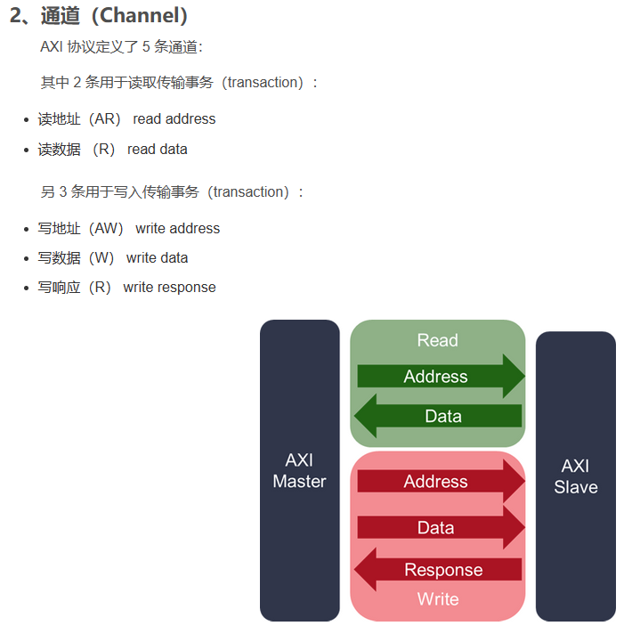
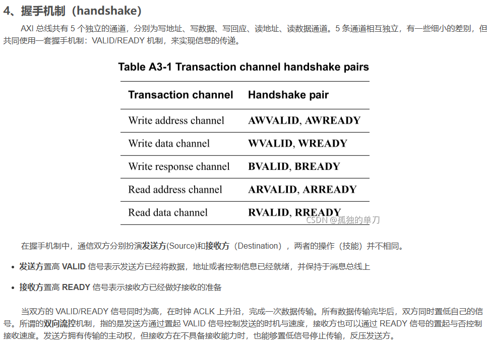

AXI4有AXI4-Stream、AXI4-Lite和AXI4-Full（也直接称为AXI4），后两者都是内存映射型总线（需要地址），是多主多从的拓扑结构。

# 1.AXI4-Full

[详解AXI4-Full接口（1）--什么是AXI4-Full接口？-CSDN博客](https://blog.csdn.net/wuzhikaidetb/article/details/121509404)

根据下图所示，每个地址中可以发生多次数据传输。此类型的传输事务称为突发（burst），需要注意的是AXI4-Full是支持突发的，而AXI4-Lite是不支持突发的， 或者说“突发长度为1”。

**通道关系**，各个通道之间基本是独立的，以下三种联系除外：

- 写回复必须在其所属传输的最后一个写数据完成后；
- 读数据必须在接收到读地址信号后产生；
- **通道间的握手需要满足通道间的握手依赖性（handshake dependencies）**

为了防止死锁情况的发生（如valid信号等ready信号，而ready信号又在等valid信号，这样就永远没办法握手，握手信号需满足以下规则）：

- 发送方的valid信号不能依赖ready信号来置位
- 接收方ready信号可以检测到valid置为后再置位

# 2. AXI-Lite

[详解AXI4-Lite接口（1）--什么是AXI4-Lite接口-CSDN博客](https://blog.csdn.net/wuzhikaidetb/article/details/121518804)

- 事务传输突发长度为1
- 每次只传输一个数据
- 所有访问的都是不可修改（Non-modifiable），不可缓冲（Non-bufferable）
- 不支持专属访问（独占访问通常用于实现多处理器间的同步机制）

AXI4-Lite比起AXI4-Full总线来说，由于每次只能传输一个数据，涮熟效率低了很多。比较适用的场景是单次访问某个寄存器（地址寻址），类似于IIC总线的单词读写。在SoC系统或者ZYNQ中比较常用。

**AXI-Lite总线只支持固定的传输总线位宽（32bit和64bit），一般来讲使用32bit，只有需要64位原子访问的组件才使用64位接口。**

