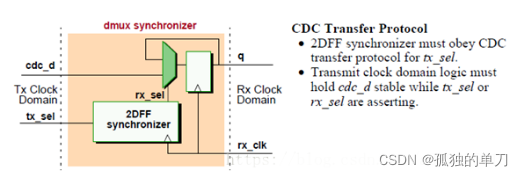

这个md是5篇来自博主“孤独的单刀”博客的笔记，主题是CDC

- 前三篇来自《Clock Domain Crossing ([CDC](https://so.csdn.net/so/search?q=CDC&spm=1001.2101.3001.7020)) Design & Verification Techniques Using SystemVerilog》的翻译

- 后两篇分别是单bit和多bit信号跨时钟域的设计方法

---

[跨时钟域处理解析（一）（Clock Domain Crossing (CDC) Design & Verification Techniques Using SystemVerilog）_跨时钟采样比较分析-CSDN博客](https://wuzhikai.blog.csdn.net/article/details/122874278)

1. 亚稳态的产生是由于寄存器采样不满足建立时间或保持时间的要求导致的，亚稳态的产生是无法避免的，我们能做的只是想办法降低其发生的概率。在跨时钟域设计中，由于时钟域存在跨域，如果不采取手段，则会有很大概率引入亚稳态。
2. 亚稳态最大的危害就是会将系统引入一个未知状态，对于许多设计而言，这无疑是致命的。

3. 并不是所设计都需要全部数据都被采样。例如，异步FIFO设计中，就可以允许漏采的存在。因为异步FIFO的设计最重要的是正确（或者说不错误）地判断FIFO的空、满。漏采一些数据并不会对其判断空满造成错误，某种意义上还会使其设计更加安全。

> 跨CDC 边界传递信号时可能出现两种情况，确定哪种情况适用于您的设计很重要：
>
> - 允许错过在时钟域之间传递的样本。
>
> - 在时钟域之间传递的每个信号都必须被采样。
>
>   第一种情况：有时不需要对每个值都进行采样，但重要的是采样值必须要准确。一个例子是标准异步FIFO设计中使用的一组格雷码计数器。在正确设计的异步FIFO 模型中，同步格雷码计数器不需要从相反的时钟域中捕获每个合法值，但至关重要的是采样值必须准确以识别何时发生满和空情况。
>
>   **第二种情况：**CDC 信号必须被正确识别或识别和确认（即握手--译者注），然后才允许对CDC 信号进行更改。
>
>   在这两种情况下，CDC 信号都需要某种形式地同步到接收时钟域中。

4. 双触发器同步，即为经典的打两拍，可适用大多数的一般设计。
5. 前面说了，亚稳态的产生是无法避免的，只能尽量避免。所以**人们引入了MTBF这个参数来表征两次故障之间的时间，即多久会发生一次亚稳态**。若能将MTBF控制在几十年，则该设计即可视为几乎不会发生亚稳态的设计。对于军工级或其相同级别设计、或者超高速设计，又或者可靠性要求较高的设计，可能需要打三拍，或者更多拍，这个取决于设计要求或公司规定。 

6. 在数据被同步到异步时钟域之前，首先需要在自己的时钟域寄存一拍，以消除组合逻辑产生的毛刺。防止毛刺传播到其他时钟域，从而防止在数据采样时存在多个边沿，造成采样失败而发生亚稳态。

---

[跨时钟域处理解析（二）（Clock Domain Crossing (CDC) Design & Verification Techniques Using SystemVerilog）-CSDN博客](https://blog.csdn.net/wuzhikaidetb/article/details/123510456?spm=1001.2014.3001.5501)

1. 多bit信号的CDC问题主要来自信号之间的Skew（简单地理解为到达目的时钟域的时间无法控制一致），可能的后果就是某些bit可能还没到达，但是某些bit已经被采样了。比如在一个跨CDC边界的逻辑控制，需要2bit信号来做逻辑控制。跨时钟域传输这2bit信号的过程中，由于信号到达目的时钟域的时间不一致（存在Skew），导致2个信号无法在同一个时钟周期进行采样造成了数据漏采，从而使得预期功能无法实现。**把控制信号合并不失为一个好办法。**

---

[跨时钟域处理解析（三）（Clock Domain Crossing (CDC) Design & Verification Techniques Using SystemVerilog）_dc怎么设置跨时钟域-CSDN博客](https://wuzhikai.blog.csdn.net/article/details/123521798)

1. 设计尽量模块化、细化，然后每个模块都只使用一个时钟，最后通过顶层模块（可以有数个层级）来讲子模块汇总，从而将CDC问题控制在顶层模块有效地减少问题发生的概率。

# [跨时钟域（CDC）设计方法之单bit信号篇（一）_握手实现cdc-CSDN博客](https://blog.csdn.net/wuzhikaidetb/article/details/123465709?spm=1001.2014.3001.5501)

1. 什么是跨时钟域？原本属于时钟域A的信号A需要传入到另一时钟域B来对其进行操作，这一操作称为跨时钟域Clock Domain Crossing, CDC。由于双方时钟频率、相位等的差异，导致**原本属于时钟域A下的同步信号A变成了一个时钟域B下的异步信号**。异步信号有概率无法满足触发器的建立时间要求和保持时间要求。一旦出现建立时间和保持时间违例，则有可能会导致系统发生亚稳态。在信号传输中产生亚稳态就会导致与其相连其他数字部件将其作出不同的判断，有的判断到“1”有的判断到“0”，有的也进入了亚稳态，数字部件就会逻辑混乱。

2. 跨时钟域处理方法可以分为两个大类：**单Bit信号跨时钟域处理、多Bit信号跨时钟域处理**。分类的原因是多bit信号的传递不光只有亚稳态这一个问题，还可能会因为多个信号之间由于工艺、PCB布局等因素导致的信号传输延时（skew）的存在，从而导致信号被漏采或者错采。
3. 信号从源时钟域跨到目的时钟域后，需要在目的时钟的“指挥”下进行操作，这一过程可视为用目的时钟对被处理后的信号进行“采集”，既然是采集，则必须满足奈奎斯特采样定理，**也就是说目的时钟频率需要至少是源时钟频率的2倍。**在实际应用过程中，不光需要将慢时钟域信号跨到快时钟域，也需要将快时钟域信号跨到慢时钟域，而后者显然是无法满足采样定理的，所以需要进行一些特定处理。
4. 电平信号：如果是电平信号进行CDC，不用考虑时钟快慢直接用2级同步器即可，因为总能被采到。**实际上可将电平信号看作一个频率超低的脉冲信号**。
5. 从快时钟域到慢时钟域的脉冲信号：将脉冲信号拓宽到一定程度，但是有一定的局限性
   - 若需要同步的两个脉冲信号距离很近，则第一个脉冲信号的扩宽可能会覆盖第二个脉冲信号，从而导致第二个脉冲信号漏采
   - 脉冲信号是以目的时钟为参考的，但是若不知道目的时钟的频率，则方法可能失效，也就是说该方法不具备普遍性

6. 一种普遍方法是使用握手法来进行CDC，**握手法的本质是负反馈**。通俗来讲，就是先将被CDC信号展宽，展宽后将其同步到目的时钟域，再目的时钟域生成指示信号，该指示信号用来指示次时信号已经被目的时钟域接收，然后将指示信号反馈到源时钟域（反馈过程），源时钟域接收到这个反馈信号后将被CDC信号拉低，从而确定了展宽长度。也通过“发送——反馈——操作”这一握手过程完成了一次CDC传输。

# [跨时钟域（CDC）设计方法之多bit信号篇（一）_多bit跨时钟域-CSDN博客](https://wuzhikai.blog.csdn.net/article/details/123653241)

1. 跨时钟域处理方法可以分为两个大类：单bit信号跨时钟域处理、多bit信号跨时钟域处理。分类的原因是多bit信号的传递不光有亚稳态这一个问题，还可能会因为多个信号之间由于工艺、PCB布局等因素导致信号传输延时（skew）的存在，从而导致信号被漏采或错采。
   - 合并多个控制信号
   - 格雷码
   - 握手法

2. 握手法是一种很保险的方法，但是缺点也很明显：需要的时序开销很大。

3. DMUX同步器？

