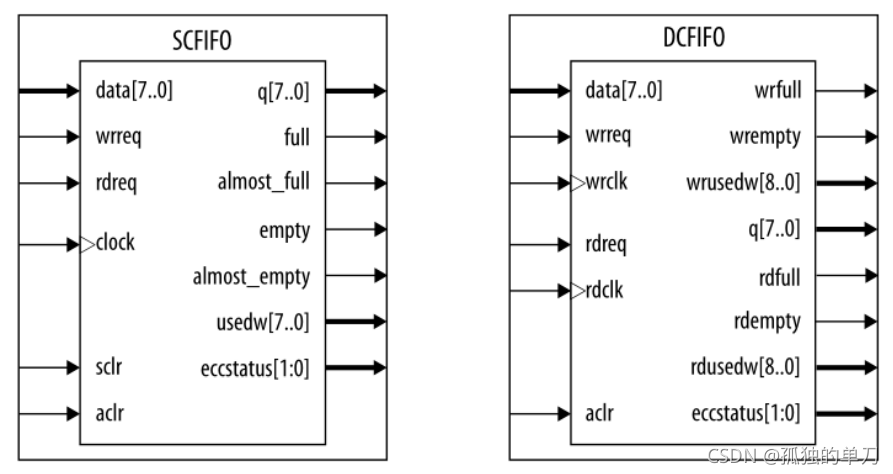
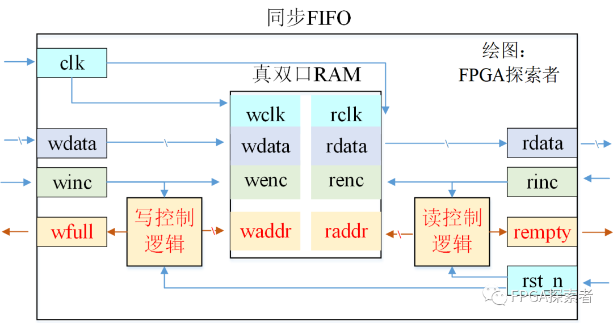
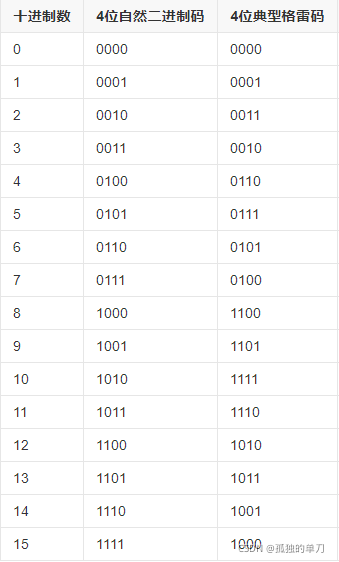
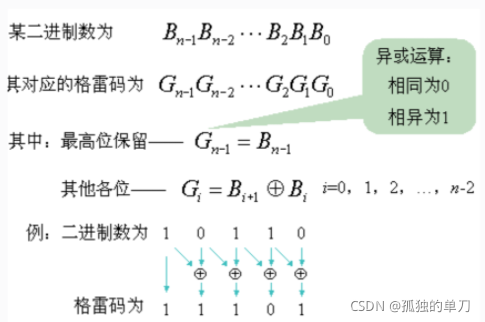
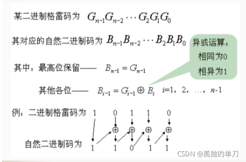
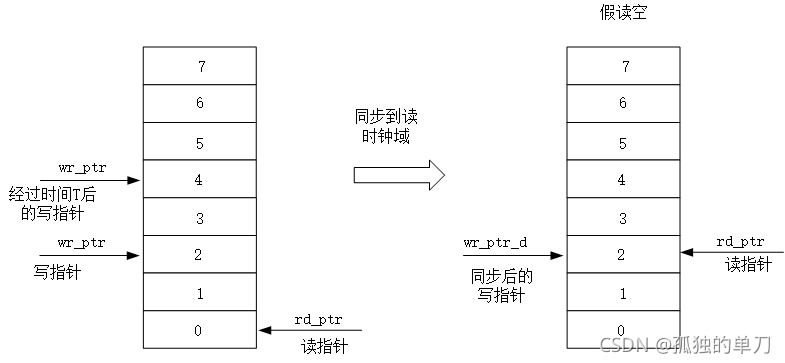
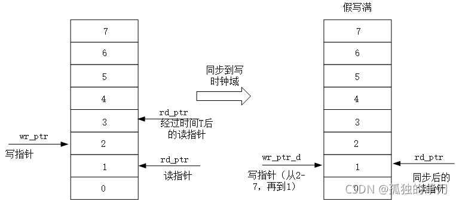
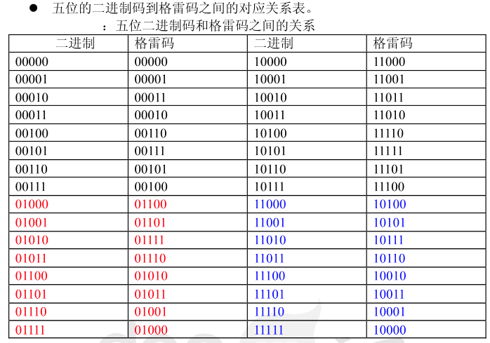
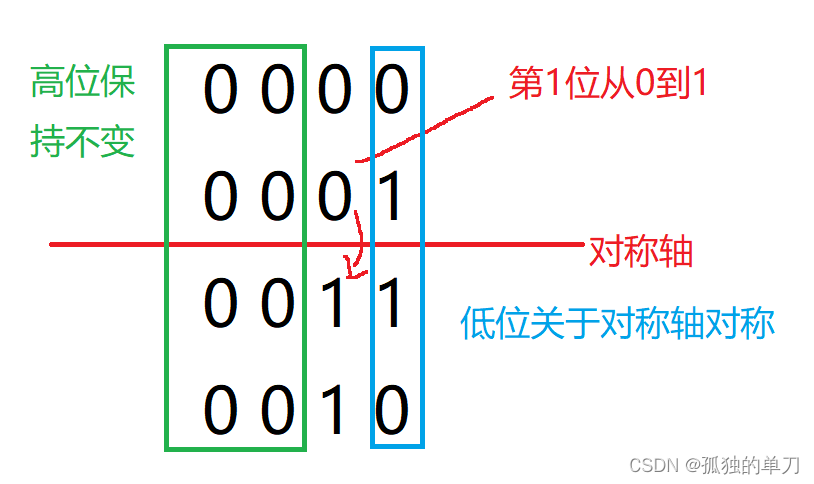
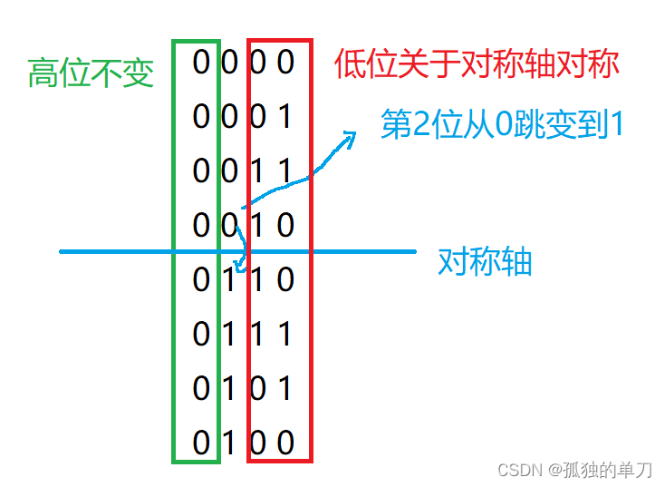

# [同步FIFO的两种Verilog设计方法（计数器法、高位扩展法）_fifo的构建方式-CSDN博客](https://wuzhikai.blog.csdn.net/article/details/121136040)

FIFO是一种先进先出的数据缓冲器，包括同步/异步FIFO。同步FIFO有一个时钟信号，读写逻辑全部使用这一个时钟信号，异步FIFO有两个时钟信号，**读和写逻辑用各自的读写时钟**。

==FIFO 本质上是由 RAM 加读写控制逻辑构成的一种先进先出的数据缓冲器。==



**FIFO 的常见参数**

FIFO 的宽度：即 FIFO 一次读写操作的数据位
FIFO 的深度：指的是 FIFO 可以存储多少个 N 位的数据（如果宽度为 N）
满标志：FIFO 已满或将要满时由 FIFO 的状态送出的一个信号，以阻止 FIFO 的写操作继续向 FIFO 中写数据而造成溢出（overflow）
空标志：FIFO 已空或将要空时由 FIFO 的状态送出的一个信号，以阻止 FIFO 的读操作继续从 FIFO 中读出数据而造成无效数据的读出（underflow）
读时钟：读操作所遵循的时钟，在每个时钟沿来临时读数据（同步FIFO中与写时钟一致）
写时钟：写操作所遵循的时钟，在每个时钟沿来临时写数据（同步FIFO中与读时钟一致）

---

### 同步FIFO的设计方法

FIFO 读写指针（读写指针就是读写地址）的工作原理：

- **写指针**：**总是指向下一个将要被写入的单元**，复位时，指向第 1 个单元(编号为 0) 
- **读指针**：**总是指向当前要被读出的数据**，复位时，指向第 1 个单元(编号为 0) FIFO 的“空”/“满”检测 

FIFO设计的关键：**产生可靠的FIFO读写指针**和**生成FIFO“空/满”状态标志**

- 当读写指针相等时，标明FIFO为空，这种情况发生在复位操作时，或当读指针读出FIFO中最后一个字后，追赶上了写指针时；
- 当读写指针再次相等时，标明FIFO为满，这种情况发生在，当写指针转了一圈，折回来（wrapped around）又追上了读指针。

可见读写指针可以在读写时能有效时，每时钟周期+1，而如何产生可靠的“空/满”信号则成了同步FIFO设计的重点。

#### 方法1：计数器法

构建一个计数器，该计数器用于指示当前FIFO中数据的个数：

reg [$clog2(DATA_DEPTH) : 0] fifo_cnt;

{rd_en, wr_en}

- 复位时，该计数器为0，FIFO中的数据个数为0
- 当读写时能信号均有效时，说明又读又写，计数器不变，FIFO中的·数据个数无变化
- 当写使能有效且!full则fifo_cnt+1，表示写操作且FIFO未满的时候，FIFO中的数据个数增加了1
- 当读使能有效且!empty则fifo_cnt-1，表示读操作且FIFO未空的时候，FIFO中的数据个数减少了1
- fifo_cnt == 0的时候，表示FIFO空，需要设置empty = 1；fifo_cnt == fifo深度的时候，表示FIFO现在已满，需要设置full = 1

#### 方法2：高位扩展法

        举例在深度为8的FIFO中，需要3bit的读写指针来分别指示读写地址3'b000-3'b111这8个地址。若将地址指针扩展1bit，则变成4bit的地址，而地址表示区间则变成了4'b0000-4'b1111。假设不看最高位的话，后面3位的表示区间仍然是3'b000-3'b111，也就意味着最高位可以拿来作为指示位。
- **当最高位不同，且其他位相同**，表示读指针或写指针多跑了一圈，而显然不会让读指针多跑一圈（多跑一圈读啥？），所以可能出现的情况只能是写指针多跑了一圈，意味着FIFO被写满了
- **当最高位相同，其他位也相同**，则表示读指针追到了写指针或者写指针追到了读指针，而显然不会让写指针追读指针（这种情况）



---

### Verilog实现格雷码与二进制码互相转换

格雷码是一种**循环二进制码**或者叫做反射二进制码。格雷码的特点是从一个数变为相邻的一个数时，只有一个数据位发生跳变，由于这种特点，就可以避免二进制编码计数组合电路中出现的亚稳态。==格雷码通常用于通信，FIFO或者RAM地址寻址计数器中。==



可以看到，上表中格雷码的每次变化位数只有一位，这就有效的避免了在CDC情况（跨时钟域情况）下亚稳态问题发生的概率。

> 比如当数字从 7 变为 8 时，4 位二进制数都发生跳变，如果直接使用异步时钟采样这些数字信号，这就很可能会发生亚稳态或者数据采样错误。而采用格雷码，就可以避免 4 位二进 制数都同时发生跳变，导致出现的亚稳态，就算出现亚稳态，最多也就一位出现错误。

但是由于格雷码是一种**变权码**，每一位码没有固定的大小，所以很难直接进行比较大小和算数运算。

二进制码转换为格雷码的原理如下：



> 假如是4 bits的二进制数据转成格雷码则是：
>
> gray[3] = 1'b0    ^ bin[3];——gray[3] = bin[3] 异或0等于自身
>
> gray[2] = bin[3] ^ bin[2];
>
> gray[1] = bin[2] ^ bin[1];   
>
> gray[0] = bin[1] ^ bin[0];

 根据上面的式子不难推出一般公式`gray = (bin >> 1) ^ bin`

```verilog
module bin2gray
#(paramter data_width)
(
    input [data_width-1 : 0] bin,
    output [data_width-1 : 0] gray
);
    
assign gray = (bin >> 1) ^ bin;
    
endmodule
```


格雷码转二进制码原理如下：



> 假如是4 bit的格雷码转换成二进制则是：
>
> bin[3] = gray[3];
>
> bin[2] = gray[2] ^ bin[3];
>
> bin[1] = gray[1] ^ bin[2];
>
> bin[0] = gray[0] ^ bin[1];

```verilog
module gray2bin
#(parameter data_width = 'd4)
(
    input [data_width-1 : 0] gray,
    output [data_width-1 : 0] bin
);
    assign bin[data_width-1] = gray[data_width-1];
    genvar i;
    generate
        for(i = 0; i <= data_width-2; i = i + 1)
            begin: gray
                assign bin[i] = bin[i+1] ^ gray[i];
            end
    endgenerate
endmodule
```

---

# [＜FPGA＞异步FIFO的Verilg实现方法_fpga fifo verilog-CSDN博客](https://wuzhikai.blog.csdn.net/article/details/121152844)

主要就是解决好**异步FIFO中的跨时钟域比较读写指针**的问题（也就是可以在采用同步FIFO设计之高位扩展法的前提下进行进一步分析）

#### 同位宽的异步FIFO设计及分析验证：

假读空示意图如下：



假写满示意图如下：




- **“写满”的判断：需要将读指针同步到写时钟域，再与写指针判断**
- **“读空”的判断：需要将写指针同步到读时钟域，再与读指针判断**


如何用格雷码判断空满？

首先我们需要将指针向高位拓展一位，这是为了判断写指针是否超过读指针一圈。然后通过对比除了最高位的其余位来判断读写指针是否重合。这种方法判断二进制的指针是没有问题的，但是这不适合格雷码形式的指针，因为**格雷码是镜像对称的，若只根据最高位是否相同来区分是读空还是写满是有问题的**，如下图：



假如仅仅通过判断读写指针除了最高位的余下位的话，那么势必会出现判断错误而引发误报的写满和读空信号。举例：读指针指向0，写指针指向15.0的格雷码与15的格雷码的最高位不同，其余位相同，所以判断为写满——这就出现误判了。

因此用格雷码判断是否为读空或写满应当看最高位和次高位是否相等，具体如下：

- **当最高位和次高位相同，其余位相同则认为“读空”**
- **当最高位和次高位不同，其余位相同则认为是“写满”**

当然还有一种办法就是：将同步后的格雷码再转换成二进制码进行比较。


==快时钟域的信号同步到慢时钟域造成的漏采？==

快时钟踩慢时钟可以直接采（打拍）这没问题，但是**快时钟信号同步到慢时钟域却有可能发生漏踩的问题**（在单bit的应用中需要展宽快时钟以便能被慢时钟采集到）。那么造成的漏采问题怎么解决？**答案是不需要解决。**

- **读慢写快**：进行写满判断的时候需要将读指针同步到写时钟域，因为读慢写快，所以不会有读指针遗漏，同步消耗时钟周期，所以同步后的读指针滞后于（小于等于）当前读地址，所以写满可能会提前产生，并非真写满。

  进行读空判断的时候需要将写指针同步到读时钟域，因为读慢写快，所以当读时钟同步写指针的时候，必然会漏掉一部分写指针，**我们不用关心到底会漏掉哪些写指针，我们在乎的是漏掉的指针会对FIFO的读空产生影响吗**？比如写指针从0写到10，期间读时钟域只同步捕捉到了3、5、8这三个写指针而漏掉了其他指针。当同步到8这个写指针时，真实的写指针可能已经写到了10，相当于在读时钟域还没来得及察觉的情况下，写时钟域可能写了数据到FIFO去，这样在判断它是不是空的时候会出现不是真正空的情况，漏掉的指针也没有对FIFO的逻辑操作产生影响。

- **读快写慢：**进行读空判断的时候需要将写指针同步到读时钟域，因为读快写慢，所以不会有写指针遗漏，同步消耗时钟周期，所以同步后的写指针滞后于（小于等于）当前写地址，所以读空可能会提前产生，并非真读空。

  进行写满判断的时候需要将读指针同步到写时钟域，因为读快写慢，所以当写时钟同步读指针的时候，必然会漏掉一部分读指针，**我们不需要关心到底会漏掉哪些读指针，我们在乎的是漏掉的指针会对FIFO的写满产生影响吗？**比如读指针从0读到10，期间写时钟域只同步捕捉到了3、5、8这三个读指针而漏掉了其他指针。当同步到8这个读指针时，真实的读指针可能已经读到了10，相当于在写时钟域还没来得及察觉的情况下，读时钟域可能从FIFO读了数据出来，这样在判断它是不是满的时候会出现不是真正满的情况，漏掉的指针也没有对FIFO的逻辑操作产生影响。

---

[关于异步FIFO设计，这7点你必须要搞清楚_异步fifo设计要素-CSDN博客](https://wuzhikai.blog.csdn.net/article/details/123570799)

1. 什么是格雷码？根据定义，在一组数的编码中，若任意两个相邻的代码只有一位二进制数不同，则称这种编码为格雷码。

   **格雷码性质**：当第N位从0变到1的时候，之后的的数的N-1位会关于前半段轴对称，而比N高的位是相同的。示例如下：





2. 异步FIFO为什么要使用格雷码？因为异步FIFO的读、写指针是不同时钟域下的信号，如果直接对比则会有亚稳态的问题。为了对异步FIFO的读、写指针进行判断，我们首先需要将其同步到统一的时钟域下，这就引发了新的问题，读、写指针大多数情况下是多bit信号。如果直接使用二进制形式进行同步，则难免会出现同步过程中会出现的多个bit信号同时变化的问题，如果直接同步，则由于不同信号之间的延迟（skew），可能导致亚稳态、错采、漏采等等问题。若使用格雷码，则指针在递增时只有1位发生变化，**这样就将多bit信号的跨时钟域转变成了单bit信号的跨时钟域，而单个bit的跨时钟域是很好实现的**。

3. 读指针、写指针应该同步到哪个时钟域？见上一个链接的文章。
4. 如何判断异步FIFO的空和满？见上一个链接的文章。

5. 空和满的判断是准确的吗？

​	既然是异步FIFO，那么读写时钟域的信号是不一致的。其中一个频率快，另一个频率慢。那么在两次同步过程中，一定是一次慢时钟采快时钟和一次快时钟采慢时钟。**快时钟采慢时钟是不会有问题的，因为这符合采样定理。**但是慢时钟采快时钟则会有问题，因为采样过程不符合采样定理。

​	**那么会造成什么问题？答案是漏采。某些数值可能会被漏掉。**例如原本是连续的0--1--2---3的信号，从快时钟同步到慢时钟后，就变成了离散的0--3，其中的1、2被漏掉了。**那么这样一种现象会导致空、满的判断是准确的吗？答案是不准确，但没关系。**

​	有读快写慢和读慢写快两种情况，参见前文。

​	现在我们发现，所谓的空满信号实际上是不准确的，在还没有空、满的时候就已经输出了空、满信号，这样的空满信号一般称为假空、假满。假空、假满信号本质上是一种保守设计，想象一下，一个深度为16的异步FIFO，在其写入14个数据时，即输出了写满（假满）标志，这会对我们的设计造成影响吗？**会，会降低我们的效率，我们实际使用的FIFO深度成了14，但是会使得我们的设计产生错误吗？显然不会。**同样地，在FIFO深度仍有2时即输出了读空（假空）标志，也不会使得我们的设计出错，但是会降低效率，因为我们使用的FIFO深度又少了2。

6. 既然有假空、假满，那么有没有真空、真满？

   **还真有，但是没有意义。**既然我们可以将读指针同步到写时钟域来判断假写满；将写指针同步到读时钟域来判断假读空。那么对应地，可以将读指针同步到写时钟域来判断空，将写指针同步到读时钟域来判断满。

​	==在写时钟域判读空：==读指针被同步过来的信号（同步后的读指针）滞后于真实的读指针，当同步后读指针等于写指针时，真实的读指针实际上早就等于写指针了，也就是说此时的空一定是空，甚至已经空了一段时间了。这样的空标志显然没有使用的意义，因为会造成对FIFO的过度读操作，来来回回读空FIFO有什么意义呢？也就是说真空能实现，但是没有实际使用的意义。

​	==在读时钟域判写满：==写指针被同步过来的信号（同步后的写指针）滞后于真实的写指针，当同步后写指针等于读指针时，真正的写指针实际上早就等于读指针了，也就是说此时的满一定是满，甚至已经满了一段时间了。这样的满标志显然没有使用的意义，因为会造成对FIFO的过度写操作，来来回回写满FIFO有什么意义呢？也就是说真满能实现，但是没有实际使用的意义。

7. 非二次幂深度的FIFO如何设计？

​	**格雷码都可以关于某条轴对称，所以只有当FIFO深度为2的幂次方时，才能做到格雷码绕一圈后，回到初始位置仍然只有1bit变化。**当FIFO深度不为2的幂次方时，显然从最尾端跳转到开头段，变化就不止1bit了。比如FIFO深度为7，显然，从13（1011）---> 0（0000），变化了可不止1bit。这样的话在这一次跳变就失去了格雷码存在的意义了，所以得想点其他办法解决。

 前面说过，格雷码相邻每位只变化1bit，而且关于中轴对称的。那么我们可以这样编码：针对深度为7的FIFO，从1（0001）开始，一直到（14个数表示7深度，高位区分状态）14（1001），1（0001）与14（1001）是关于中轴对称的（高位为变化位），所以也只有1bit的跳变。同样的如果深度为6的FIFO，就从2（0011）开始，到13（1011），同样只跳变1bit。


​	**空标志**只用判断读、写指针是否全部相等即可。但是满标志就不能用“高两位相反，其他位相同”来判断了，需要找其他规律。从这里可以看出，格雷码作为一种无权码，在比较和运算等方面不如有权码二进制灵活，**所以可以转回二进制再比较**。实际上不管设计FIFO用RAM还是直接调用IP也好，**最终实现都是用Block RAM资源**，其生成的位宽肯定是2的幂次，所以不用也是浪费。