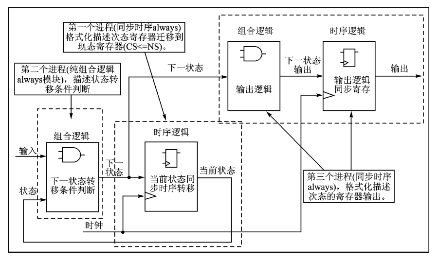

- 根据状态机的实际写法，状态机可以分为一段式、二段式和三段式状态机。

  - 一段式状态机：整个状态机写到一个always模块里面，在该模块中既描述**状态转移**，又描述**状态的输入和输出**；

    - 不推荐采用这种状态机，因为从代码风格方面来讲，一般都会要求把组合逻辑和时序逻辑分开；从代码维护和升级来说，组合逻辑和时序逻辑混合在一起不利于代码维护和修改，也不利于约束。

    

  - 二段式状态机：用两个always模块来描述状态机，其中一个always模块采用同步时序描述**状态转移**，另一个模块采用组合逻辑**判断状态转移条件，描述状态转移规律及输出**。不同于一段式状态机的是，它需要定义两个状态，现态和次态，然后通过现态和次态的转换来实现时序逻辑；

    - 输出如果用组合逻辑，则非常容易产生毛刺，所以请尽量在后面补一个寄存器。

    

  - 三段式状态机：在两个always模块描述方法的基础上，使用三个always模块，一个always模块采用同步时序描述**状态转移**，一个always采用组合逻辑**判断状态转移条件，描述状态转移规律**，另一个always模块描述**状态输出**。

    

- Mealy型状态机的输出和当前状态以及输入都有关，Moore型状态机的输出只和当前状态有关。
  - Mealy型状态机比Moore型状态机的状态个数要少
  - Mealy型状态机比Moore型状态机的输出要早一个时钟周期
- 状态机的编码方式一般有三种，各有优劣，独热码算是用的比较多的：
  - 独热码：和格雷码相比，虽然独热码多用了触发器，但所用组合电路可以省一些，因而使电路的速度和可靠性有显著提高，而总的单元数并无显著增加。**因为独热码只有一位的变化，所以更适用于高速系统**。
  - 格雷码：在一组数的编码中，若任意两个相邻的代码只有一位二进制数不同，则称这种编码为格雷码（Gray Code），另外由于最大数与最小数之间也仅一位数不同，即“首尾相连”，因此又称循环码或反射码。使用了更多的组合逻辑资源，但是比独热码能表示更多的状态。
  - 二进制码：使用了更多的组合逻辑资源，但是比独热码能表示更多的状态，**稳定性不如格雷码**。

**总结与思考：**

==状态机的三种描述方法：==

- 一段式：整个状态机写到一个always模块里面，**在该模块中即描述状态转移，又描述状态的输入和输出**；
- 二段式：用两个always模块来描述状态机，其中一个always模块采用**同步时序描述状态转移**，另一个模块**采用组合逻辑判断状态转移条件，描述状态转移规律及输出**；
- 三段式：在两个always模块描述方法的基础上，使用第三个always模块，一个always模块采用同**步时序描述状态转移**，一个always采用组合逻辑判断状态转移条件，描述状态转移规律，第三个always模块描**述状态输出**。

==应该选择哪一种状态机 ？==

一段式状态机写法**不够模块化 ，且过于臃肿不利于维护及布局布线**；

二段式状态机将同步时序和组合逻辑分别放到不同的always模块中实现，这样做的好处不仅仅是便于阅读、理解、维护，更重要的是利于综合器优化代码，利于用户添加合适的时序约束条件，利于布局布线器实现设计。**但是其当前状态的输出用组合逻辑实现，组合逻辑很容易产生毛刺，而且不利于约束，不利于综合器和布局布线器实现高性能的设计**。

三段式状态机与二段式状态机相比，关键在于根据状态转移规律，在上一状态根据输入条件判断出当前状态的输出，从而在不插入额外时钟节拍的前提下，实现了寄存器输出，解决了毛刺问题。实际应用中三段式状态机使用最多，因为三段式状态机将组合逻辑和时序分开，有利于综合器分析优 化以及程序的维护；并且三段式状态机将状态转移与状态输出分开，使代码看上去更加清晰易懂，提高了代码的可读性，推荐使用三段式状态机。

==三段式状态机的基本格式：==

- 第一个 always 语句实现同步状态跳转；
- 第二个 always 语句采用组合逻辑判断状态转移条件；
- 第三个 always 语句采用时序逻辑描述状态输出。

==三段式状态机的第三段采用next_state还是cur_state：==

Mealy型状态机的第三段输出采用cur_state，因为它的输出是与输入挂钩的，而next_state也是个组合逻辑变量，如果采用next_state输出，则输出是完全基于组合逻辑的，就容易有问题。

Moore型状态机第三段使用next_state和cur_state的区别在于，当状态跳转时，基于next_state的输出是立刻变化的，而基于cur_state输出会延迟一个周期，其他情况都一样，应该根据自己的时序要求选择。

---

比如下图中的基于next_state的Mealy型状态机的输出，在投入第2个硬币后就拉高了输出cola，明显的功能错误。因为组合逻辑的跳转不是基于时钟的，而且Mealy型的输出也是基于输入的。


同样的输入激励在Moore状态机上就不会产生这种问题。二者的区别仅仅是next_state的输出比cur_state快一个时钟周期而已。


==modelsim显示状态机名称的方法：==

1. 在Testbench中添加如下语句：实质上就是在测试文件里添加一个变量来代替你要观察的变量；
2. 在modelsim的波形仿真见面右击波形，选择Radix--ASCII。

```cobol
// 状态机名称查看器
reg [39:0]	state_name_cur;			    //每字符8位宽，这里最多5个字符40位宽（THREE）
reg [39:0]	state_name_next;		    //每字符8位宽，这里最多5个字符40位宽（THREE）
 
always @(*) begin
    case(FSM_Mealy_3_inst.cur_state)    //这里写你例化的状态机模块里你想查看的参数
         4'b0001:    	state_name_cur = "IDLE";    //编码对应你的状态机的编码
         4'b0010:   	state_name_cur = "ONE";
         4'b0100:   	state_name_cur = "TWO";
         4'b1000:		state_name_cur = "THREE"; 
        default:		state_name_cur = "IDLE";
    endcase
end
 
always @(*) begin
    case(FSM_Mealy_3_inst.next_state)
         4'b0001:    	state_name_next = "IDLE";
         4'b0010:   	state_name_next = "ONE";
         4'b0100:   	state_name_next = "TWO";
         4'b1000:		state_name_next = "THREE"; 
		 default:		state_name_next = "IDLE";
    endcase
end
```