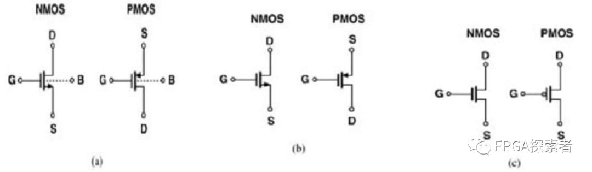
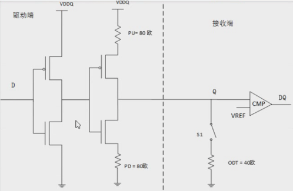
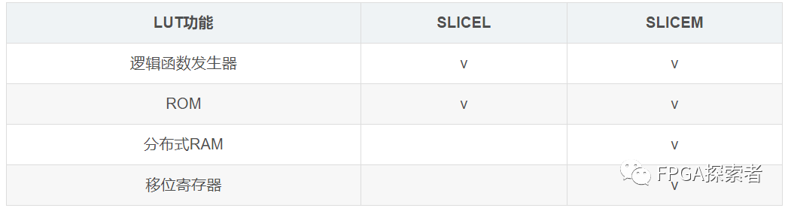
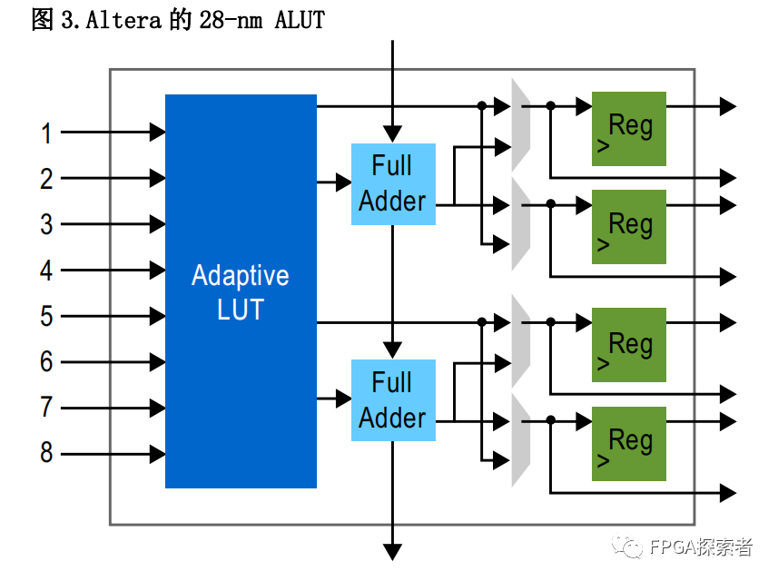

# 数字IC八股文集锦（来源FPGA探索者）

## 一、基础知识

学习方法：由点及面，本节主要掌握提到的术语，在参考学习所给链接的基础上，借助网络搜索更多相关的内容；**不要过于细节，后面还有反复学习的时间**。

一阶段重点掌握：FPGA底层资源；Verilog语法与底层硬件电路的映射；同步复位、异步复位、同步复位异步释放；数字IC设计流程；STA静态时序分析基本概念；偶数分频、奇数分频；同步FIFO*……

### 1. CMOS电路、门电路

**（1）**TTL门电路的输入端**可以**悬空，CMOS门电路的输入端**不可以**悬空。

- TTL悬空后相当于接了无穷大电阻，大于开门电阻，认为输入了高电平；CMOS悬空后，输入情况不确定是低电平还是高电平，所以一般会外接一个确定的电平。
- 对于CMOS来讲，输入阻抗高，输入端悬空时，即使很小的噪声在大的阻抗作用下也可能认为是有效的电压信号，所以不可以悬空；**CMOS内部是MOS管，电流小，所以引脚不管接大电阻还是小电阻都算低电平**。
- 为了避免干扰，一般CMOS和TTL都可以按功能接高电平或者低电平，或者和其他输入端并联。
- 对于TTL 来讲，有输入特性和负载特性，存在开门电阻和关门电阻，**如果外接电阻小于关门电阻则认为是接了低电平，如果外接电阻大于开门电阻则认为是接了高电平**——TTL悬空的引脚相当于接了一个无穷大电阻，相当于是接了高电平；TTL串联10 kΩ电阻接地，相当于接了高电平。
- TTL是电流控制元件，CMOS是电压控制元件；TTL速度快功耗大，CMOS速度慢功耗低。

**补充：**

- **关门电阻/开门电阻：**在保证门电路输出为额定高电平的条件下，所允许R~OFF~ 的最大值称为关门电阻。典型的TTL门电路R~OFF~≈ 0.7 kΩ；在保证门电路输出为额定低电平的条件下，所允许R~ON~ 的最小值称为开门电阻。典型的TTL门电路R~ON~≈ 2 kΩ。当输入电压大于门的高电平电压（通常约为2.0 V）时，门被视为处于"开"状态，输入电压小于门的低电平电压（通常约为0.8 V）时，门被视为处于"关"状态。这两个电平之间存在一个电压范围，在这个范围内，门的状态是不确定的。
- **输入阻抗：**输入阻抗是一个电路的输入端口对外部信号的阻抗。它描述了电路对外部信号源的负载效应。输入阻抗通常由电路设计和构成原件（如晶体管）的特性决定。
- **负载效应：**负载效应是指电路输出端点所连接的负载（例如电阻、电感和电容）对电路整体性能的影响。在电路中，输出端点通常会提供电流或电压给负载，而负载会对这些提供的电流或电压产生影响，从而影响电路的性能。

**（2）**在不影响逻辑功能的情况下，CMOS与非门的多余输入端可<u>接高电平</u>。

- CMOS与非门，只要有一个输入端为低电平，与运算后均为低电平，输出为高电平，影响输出结果；若接地或悬空会使输出始终为1。
- CMOS与门、与非门：多余端通过限流电阻（500 Ω）接电源。
- CMOS或门、或非门：多余端通过限流电阻（500 Ω）接地。
- TTL与门、与非门：
  1. 将多余输入端接高电平，即通过限流电阻与电源相接；
  2. 通过大电阻（大于1 kΩ）到地，相当于输入端外接高电平（外接电阻大于开门电阻）；
  3. 把多余输入端悬空（相当于有大电阻），输入端相当于外接高电平；
  4. TTL门电路的工作速度不高，信号源驱动能力较强，多余输入端可与使用的输入端并联。
- TTL或门、或非门：通过接小于1 KΩ（500 Ω）的电阻到地（外接电阻小于关门电阻）。

**补充：**

- CMOS输入端悬空时，悬空引脚容易受到外界干扰，在使用CMOS门电路时输入端应特别注意不能悬空。
- 压降：压降是指电路中由于电阻、电感、电容等原件的存在而导致电压下降的现象。在电路中，电流通过一个元件时，会因为该原件的特性而导致电压降低。有电阻性元件的压降、电感性元件的压降、电容性元件的压降。压降通常用来描述电路中各个元件之间的电压差异，以及在电路中电压随着电流的传输而发生的变化。

**（3）**NMOS和PMOS的表示方法：




- PMOS管是源极进去，NMOS管是源极出来。（a/b）

- PMOS管在输入端为0时导通，NMOS管在输入端为1时导通。(c)



- 驱动端为0时，NMOS管导通，反相器（右边的一对MOS管）输出接地，电阻上没有电流，因此功耗较低。

**补充：**

- 电阻分压从零电势开始算起。比如两电阻分压，两电阻中间电电压与靠近地一端的电阻所分电压相同。

### 2. FPGA底层资源，Verilog对应的硬件电路（触发器、锁存器、LUT查找表、BRAM）

**（1）**资源和速度【关键路径】【timing时序】【位宽扩展】

**（2）**FPGA设计中的优化问题——【面积优化】【速度优化】【关键路径优化】【流水线】【寄存器配平】【资源共享】

- 两大优化方向：面积优化、速度优化，相互制约。

- 以下方法哪些是进行面积优化？

  - [x] 串行化、资源共享、逻辑优化
  - [ ] 流水线设计、寄存器配平、关键路径优化

  可见凡是进行面积优化，都是减小至少是不增加寄存器的使用，而速度优化则相反：流水线（增加寄存器）、寄存器配平（配平要增加寄存器,至少不减小）、关键路径优化（比如对乘法寄存器分割流水、减小关键路径）。

**（3）**LUT查找表【FPGA底层资源】

-   Xilinx 的 7 系列 FPGA 中有两种 Slice（Slice Logic，Slice Memory），其区别在于 LUT6 的实现上（具体内容见补充链接）。



- 对于Altera系列的FPGA，其底层组合逻辑也是依靠LUT查找表实现的。



**（3）**笔试 | 代码与门电路，底层资源映射（一段代码会对应到什么门电路）

- [电路逻辑门图形符号汇总_八种逻辑门电路符号-CSDN博客](https://blog.csdn.net/rwrsgg/article/details/106849011)
- 电路用与非门实现、用或非门实现，其实就是对表达式的化简->数字电路最简表达式？

**（4）**笔试 | 再探Latch产生条件（if...else看似完备但实际不完备）

- Flip-Flop是触发器，简写为FF，边沿触发；Latch是锁存器，电平触发，二者皆可存储数据。

- 触发器比锁存器占的面积大，但是一般应避免产生Latch，原因如下：

  1. Latch是<u>电平触发，对毛刺敏感</u>；FF是边沿触发，稳定性高。
  2. Flip-Flop可以设计成均在同一个时钟的同一个边沿的驱动下触发，是同步电路设计，而如果这其中有Latch的产生，则数据的寄存不止发生在某一边沿，打破了同步设计（异步设计），**这样不利于STA静态时序分析**（==STA只能分析同步电路====，插Latch以后属于异步==）。

- Latch的优点：

  1. 面积比FF小，在ASIC设计中可以做出来Latch去实现一定的逻辑，能够节省资源；==但是在FPGA设计中，是没有单独的Latch的，一般是LUT查找表实现组合逻辑，Flip-Flop实现时序逻辑==，FPGA中的Latch实际上也是消耗FF来实现的；注意此处所说的Flip-Flop实现时序逻辑，并且用Flip-Flop实现的Latch锁存器，这暗示着Latch实际上也是时序逻辑。

     **曾经有笔试题考过：Latch是不是时序逻辑。**

     **答案：Latch是时序逻辑，有数据存储功能。**

  2. Latch可以在某些场合用于解决一定的时序问题，利用其电平触发特性，相比边沿触发能够多出来半个时钟周期的缓冲时间，专有名词**timing borrow**（**时钟借用**），这部分可以自行查阅。[静态时序分析——Timing borrow-CSDN博客](https://blog.csdn.net/qq_21842097/article/details/108312949)

- 1. 在case列出的条件是完备的情况下，仍然会有综合成latch的可能，原因在于每个条件没有==明确指出所有输出，比如：==

  ```verilog
  always@(b or d)
  begin
    case(d)//synopsys full_case
      2’b00:a=b>>1;
      2’b11:c=b>>1;
    endcase
  end
  ```

  2'b00时没指出c的输出，那么默认要暂存，保持上次的值，所以产生Latch。**//synopsys full_case**是给综合工具的指令，表示在case语句里认为这里列出来的条件是完备的。

  2. 没有Latch，在不满足case的某个条件时，a和c也有确定的值，不会出现Latch，但是这种代码风格不好。

  ```verilog
  always @(b or d) begin
    a=b;
    c=b;
    case(d)
      2’b00:a=b>>1;
      2’b11:c=b>>1;
    endcase
  end
  ```

- 有Latch，同理，输出逻辑实际不完备。

```verilog
always @ (b or d)
  case(d)
  2’b00:a=b>>1;
  2’b11:c=b>>1;
  default: begin
    a=b;
    c=b;
  end
  endcase
```

- 带异步低电平复位的D触发器二分频

```verilog
`timescale 1ns/1ns

module dff_2clk(
	input	clk,
    input	rst_n,
    
    output reg q
);
    always @(posedge clk or negedge rst_n)
        if(!rst_n)
            q <= 1'b0;
    	else
            q <= ~q;
    
endmodule
```

如果是4分频：两个D触发器串联起来，二分频后再二分频，得到四分频。但是这只适用于分频要求不高的电路，如果100分频，则时钟到达每个寄存器之间会出现延迟，此时应当采用第二种方法：==计数器偶数分频==

```verilog
// 十分频，使用计数器分频，每计5个数就输出翻转一次，这样会让输出高低电平一共包含10个输入时钟，实现10分频
// 每次计数值为0~4，即(10/2)-1；任意偶数2N分频，计数值0~N-1
`timescale 1ns/1ns

module dff_10clk(
	input clk,
    input rst_n,
    
    output reg q
);
    
reg [2:0] cnt;
    
always @(posedge clk or negedge rst_n)
    if(!rst_n) begin
            q <= 1'b0;
            cnt <= 3'd0;
        end
    else if(cnt == 3'd4) begin
        	q <= ~q;
        	cnt <= 3'd0;
    end
    else begin
        cnt <= cnt + 1'd1;
        q <= q;// 其实不用写
    end
endmodule
```

### 3.FIFO深度计算，同步FIFO、异步FIFO设计

#### （1）FIFO深度计算【异步FIFO】【同步FIFO】

1. 假设**两个异步时钟clk_a和clk_b**，clk_a=148.5M，clk_b=140M。如图所示，clk_a时钟域中连续1920个16bit的数据通过data_valid标记，有效数据之后，紧接着720个无效数据时钟周期。请问，该数据通过异步fifo同步到clk_b时钟域，异步fifo的最小深度是多少？请写出计算过程。

### **补充：**

- LUT查找表 ：**LUT实际上是一种存储在FPGA中的小型内存数组，它将输入模式映射到输出模式**，通常用于实现逻辑功能（也可以用来实现RAM，对于一些较小的、定制的RAM可行）。在FPGA中，大量的LUT被组织成片上的逻辑块（CLB），这些逻辑块连接在一起形成逻辑电路。通过有效地配置LUT和连接它们，可以实现复杂的数字逻辑功能，如处理器、DSP等。
- BRAM ：BRAM（Block RAM）是FPGA中的专用存储器块。与通过LUT组合形成的RAM相比，**BRAM提供了更高的性能和效率**。每个BRAM块都是专门设计的硬件资源，用于存储和检索数据，通常由 FPGA 制造商提供。特点如下：
  1. 容量和宽度：数据宽度可以配置为满足特定需求；
  2. 独立的读写端口：BRAM通常支持独立的读和写端口，使其能够同时执行读取和写入操作；
  3. 存储器块分布：通常分布在不同区域，使其更靠近逻辑单元和其他相关资源，以减小访问延迟；
  4. 时序特性： 由于BRAM是硬件资源，<u>具有可预测的时序特性</u>，这有助于在设计中实现精确的时序要求；
  5. 编程和配置。

- 当两个8-bit数相乘，为保证乘法运算不溢出，结果位宽需要16-bit。当两个8位数相乘时，乘积的位宽取决于所需的精度和最大可能的结果值。如果不确定乘积的最大值，您可以通过将两个8位数的最大值相乘来计算。如果结果超过8位数的最大值（255 * 255 = 65,025），那么您将需要一个16位宽的结果来容纳所有可能的结果。
- 关键路径 : 在数字电路中，关键路径是指电路中最长的延迟路径，其决定了电路的最大工作频率。在时序电路设计中，了解和优化关键路径非常重要，因为它限制了电路的工作速度。关键路径通常是由多个逻辑门、寄存器和电线组成的路径，从电路的输入到输出。延迟主要由逻辑门的传播延迟、寄存器的时钟到输出延迟以及线路的传输延迟等组成。在数字电路设计中，设计工具（如EDA工具）可以分析电路并识别关键路径。一旦确定了关键路径，设计者可以采取一些技术来优化它，例如重布线、**插入缓冲器**、调整时钟频率等，以提高电路的性能。

- 速度优化，提高运行速度：

  1. 流水线设计（也属于关键路径优化，在关键路径的组合逻辑中插入寄存器）；
  2. 寄存器配平（重定时Retiming，确保时钟信号到达所有寄存器的时间相同，从而避免时序错误）；
  3. 关键路径优化（减少关键路径上的组合逻辑延时）；
  4. **迟滞信号后移**（延时较大的信号放后面，缩短这个信号的路径长度）；

  后面两种目前编译器自己能够做些处理：

  5. 消除代码优先级（if_else嵌套、case）；
  6. 并行化（树形结构，加法树、乘法树，消除符号运算的优先级）。

- 面积优化，提高资源利用率以降低功耗要求：

  1. 串行化;
  2. 资源共享;
  3. 逻辑优化。

- 在赛灵思（Xilinx）的FPGA中，Slice是一种逻辑资源单元，用于实现数字逻辑功能。每个Slice包含一组可编程逻辑资源，通常包括LUT（查找表）、寄存器和其他与逻辑功能相关的资源。Slice可以分为两种不同类型：Slice Logic（逻辑片）和Slice Memory（存储片）。它们分别用于实现不同类型的功能。

  1. **Slice Logic（逻辑片）：** Slice Logic用于实现逻辑功能，包括布尔逻辑、算术逻辑、状态机等。
  2. **Slice Memory（存储片）：** Slice Memory用于实现存储器功能，例如RAM（随机存取存储器）或ROM（只读存储器）。

- Xilinx 7 系列 FPGA 底层资源-- 内部结构之CLB（LUT查找表、Flip-Flop、进位链、MUX）https://mp.weixin.qq.com/s/TqpxyEzkyrbjlVSiQuXmWw

- 综合后仿真：综合后仿真检查综合结果是否和原设计一致。仿真时，可以估计门延时带来的影响，但是无法估计线延时，因此和布线后的实际情况有一定差距。