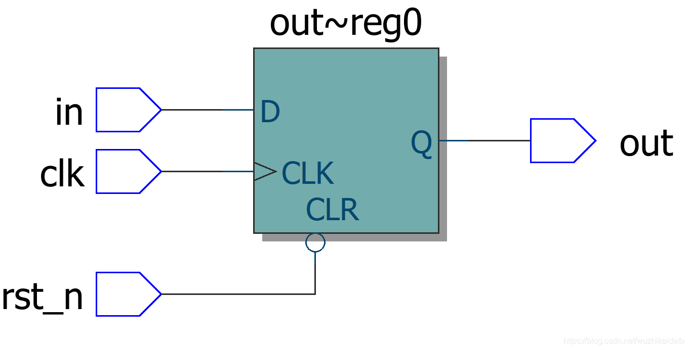

[toc]


# 1.FPGA与ASIC有什么差异？二者该如何选用？

| 序号 | FPGA                                                         | ASIC                                                         |
| ---- | ------------------------------------------------------------ | ------------------------------------------------------------ |
| 1    | 可重构电路（重配置、部分重配置——在数据中心的加速计算中得到了广泛应用） | 固定电路                                                     |
| 2    | HDL                                                          | HDL                                                          |
| 3    | 低门槛                                                       | 成本、学习曲线、与半导体工厂联系等方面的门槛很高             |
| 4    | 不适合大规模生产                                             | 适合大规模生产                                               |
| 5    | 功耗高                                                       | 功耗低                                                       |
| 6    | 与类似工艺节点的AISC相比，工作频率有限。**布线逻辑和可配置逻辑会吞噬时序裕量** | 利用相同的工艺节点制作的ASIC，其 工作频率远高于FPGA          |
| 7    | **无法进行模拟设计**。虽然FPGA可能包含某些模拟电路的硬核，如PLL和ADC等，但它们并不能灵活地来创建如射频收发器等模拟电路。 | **可以有完整的模拟电路**，例如Wi-Fi收发器等。**这是FPGA所不具备的优势**。 |
| 8    | FPGA非常适合雷达、手机基站等应用，目前的设计可能需要升级，以便使用更好的算法或更好的设计。在这些应用中，FPGA高昂的成本并不是决定性因素，它的可编程特性才是决定因素。 | ASIC不适合在可能需要经常更新设计的应用领域。                 |
| 9    | **最好用于原型验证和验证设计**。很多ASIC都使用FPGA来做原型验证。一些大的处理器厂商也在使用FPGA来验证他们的片上芯片(SOC)。 | 不建议使用ASIC来做原型设计，除非它是绝对有效的。一旦流片后，几乎就没有办法来修复设计错误了（流片失败成本巨大）。 |
| 10   | **FPGA设计师通常不需要管后端设计**。所有的事情都由综合工具来处理，这些工具会确保设计如RTL代码所描述的那样，并确保其满足时序要求。因此,设计师可以专注于完成RTL的设计。 | 从RTL向下到复位树、时钟树、物理布局和布线、工艺节点、制造约束(DFM)、测试约束(DFT)等，ASIC设计师都需要关注。一般而言，上述每个领域都由不同的工程师负责。 |

SIC的NRE成本高达数百万美元，而实际的每一个die成本可能只有几美分。FPGA没有NRE成本，成本的大部分来源于软件（知识产权）。因为NRE成本的存在，ASIC的总成本在一开始就非常高，但其成本斜率较低。也就是说，小规模的ASIC的成本很高，但在大规模的ASIC中，每个批量的成本将变得非常低。与ASIC相比，FPGA的成本仅限于购买现成的IC。

# 2.FPGA设计的抽象层级？

- 顶层是系统架构，它定义了各种子模块并根据功能对它们进行分组。例如，处理器集群具有多个核，高速缓存和高速缓存一致性逻辑。所有这些都将被封装为具有输入输出的单个模块。
- 每个子模块都用HDL编写，以准确描述每个独立模块的功能。在此阶段将忽略较低级别的实现细节，例如电路原理图、技术库等。
- 然后，HDL被转换成门级原理图，其中还涉及表征触发器等数字元件的技术库。
- 晶体管级。

**设计风格**

自上而下（top-down）：在这种风格中，首先定义顶层模块以及构建顶层模块所需的子模块的表示。类似地，每个子模块将被进一步划分为更小的组件，该过程可以继续进行，直到达到叶单元或无法进一步划分的阶段。

自下而上（down-top）：在这种情况下，**第一个任务是识别可用的构建模块**。然后将它们放在一起并以某种方式连接以构建更大的单元，用以拼凑出顶层模块。

实践中通常这两种流程都会用到。架构师定义设计的系统级视图，设计人员实现每个功能模块的逻辑并将其综合到门中（PS：这块看起来像是机器翻译的，应该是进行门级综合吧？）。到目前为止，一直遵循自上而下的风格。然而，这些门是按照自下而上的流程构建的，从尽可能的最佳面积、性能和功耗的最小模块的物理布局开始。

# 3.[FPGA设计的10点小知识]([FPGA设计的10点小知识_fpga小知识分享-CSDN博客](https://wuzhikai.blog.csdn.net/article/details/127430823))

# 4.FPGA同步复位、异步复位、异步复位同步释放

[FPGA同步复位、异步复位、异步复位同步释放_fpga 异步复位-CSDN博客](https://wuzhikai.blog.csdn.net/article/details/119641269)

**同步复位**：同步复位是指当时钟上升沿（有效沿）检测到复位信号，执行复位操作，有效的时钟沿是前提。


可以看到，生成的触发器并没有复位置位段，而是生成了一个选择器，同步复位信号rst_n用作了选择器的选择信号，从而实现复位清零的作用。

==同步复位电路的优点：==

- 有利于仿真器的仿真
- 基本上没有亚稳态问题
- 可以使所设计的系统成为完全的同步时序电路，有利于时序分析
- 由于只在时钟有效电平到来时才有效，所以可以滤除高于时钟频率的复位毛刺

==同步复位电路的缺点：==

- 复位信号的有效时长必须大于时钟周期，才能真正被系统识别并完成复位任务。同时还要考虑延时因素
- 大多数FPGA的DFF只有异步复位端口，采用同步复位得话综合器就会在寄存器的数据输入端口插入组合逻辑，这样会消耗逻辑资源


**异步复位**：异步复位是指无论时钟沿是否到来，只要复位信号有效，就对系统进行复位。当时钟上升沿检测到复位信号，执行复位操作。




从仿真结果可以看到：

- 只要复位信号被置为低电平，就执行复位操作，与时钟无关
- 高频毛刺信号会对系统造成误复位
- 在不考虑亚稳态的前提下，复位时间没有要求

a. 在复位信号释放（release）的时候容易出现问题，具体说就是：倘若复位释放时恰恰在时钟有效沿附近，就很容易使寄存器输出出现亚稳态，从而导致亚稳态。

b. 复位信号容易受到毛刺的影响

==异步复位电路的优点：==

- 大多数目标器件库的dff都有异步复位端口，因此**采用异步复位可以节省资源**
- 设计相对简单，异步复位信号识别方便，而且可以很方便地使用FPGA的全局复位端口GSR

==异步复位电路的缺点：==

- 复位信号容易受到毛刺的影响
- **因为是异步逻辑，无法避免地存在亚稳态问题**

关于异步复位还需要考虑：恢复时间（Recovery Time）：是指异步控制信号在“下个时钟沿”来临之前变无效的最小时间长度、去除时间（Removal）：是指异步控制信号在“有效时钟沿”之后变无效的最小时间长度，这个时间的意义是，如果保证不了这个去除时间，也就是说这个异步控制信号的解除与“有效时钟沿”离得太近（但在这个时钟沿之后），那么就不能保证有效地屏蔽这个“时钟沿”，也就是说这个“时钟沿”可能会起作用。==可以把它们理解为“恢复时钟沿有效的时间”和“去除时钟沿有效的时间”==

 换句话来说，如果你想让某个时钟沿起作用，那么你就应该在“恢复时间”之前使异步控制信号变无效，如果你想让某个时钟沿不起作用，那么你就应该在“去除时间”过后使控制信号变无效。


**异步复位、同步释放：**结合两种复位的优点，可以使用异步复位、同步释放的设计，Verilog代码如下：

```verilog
module rst_test(
	input clk,
    input rst_n,
    input in,
    output reg out
);
//----------reg定义----------
    reg arst_n_r;
    reg arst_n;
//----------复位信号同步模块----------
    always @(posedge clk or negedge rst_n) begin
        if(!rst_n) begin
           arst_n_r <= 1'b0; // 复位将输出置零
           arst_n   <= 1'b0; // 复位将输出置零
        end else begin
           arst_n_r <= 1'b1;
           arst_n   <= arst_n_r;
        end
    end
//----------输出模块----------
    always @(posedge clk or negedge arst_n) begin
        if(!arst_n)
            out <= 1'b0; // 复位将输出置零
        else
            out <= in; // 其他时候将输出赋值给输入
    end
endmodule
```

综合出来的RTL视图：


实际电路图如下：


复位是异步进行的，一旦复位信号为低电平，则输出复位，而复位的撤除则被同步到了时钟域下。如此一来，既解决了同步复位资源消耗（这里应该是指组合逻辑资源）的问题，也解决了异步复位亚稳态的问题。**其基本思想，也是将异步信号同步化。**

---

[异步复位，同步释放的理解_为什么复位信号一般采用异步复位同步释放-CSDN博客](https://blog.csdn.net/wordwarwordwar/article/details/79889725)

[【 FPGA 】稳态与亚稳态小结_亚稳态到稳态-CSDN博客](https://blog.csdn.net/Reborn_Lee/article/details/84899344?ops_request_misc=%7B%22request%5Fid%22%3A%22162868926916780274173754%22%2C%22scm%22%3A%2220140713.130102334.pc%5Fall.%22%7D&request_id=162868926916780274173754&biz_id=0&utm_medium=distribute.pc_search_result.none-task-blog-2~all~first_rank_v2~hot_rank-4-84899344.first_rank_v2_pc_rank_v29&utm_term=亚稳态)

未在本模块时钟域做过“异步复位，同步释放”处理的复位信号，提供给本模块做异步复位使用时，都需要做“异步复位，同步释放”处理。常见于系统内两部件不在同一时钟域的情况下。

[Verilog 1995 VS Verilog 2001 - T_shell - 博客园 (cnblogs.com)](https://www.cnblogs.com/tshell/p/3236476.html)

第一级触发器的输出，永远存在亚稳态的可能。亚稳态导致系统不会复位到已知状态。

如果在第二级采样时保持时间不够，第一级的输出仍然处于很强的亚稳态，将会导致第二级同步器也进入亚稳态，但这种故障出现的概率比较小。

一般情况下，两级同步器总体的故障概率是一级同步器故障概率的平方。在大部分的同步化设计中，两级同步器足以消除所有可能的亚稳态了。

**两级触发器同步，就能消除亚稳态吗？**不能！大大降低概率，几十年出现一次？

**第一级触发器的数据端口为什么是1’b1？**综合后比较节省资源。

由于产生亚稳态后，寄存器Q端输出在稳定下来之前可能是毛刺、振荡、固定的某一电压值。在信号传输中产生亚稳态就会导致与其相连其他数字部件将其作出不同的判断，有的判断到“1”有的判断到“0”，有的也进入了亚稳态，数字部件就会逻辑混乱。

预防亚稳态的方法就是将输入信号（单bit信号）打拍，也就是在要使用的时钟域下，将信号寄存。

单bit信号从慢速时钟域同步到快速时钟域需要使用打两拍的方式消除亚稳态。单bit信号从快速时钟域同步到慢速时钟域仅仅打两拍会漏采数据。**所以采用脉冲同步的方法来解决此问题。**其核心就是先在快速时钟域中将单比特脉冲信号转换为沿信号（相当于将信号拉长，从而可以在慢速时钟域中采到该信号），然后再在慢速时钟域中对沿信号进行边沿检测，把沿信号转化为脉冲信号。[加油站| 单比特信号跨时钟域问题详解（大疆FPGA逻辑岗A卷） (qq.com)](https://mp.weixin.qq.com/s/mS3JMVDjEu3cvg-oSleeUw)

---

高扇出信号对时序收敛的影响可能有：

- **延迟增加**：导致接收器在不同的时间受到相同的信号，从而导致时序上的不一致性
- **时序偏移**：由于传播延迟不同，不同接收器可能在时间上有所偏移
- **信号失真**
- **干扰和噪声**
- **电源问题**

若频繁使用全局复位，势必将复位信号变成一个高扇出信号，这对时序收敛无疑是一个巨大的挑战。

**总结**

​    复位信号能不用就不要用，**需要特定初值的可以在定义寄存器时赋值**

​    如果一定需要则使用异步复位、同步释放的方法，并将复位信号局部化，避免高扇出

---

只要系统中有异步元件，亚稳态就是无法避免的，亚稳态主要发生在：

- 异步信号检测
- 跨时钟域信号传输
- 复位电路等常用设计中

---

平均无故障工作时间：MTBF

如果数据输出信号在下一个寄存器捕获数据之前解析为有效状态，则亚稳态信号不会对系统操作产生负面影响。但是，如果亚稳态信号在到达下一个设计寄存器之前没有解析为低或高状态，则可能导致系统失败。继续球和山的类比，当球到达山底所需的时间（稳定的逻辑值 0 或 1）超过分配的时间（即寄存器的 tco加上任何时间）时，可能会发生故障。当亚稳态信号未在分配的时间内解决时，如果目标逻辑观察到不一致的逻辑状态，即不同的目标寄存器为亚稳态信号捕获不同的值，则可能导致逻辑故障。


C1和 C2常数取决于器件工艺和操作条件。fCLK and fDATA参数取决于设计规范：fCLK 是接收异步信号的时钟域的时钟频率，fDATA是异步输入数据信号的翻转频率。更快的时钟频率和更快的数据切换会降低（或恶化）MTBF。 tMET参数是可用的亚稳态建立时间，或超出寄存器 tco的可用时序裕量，用于将潜在亚稳态信号解析为已知值。同步链的tMET是链中每个寄存器的输出时序裕量的总和。 


​    总体设计 MTBF可以由设计中每个同步器链的 MTBF 确定。同步器的故障率为 1/MTBF，整个设计的故障率通过将每个同步器链的故障率相加来计算，如下所示：


​    设计亚稳态 MTBF 为 1/failure_rate设计。 
