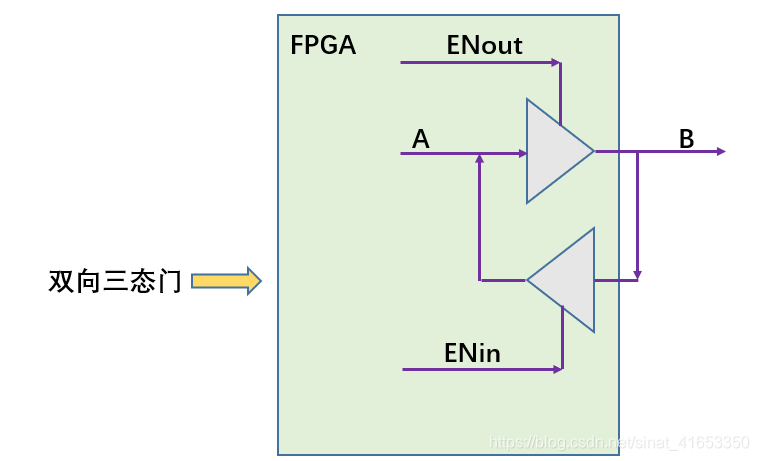
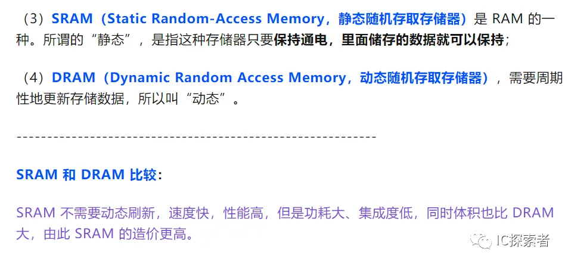
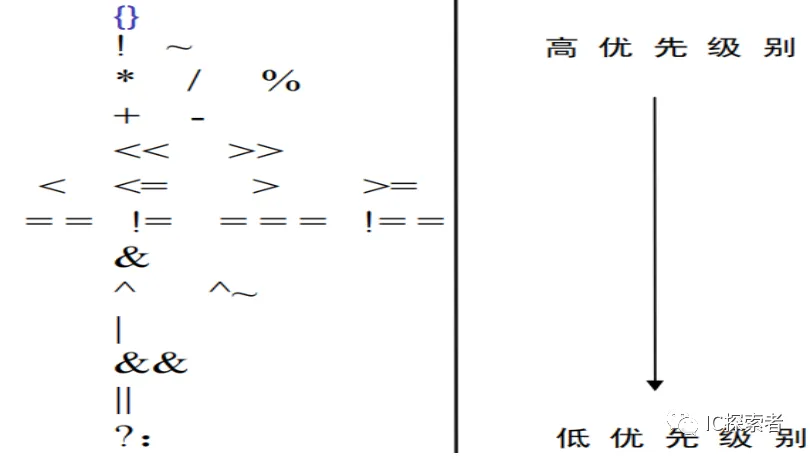
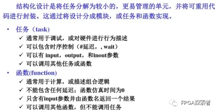
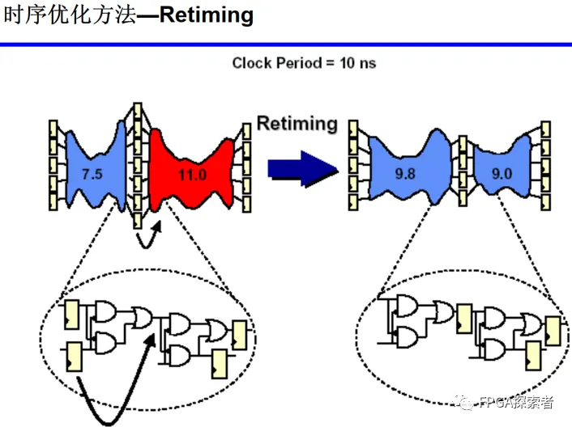
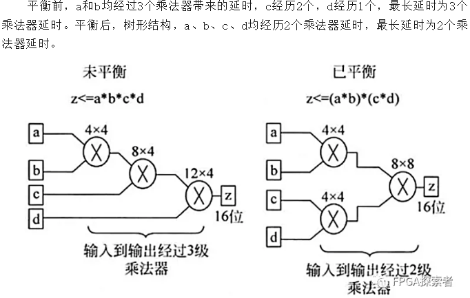
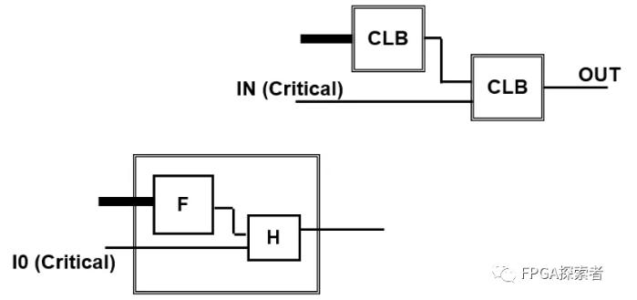

1. 下列微处理器中哪个是16位处理器？8086。80386是32位处理器，曾广泛应用于IBM PC，这些PC被称为“386计算机”。

2. 电感两端的电压与（电流的变化率）成正比。UL=L*di/dt。电感——线圈，线圈也称为电感，单位为亨利，用字母L表示。

3. 叠加定理适用于由独立源、受控源、无源器件和变压器组成的线性网络。不适用于一些非线性电路，如电路中存在二极管，如果存在独立源单独作用时不能使二极管导通，但整个电路中二极管是可以导通的，那这个电路使用叠加定理来分析就可能出错。

4. 组合逻辑电路消除竞争冒险的方法有？https://www.bilibili.com/read/cv6946060/
   - 办法1：修改逻辑表达式以避免上述情况（需要逻辑分析能力）
   - 办法2：采用时序逻辑，仅在时钟边沿采样（推荐，事实上也最常用）
   - 办法3：在芯片外部并联电容消除窄脉冲

​	**竞争：**在组合逻辑电路中，信号经过多条路径到达输出端，每条路径经过的逻辑门不同，导致存在时差，**在信号变化的瞬间存在先后顺序**。这种现象叫竞争。

​	**冒险**：由于竞争而引起电路输出信号中**出现了非预期信号，产生瞬间错误的现象**称为冒险。表现为输出端出现了原设计中没有的窄脉冲，即毛刺。

5. 双向数据总线常采用（三态门）构成。[FPGA双向IO使用之三态门说明_pds fpga io三态-CSDN博客](https://blog.csdn.net/sinat_41653350/article/details/106018051)

6. STA 主要考虑哪些时序路径？常分析的四种时序路径：**输入引脚->输出引脚**；**输入引脚->寄存器**；**寄存器->寄存器**；**寄存器->输出引脚**；

7. 根据建立时间、保持时间、路径延迟，计算最大工作频率。
8. SRAM/DRAM区别

[存储器相关问题汇总【SRAM】【DRAM】【SDRAM】【Flash】【EPROM】【EEPROM】 (qq.com)](https://mp.weixin.qq.com/s?__biz=MzUyNTc4NTk0OA==&mid=2247485989&idx=1&sn=ad679b935c0dc284e9e042910abce633&chksm=fa198416cd6e0d00b0e079f944a86234ebb613614d5ec7777da8095dfce80a8d78c1e7839ca7&scene=21#wechat_redirect)

FLASH分两种：Nand FLASH成本低、串行结构、读写慢、可靠性差；Nor FLASH与之相反。

8. Verilog运算符号中优先级最高的是？

9. 门控时钟（Clock Gating）的作用。最要作用是**用于低功耗，针对的是降低动态功耗，通过对时钟的门控降低翻转率**。门控时钟多用于ASIC，主要是考虑功耗。[芯片设计进阶之路——门控时钟 - 知乎 (zhihu.com)](https://zhuanlan.zhihu.com/p/139363948)

10. 循环：forever、while、repeat、for：当for里的循环变量是常数时，可以综合；其他均不可综合。
11. Verilog系统函数。
    - 显示、打印、监控：\$display, \$write, \$monitor;
    - 仿真暂停、结束：\$stop, \$finish; [Verilog中\$finish、\$stop的使用与区别-CSDN博客](https://wuzhikai.blog.csdn.net/article/details/124782328)
    - 读取文件：\$readmemb, \$readmemh;
    - 产生随机数：\$random;
    - 返回当前系统时间：\$time, \$realtime;
12. 分频实现。奇数分频：[Verilog笔记——奇数分频和小数分频 (qq.com)](https://mp.weixin.qq.com/s?__biz=MzUyNTc4NTk0OA==&mid=2247483713&idx=1&sn=6a5fc4f05112dbd8ba8ed790983f0e03&chksm=fa198f72cd6e0664e0df8f7fddf1777adb7f4a48618359c8c30d417ba4078c5954245e1f7b78&scene=21#wechat_redirect)，[【数字IC手撕代码】Verilog小数分频|题目|原理|设计|仿真_数字ic设计 verilog代码-CSDN博客](https://blog.csdn.net/weixin_43698385/article/details/122773225?ops_request_misc=%7B%22request%5Fid%22%3A%22171306453316800186570227%22%2C%22scm%22%3A%2220140713.130102334.pc%5Fblog.%22%7D&request_id=171306453316800186570227&biz_id=0&utm_medium=distribute.pc_search_result.none-task-blog-2~blog~first_rank_ecpm_v1~rank_v31_ecpm-1-122773225-null-null.nonecase&utm_term=小数分频&spm=1018.2226.3001.4450)

13. 设计前后的验证方式，四选一：形式验证、RTL验证、随机验证、网表验证。设计阶段采用RTL验证，综合阶段采用形式验证来证明网表和RTL代码的逻辑是等价的。[形式验证——学习笔记-CSDN博客](https://blog.csdn.net/zgezi/article/details/108309564)
    - 形式验证（Formal Verification, FM）
      - 通过纯数学方法分析两个网表的逻辑是否完全等价
      - 一种静态比较，会遍历所有的组合保证逻辑等价性，不需要动态激励
      - 比仿真可靠性高，仿真覆盖率低，且后仿真非常慢
    - 目前，逻辑等价性检查（Logic Equivalence Check, LEC）是最成熟的形式验证方法[【A级忍术】形式验证的原理及流程详细总结 (zhihu.com)](https://www.zhihu.com/tardis/zm/art/436453322?source_id=1005#:~:text=如下图所示，逻辑锥的锥体内部由组合逻辑组成。 以前级逻辑锥可以正常工作为前提，一个逻辑锥顶点所对应的寄存器能否正常工作完全取决于其内部组合逻辑的相关时间参数及延迟特性。,锥顶也叫做比较点 (Compare Ponits)，可以是输出端口、寄存器、锁存器、黑盒输入引脚。)

14. latch形成条件：在组合逻辑中，if条件不全、case语句条件不全。

- [笔试 | 再探Latch产生条件（if...else看似完备但实际不完备） (qq.com)](https://mp.weixin.qq.com/s?__biz=MzkxODM0MDkzMg==&mid=2247483714&idx=1&sn=24a378f680d8ec4bba58a14c3c5d2588&chksm=c1b39569f6c41c7f9dc1a2f4284b2c1a2f9ab16ad0de82b73f8549c15b397a212328858e069d&scene=21#wechat_redirect)

- [笔试 | Latch和Flip-Flop（锁存器和触发器，timing borrow时钟借用，STA静态时序分析） (qq.com)](https://mp.weixin.qq.com/s?__biz=MzkxODM0MDkzMg==&mid=2247483703&idx=1&sn=3d198ecce4eea7668b4df0bb71ae3044&chksm=c1b3951cf6c41c0a96203a9ed25dfbfa6365729974faac358c14b503c8ce3c4a52dfbf130068&scene=21#wechat_redirect)

15. 任务和函数的区别。任务可以调用任务和函数、函数只能调用函数、不能调用任务。[Verilog Tutorial（9）任务Task与函数Function的使用_vivado task 和function-CSDN博客](https://wuzhikai.blog.csdn.net/article/details/129667730)

==任务task与函数function之间有两个主要区别：编写函数时，它会执行计算并返回单个值，相反，任务则会执行许多顺序语句且不返回值，但任务可以有无限量的输出；函数会立即执行，并且不能包含任何时间控制语句，例如delay、posedge或wait等语句；任务则可以包含时间控制语句。==

16. 覆盖率的种类。

    代码覆盖率：状态机覆盖率、翻转覆盖率、行覆盖率、条件覆盖率、路径覆盖率、分支覆盖率。[验证方法学覆盖率(一):代码覆盖率_覆盖率验证包括哪几类覆盖率-CSDN博客](https://blog.csdn.net/weixin_42764060/article/details/107163136)

​	功能覆盖率。用来衡量哪些设计特征已经被测试程序测试过的一个指标。[【看即会用】SystemVerilog实用知识点：覆盖率之Function Coverage - 知乎 (zhihu.com)](https://zhuanlan.zhihu.com/p/573638990)

17. 关键路径通常指同步逻辑电路中，组合逻辑时延最大的路径（加上布线的延迟），关键路径是对设计性能起决定性影响的时序路径。对关键路径进行时序优化，可以直接提高设计性能，对于同步逻辑来说，常用的时序优化方法包括：Pipeline、Retiming、逻辑复制、加法/乘法树、关键信号后移、消除优先级等解决。

    1. 组合逻辑中插入寄存器（插入流水线），这种设计中额外插入寄存器增加的时钟周期延时并不会违反整个设计的规范要求，从而不会影响设计的总体功能实现。

    2. 寄存器平衡（Retiming），在不增加寄存器个数的前提下，通过改变寄存器的位置来优化关键路径。

    

    3. 操作符平衡（加法树、乘法树）

    

    4. 消除代码优先级（case代替if-else），本身不需要优先级的地方，可以使用case代替if-else，使得顺序执行的语句变成并行执行。如果确实有优先级则不能这样做。这种消除代码优先级的策略也称为**代码结构平坦化技术**，主要针那些带优先级的编码结构。

    5. 逻辑复制，**高扇出的危害是大大增加了布局布线的难度，其扇出的节点无法倍布局得彼此靠近，所以就导致了布线长度过大的问题。**

    6. 关键信号后移，关键输入应在逻辑最后一级提供，**关键输入为芯片、Slice或者LUT提供的时延最大的输入**，比如在if-else-if链中，将关键信号放在第一级（这里不是写错，而是放在第一级的信号最先出逻辑判断）。

       