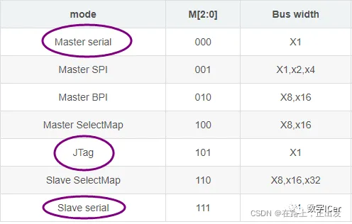
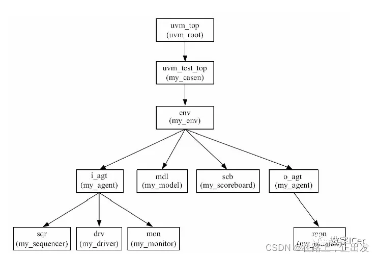
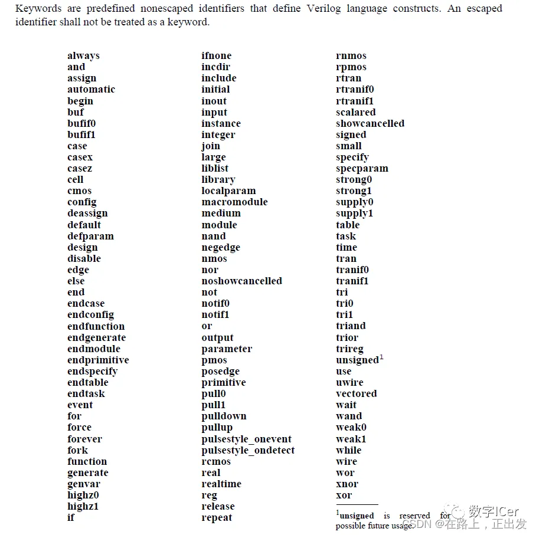
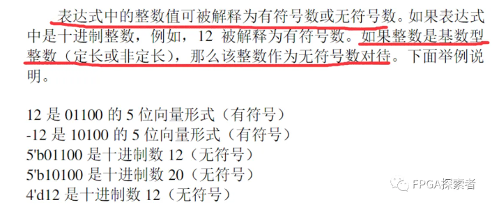

1. 下列微处理器中哪个是16位处理器？8086。80386是32位处理器，曾广泛应用于IBM PC，这些PC被称为“386计算机”。

2. 电感两端的电压与（电流的变化率）成正比。UL=L*di/dt。电感——线圈，线圈也称为电感，单位为亨利，用字母L表示。

3. 叠加定理适用于由独立源、受控源、无源器件和变压器组成的线性网络。不适用于一些非线性电路，如电路中存在二极管，如果存在独立源单独作用时不能使二极管导通，但整个电路中二极管是可以导通的，那这个电路使用叠加定理来分析就可能出错。

4. 组合逻辑电路消除竞争冒险的方法有？https://www.bilibili.com/read/cv6946060/
   - 办法1：修改逻辑表达式以避免上述情况（需要逻辑分析能力）
   - 办法2：采用时序逻辑，仅在时钟边沿采样（推荐，事实上也最常用）
   - 办法3：在芯片外部并联电容消除窄脉冲

​	**竞争：**在组合逻辑电路中，信号经过多条路径到达输出端，每条路径经过的逻辑门不同，导致存在时差，**在信号变化的瞬间存在先后顺序**。这种现象叫竞争。

​	**冒险**：由于竞争而引起电路输出信号中**出现了非预期信号，产生瞬间错误的现象**称为冒险。表现为输出端出现了原设计中没有的窄脉冲，即毛刺。

5. 双向数据总线常采用（三态门）构成。[FPGA双向IO使用之三态门说明_pds fpga io三态-CSDN博客](https://blog.csdn.net/sinat_41653350/article/details/106018051)

6. STA 主要考虑哪些时序路径？常分析的四种时序路径：**输入引脚->输出引脚**；**输入引脚->寄存器**；**寄存器->寄存器**；**寄存器->输出引脚**；

7. 根据建立时间、保持时间、路径延迟，计算最大工作频率。
8. SRAM/DRAM区别

[存储器相关问题汇总【SRAM】【DRAM】【SDRAM】【Flash】【EPROM】【EEPROM】 (qq.com)](https://mp.weixin.qq.com/s?__biz=MzUyNTc4NTk0OA==&mid=2247485989&idx=1&sn=ad679b935c0dc284e9e042910abce633&chksm=fa198416cd6e0d00b0e079f944a86234ebb613614d5ec7777da8095dfce80a8d78c1e7839ca7&scene=21#wechat_redirect)

FLASH分两种：Nand FLASH成本低、串行结构、读写慢、可靠性差；Nor FLASH与之相反。

8. Verilog运算符号中优先级最高的是？

9. 门控时钟（Clock Gating）的作用。最要作用是**用于低功耗，针对的是降低动态功耗，通过对时钟的门控降低翻转率**。门控时钟多用于ASIC，主要是考虑功耗。[芯片设计进阶之路——门控时钟 - 知乎 (zhihu.com)](https://zhuanlan.zhihu.com/p/139363948)

10. 循环：forever、while、repeat、for：当for里的循环变量是常数时，可以综合；其他均不可综合。
11. Verilog系统函数。
    - 显示、打印、监控：\$display, \$write, \$monitor;
    - 仿真暂停、结束：\$stop, \$finish; [Verilog中\$finish、\$stop的使用与区别-CSDN博客](https://wuzhikai.blog.csdn.net/article/details/124782328)
    - 读取文件：\$readmemb, \$readmemh;
    - 产生随机数：\$random;
    - 返回当前系统时间：\$time, \$realtime;
12. 分频实现。奇数分频：[Verilog笔记——奇数分频和小数分频 (qq.com)](https://mp.weixin.qq.com/s?__biz=MzUyNTc4NTk0OA==&mid=2247483713&idx=1&sn=6a5fc4f05112dbd8ba8ed790983f0e03&chksm=fa198f72cd6e0664e0df8f7fddf1777adb7f4a48618359c8c30d417ba4078c5954245e1f7b78&scene=21#wechat_redirect)，[【数字IC手撕代码】Verilog小数分频|题目|原理|设计|仿真_数字ic设计 verilog代码-CSDN博客](https://blog.csdn.net/weixin_43698385/article/details/122773225?ops_request_misc=%7B%22request%5Fid%22%3A%22171306453316800186570227%22%2C%22scm%22%3A%2220140713.130102334.pc%5Fblog.%22%7D&request_id=171306453316800186570227&biz_id=0&utm_medium=distribute.pc_search_result.none-task-blog-2~blog~first_rank_ecpm_v1~rank_v31_ecpm-1-122773225-null-null.nonecase&utm_term=小数分频&spm=1018.2226.3001.4450)

13. 设计前后的验证方式，四选一：形式验证、RTL验证、随机验证、网表验证。设计阶段采用RTL验证，综合阶段采用形式验证来证明网表和RTL代码的逻辑是等价的。[形式验证——学习笔记-CSDN博客](https://blog.csdn.net/zgezi/article/details/108309564)
    - 形式验证（Formal Verification, FM）
      - 通过纯数学方法分析两个网表的逻辑是否完全等价
      - 一种静态比较，会遍历所有的组合保证逻辑等价性，不需要动态激励
      - 比仿真可靠性高，仿真覆盖率低，且后仿真非常慢
    - 目前，逻辑等价性检查（Logic Equivalence Check, LEC）是最成熟的形式验证方法[【A级忍术】形式验证的原理及流程详细总结 (zhihu.com)](https://www.zhihu.com/tardis/zm/art/436453322?source_id=1005#:~:text=如下图所示，逻辑锥的锥体内部由组合逻辑组成。 以前级逻辑锥可以正常工作为前提，一个逻辑锥顶点所对应的寄存器能否正常工作完全取决于其内部组合逻辑的相关时间参数及延迟特性。,锥顶也叫做比较点 (Compare Ponits)，可以是输出端口、寄存器、锁存器、黑盒输入引脚。)

14. latch形成条件：在组合逻辑中，if条件不全、case语句条件不全。

- [笔试 | 再探Latch产生条件（if...else看似完备但实际不完备） (qq.com)](https://mp.weixin.qq.com/s?__biz=MzkxODM0MDkzMg==&mid=2247483714&idx=1&sn=24a378f680d8ec4bba58a14c3c5d2588&chksm=c1b39569f6c41c7f9dc1a2f4284b2c1a2f9ab16ad0de82b73f8549c15b397a212328858e069d&scene=21#wechat_redirect)

- [笔试 | Latch和Flip-Flop（锁存器和触发器，timing borrow时钟借用，STA静态时序分析） (qq.com)](https://mp.weixin.qq.com/s?__biz=MzkxODM0MDkzMg==&mid=2247483703&idx=1&sn=3d198ecce4eea7668b4df0bb71ae3044&chksm=c1b3951cf6c41c0a96203a9ed25dfbfa6365729974faac358c14b503c8ce3c4a52dfbf130068&scene=21#wechat_redirect)

15. 任务和函数的区别。任务可以调用任务和函数、函数只能调用函数、不能调用任务。[Verilog Tutorial（9）任务Task与函数Function的使用_vivado task 和function-CSDN博客](https://wuzhikai.blog.csdn.net/article/details/129667730)

==任务task与函数function之间有两个主要区别：编写函数时，它会执行计算并返回单个值，相反，任务则会执行许多顺序语句且不返回值，但任务可以有无限量的输出；函数会立即执行，并且不能包含任何时间控制语句，例如delay、posedge或wait等语句；任务则可以包含时间控制语句。==

16. 覆盖率的种类。

    代码覆盖率：状态机覆盖率、翻转覆盖率、行覆盖率、条件覆盖率、路径覆盖率、分支覆盖率。[验证方法学覆盖率(一):代码覆盖率_覆盖率验证包括哪几类覆盖率-CSDN博客](https://blog.csdn.net/weixin_42764060/article/details/107163136)

​	功能覆盖率。用来衡量哪些设计特征已经被测试程序测试过的一个指标。[【看即会用】SystemVerilog实用知识点：覆盖率之Function Coverage - 知乎 (zhihu.com)](https://zhuanlan.zhihu.com/p/573638990)

17. 关键路径通常指同步逻辑电路中，组合逻辑时延最大的路径（加上布线的延迟），关键路径是对设计性能起决定性影响的时序路径。对关键路径进行时序优化，可以直接提高设计性能，对于同步逻辑来说，常用的时序优化方法包括：Pipeline、Retiming、逻辑复制、加法/乘法树、关键信号后移、消除优先级等解决。

    1. 组合逻辑中插入寄存器（插入流水线），这种设计中额外插入寄存器增加的时钟周期延时并不会违反整个设计的规范要求，从而不会影响设计的总体功能实现。

    2. 寄存器平衡（Retiming），在不增加寄存器个数的前提下，通过改变寄存器的位置来优化关键路径。

    

    3. 操作符平衡（加法树、乘法树）

    

    4. 消除代码优先级（case代替if-else），本身不需要优先级的地方，可以使用case代替if-else，使得顺序执行的语句变成并行执行。如果确实有优先级则不能这样做。这种消除代码优先级的策略也称为**代码结构平坦化技术**，主要针那些带优先级的编码结构。

    5. 逻辑复制，**高扇出的危害是大大增加了布局布线的难度，其扇出的节点无法倍布局得彼此靠近，所以就导致了布线长度过大的问题。**

    6. 关键信号后移，关键输入应在逻辑最后一级提供，**关键输入为芯片、Slice或者LUT提供的时延最大的输入**，比如在if-else-if链中，将关键信号放在第一级（这里不是写错，而是放在第一级的信号最先出逻辑判断）。

       

7. ITU把漂移和抖动之间的门限定义为10Hz，偏移频率大于10Hz的叫抖动，小于10Hz的叫做漂移。

8. FPGA是非连续式布线，分线段互联，延时不可控，连线长度可累积。CPLD是连续式布线，延时严格可控。

9. 请选出哪个不是当前FPGA的加载方式：A.被动并行 B.主动并行 C.JTAG D.I2C加载，选D，理由

10. UVM树形结构：

11. 组合电路的基本时间参数：传输延时（Propagation delay, tpd）、污染延时（Contamination delay, tcd）；时序电路的基本时间参数：建立时间、保持时间、最大时钟频率。

12. Verilog保留字

13. 一个完整的VHDL程序包含结构体、实体、配置、程序包、库。

14. **VHDL**基本标识符要求（87标准）：

（1）由26个大小写英文字母、数字0~9及下划线“”组成的字符串；

（2）以英文字母开头；

（3）不连续使用下划线“”；

==（4）不以下划线“_”结尾；==

（5）基本标识符中的英文字母不分大小写；

（6）VHDL的保留字不能作为标识符使用。

15.  一个非门最少需要2个晶体管实现，CMOS晶体管用量：反相器2个，2输入与非门4个，3输入与非门6个。

16. TTL的电源电平是5V，CMOS的电源电平是12V。

17. 对于一般的逻辑电平，各参数需满足：Voh输出高电平 > Vih输入高电平 > Vt阈值电平> Vil 输入低电平> Vol输出低电平。

18. 起始状态为0的响应叫零状态响应，零时刻非零初态的响应叫零输入响应。

19. ==对于序列的傅里叶变换而言，其信号的特点是：时域离散非周期，频域连续周期。==

20. 中断向量地址是==中断服务程序入口地址的地址。==

21. 一次可编程只读存储器PRAM（Programmable ROM），一旦写入芯片即不可擦除。

22. 与模拟电路相比，数字电路主要优点为：通用性强、保密性好、抗干扰能力强、针对性强。

23. 概念辨析
    - 扇出：FPGA里面，扇出是一个输出端连接/驱动的后级资源的个数，比如驱动10个LUT查找表；
    - 互调：由于器件的非线性，不同频率的信号互相调制，形成一个新频率信号；在通信中的接收机中常出现交调干扰和互调干扰，==交调干扰时幅度失真，互调干扰是频谱失真==；
    - 串扰：一个信号的部分==能量==传输到相邻到线上，常出现在多路并行的高速传输线上，所以对于Gbps传输，常常使用GT高速串行收发器，而不采用并行（原因之一）；
    - 耦合：有两个依赖，彼此作用；
24. 对于时钟和数据信号，分析建立时间和保持时间；对于时钟和异步复位信号，分析恢复时间和移除时间，恢复时间：在有效时钟沿来临前，异步复位信号保持稳定的最短时间、去除时间：在有效时钟沿来临后，异步复位信号保持稳定的最短时间。
25. 多数时序问题，归根结底是建立-保持时间问题；对时序逻辑，STA静态时序分析，最主要是setup和hold问题。组合逻辑中则是竞争冒险问题。
26. 线与：OC门和OD门。OD：漏极开路门（Open-Drain），直接线与；OC：集电极开路门（Open-Collector），必须接电源和上拉电阻。【这里可以看一下STM32资料里边的GPIO输出】
27. 对于Intel（Altera）的FPGA，速率等级中-6/-7/-8，-6最快，-8最慢；Xilinx的FPGA：-1/-2/-3，-1最慢，-3最快，现在还有-1/-L1/-2/-L2/-3，L是低功耗Low power。
28. CMOS集成电路低功耗：降频、降压、多电压、多阈值（Multi-Voltage，==高速运算部分采用低阈值，运算快==；普通运算用高阈值，运算慢一点但是节省功耗）、门控时钟。**对于非关键路径，对延时不敏感，可以使用高VT（高阈值）的器件，则可以在满足时序的前提下，减小静态功耗。**
29. 在时序电路中，时钟频率为100M，计数器位宽为3bit，那么计数器的翻转周期是80ns。解答：100MHz时钟对于10ns时钟周期，计数器位宽3-bit，8进制计数器，计8个时钟周期，80ns。
30. 加减、积分、微分、乘除等模拟运算电路要求集成运放工作在**线性放大**状态。
31. 若一模拟信号为带限，且对其抽样满足奈奎斯特条件，则只要将抽样信号通过**理想低通滤波器**即可完全不失真恢复原信号。
32. 连续周期信号f(t)的频谱的特点是离散、非周期频谱。
    - 时域连续，频域非周期；
    - 时域离散，频域周期；
    - 时域周期，频域离散；
    - 时域非周期，频域连续。
33. **格雷码是循环二进制码**。

34. 表达式中的整数可被解释为有符号数或无符号数。

35. 集成电路的保护措施有：限幅输入保护电路、二极管单向导电保护、输出端对地保护、输出端限流保护。

36. fork-join_none不占用其后语句的时间。
37. 升压，跑得更快，组合逻辑延时更小，setup更容易满足，但是hold可能不会满足。随意的升压降压都可能会出现时序问题。
38. 首先我们要明确一下，setup time ,和hold up time是由器件决定的，并不是说可以随着你电路设计的改变而改变。那么时钟频率是怎么计算的呢？在不考虑时钟延时抖动等条件下，理想的说：一个信号从触发器的D端到Q端的延时假设是Tcd，从Q端出来之后会经过组合电路延时，这里注意即使没有组合电路，就单单经过导线也是有延时的，这个延时称作Tdelay，经过这个延时之后，信号将要去下一个触发器，而且必须要满足触发器的建立时间tsetup，至于为什么不在赘述。所以这三个时间加起来应该比周期要小，否则数据无法打入下一个触发器，那就会进入亚稳态。Tcd+Tdelay+Tsetup<T，时钟频率f=1/T，周期越短频率越高，那么最短周期是什么呢显而易见。上面式子中Tcd Tsetup 都是由器件决定，唯一我们能减小的就是Tdelay，在电路中Tdelay有无数条，有长有短，而那个最长的路径（关键路径）直接决定了主频能跑多快。这就是为什么我们做时序优化总是要从关键路径下手。
    至于你说的是否与hold up 时间有关，我这么跟你说吧，具体做设计的时候，不会说让你先设计然后再看主频有多快，而是主频给定了比如1GHZ，设计随便你，但是必须保证性能要求。在这种情况下，==Tcd+Tdelay+Tsetup<T依然要满足，所以Tsetup决定了最长路径的上限==。而==Tcd+Tdelay>Tholdup，也就是说Tholdup 决定了最短路径的下限==，也就是说组合逻辑是不能太大也不能太小的。这就是hold time 能起作用的地方吧。你觉得呢？
39. 动态功耗与翻转率有关。**芯片工作条件PVT**：工艺、电压、温度影响翻转率、漏电流。