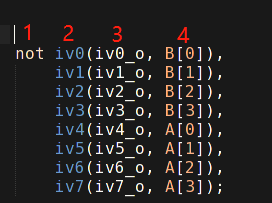

1. 奇数分频，如果上升下降沿到(N-1)/2翻转，输出就用或（|），如果到(N-1)/2-1翻转，输出就用与（&）。
1. Verilog门级描述题[4位数值比较器电路_牛客题霸_牛客网 (nowcoder.com)](https://www.nowcoder.com/practice/e02fde10f1914527b6b6871b97aef86d?tpId=301&tqId=5000580&ru=/exam/oj&qru=/ta/verilog-start/question-ranking&sourceUrl=%2Fexam%2Foj%3Fpage%3D1%26tab%3DVerilog%E7%AF%87%26topicId%3D301)

关于门级描述方式，需要注意的是

上图示例代码中，1表示门类型，2表示门实例名，3表示门实例输出，4及以后位置表示的是门输入，1和2中间还可以添加驱动能力和延迟参数。

3. 行波进位加法器（Ripple-Carry Adder, RCA）和超前进位加法器（Lookahead Carry Adder, LCA）[数电——超前进位加法器 - 一曲挽歌 - 博客园 (cnblogs.com)](https://www.cnblogs.com/yiquwange/p/14988026.html#:~:text=一、 串行（行波）进位加法器 进行两个4bit的二进制数相加，就要用到4个全加器。 那么在进行加法运算时，首先准备好的是1号全加器的3个input。 而2、3、4号全加器的Cin全部来自前一个全加器的Cout，只有等到1号全加器运算完毕，2、3、4号全加器才能依次进行进位运算，最终得到结果。,这样进位输出，像波浪一样，依次从低位到高位传递， 最终产生结果的加法器，也因此得名为 行波进位加法器 （Ripple-Carry Adder，RCA）。)；超前进位加法器是通过公式直接导出最终结果与每个输入的关系，是一种用面积换性能的方法，加法器宽度越大，性能优势越明显。LCA的逻辑门扇入扇出比较大，面积和复杂度都比较高。

```verilog
module rca #(
	parameter width = 4
)(
    input [width-1:0] A,
    input [width-1:0] B,
    input [width-1:0] S,
    
    input C_i,
    output C_o
);
    wire [width:0] C;
    genvar i;
    generate
        for(i = 0; i < width; i = i+1) begin : loop
            full_adder myadder(
                .A   (A[i]),
                .B   (B[i]),
                .C_i (C[i]),
                .S   (S[i]),
                .C_o (C[i+1])
            );
        end
    endgenerate
    assign C[0] = C_i;
    assign C_o = C[Width];
endmodule
```

```verilog
// 4-bit LCA
`timescale 1ns/1ns

module lca_4(
	input		[3:0]       A_in  ,
	input	    [3:0]		B_in  ,
    input                   C_1   ,
 
 	output	 wire			CO    ,
	output   wire [3:0]	    S
);
    wire [3:0] g, p;
    wire [3:0] c_temp, pc_temp;
    genvar i;
    generate
        for(i=0;i<4;i=i+1)
            begin:some
                xor p_gate (p[i], A_in[i], B_in[i]);
                and g_gate (g[i], A_in[i], B_in[i]);
                
                if(i == 0) begin
                    and pc_gate (pc_temp[i], p[i], C_1);
                    xor s_gate (S[i], p[i], C_1);
                end
                else begin
                    and pc_gate (pc_temp[i], p[i], c_temp[i-1]);
                    xor s_gate (S[i], p[i], c_temp[i-1]);
                end
                
                or c_gate (c_temp[i], g[i], pc_temp[i]);
                
            end
    endgenerate
    
    assign CO = c_temp[3];
    
endmodule
```

4. 使用8-3优先编码器实现16-4优先编码器


5. [Verilog -- 序列检测器（采用移位寄存器实现）_使用移动寄存器实现序列机-CSDN博客](https://blog.csdn.net/darknessdarkness/article/details/105832803)

**Note：**

- 跟用状态机实现的区别在于，使用移位寄存器需要存储所有的码字，因此如果序列长度为N,则该方法需要消耗的寄存器就是N个。而使用状态机实现时，每个状态代表部分码字，如果使用十进制编码，则只需要使用log2(N)个寄存器即可编码所有状态，从寄存器资源的角度来看FSM实现起来代价较小。
- 此外，寄存器版本每来一个码元都要比较所有码字，因此需要消耗N个比较器，而FSM的的状态寄存器每一位在状态转移时都需要不同的译码逻辑，如果状态转移比较简单，组合逻辑可能会比移位寄存器少，状态转移复杂的化就不好说了。
- 当然，移位寄存器的版本编码更加简洁明了（PS：这种情况下，代码简洁了，但是最终和FSM结构对比，不一定综合后的电路比FSM少。所以取舍还是需要认真考虑下。）。
