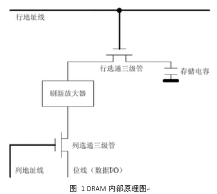
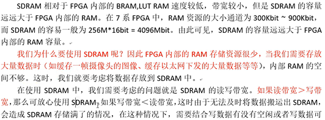
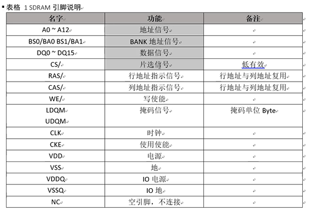
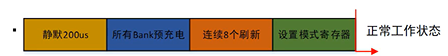

# 一、常识

RAM：随机存储器

ROM：只读存储器 -> EEPROM

RAM种类：

- SRAM：Static Random Access Memory， 静态随机存储器。运行时不需要刷新数据。
- DRAM：Dynamic Random Access Memory，动态随机存储器。运行时需要定时刷新数据。
- SDRAM：Synchronous Dynamic Random Access Memory，动态同步随机存储器。在读写数据时需要随路时钟。

SDRAM发展历史：

​	SDR SDRAM、DDR SDRAM、DDR2 SDRAM、DDR3 SDRAM、DDR4 SDRAM

SDR：相对于时钟来讲，数据只在上升沿传输

DDR：相对于时钟来讲，**数据在时钟的上升沿与下降沿都传输**

---

参考时钟：提供给FPGA的PLL或者其他IP核的时钟，用于产生SDRAM的核心时钟。（板级晶振）

核心时钟：SDRAM芯片运行的时钟。

数据时钟（数据速率）：SDRAM芯片数据端口上的等效时钟。

注：SDR SDRAM：数据时钟=核心时钟；DDRx SDRAM：数据时钟=2*核心时钟

---

Ax：行/列地址，行列地址共用地址线，通过CAS和RAS选择

掩码一半很少用

LDQM：低字节掩码，当低字节掩码为1时，DQ0~7无效

UDQM：高字节掩码，当高字节掩码为1时，DQ8~15无效

刷新放大器：预充电/自刷新

---

SDRAM是同步动态随机存储器，在数据读写时需要随路时钟同步信号。SDRAM常用的时钟频率为100MHz，数据位宽为16bit，因此数据带宽为：100MHz*16bit/8bit = 200MB/s

修改：”如果写带宽<读带宽“修改为”如果读带宽<写带宽“

# 三、SDRAM功能

1. 上电初始化

   系统上电时，SDRAM芯片需一定时间进入工作状态。上电后，SDRAM需稳定200us，然后FPGA需发送所有Bank充电指令。在所有Bank充电指令发送完成后，还需要连续8次刷新操作，最后发送模式寄存器的参数。发送完模式寄存器参数后，SDRAM就进入正常的工作状态，初始化流程如下图所示。

2. 
