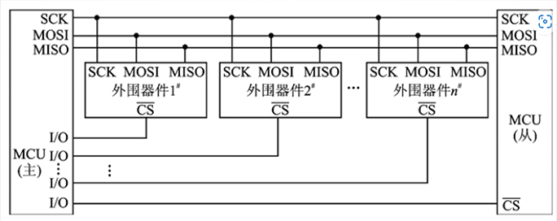
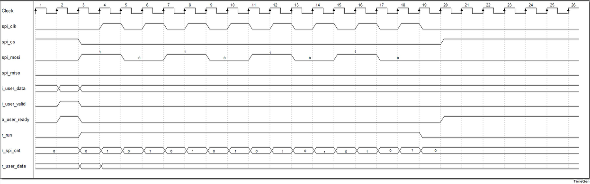
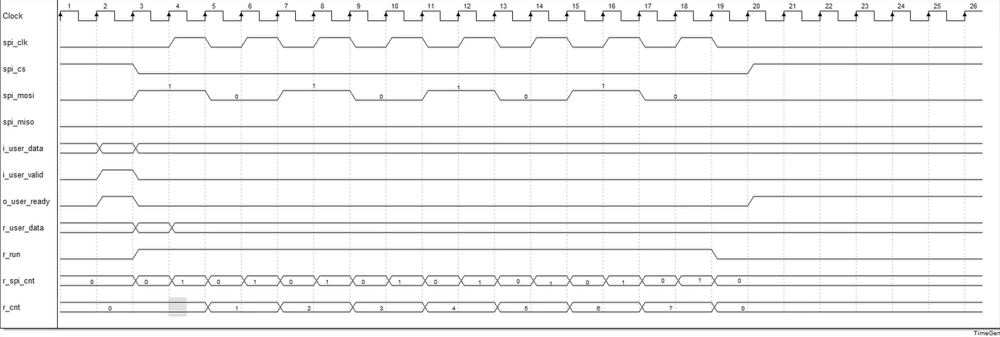
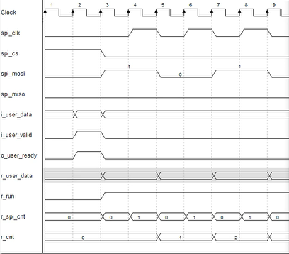

UART：异步串行通信，特点：全双工、异步 2M

SPI：同步串行通信 100M

---

SPI是高速、全双工、同步的通信总线，并且至多仅需使用4根线，SPI主要应用于FLASH、ADC、DAC等芯片。

SPI设备之间采用全双工模式通信，是一个主机和一个或多个从机的主从模式，主机负责初始化帧，这个数据传输帧可以用于读、写两种操作，片选线可以从多个从机中选择一个来响应主机的请求。

CLK：时钟，有CPOL（时钟极性）和CPHL（时钟相位）两个参数

CS：片选（从机接收到低有效）

MOSI：（Master Out Slave Input）

MISO：（Master In Slave Out）

SPI优点：因为有时钟所以不用做过采样、时钟矫正

1. 支持全双工通信
2. 通信简单
3. 数据传输速率快

SPI缺点：

1. 没有应答机制（没有应答，只负责发送数据）
2. 无法检测误码（没有奇偶校验）

---

下降沿改变数据，上升沿读取数据

模式：SPI模式0~SPI模式3

1. CPOL：时钟极性，时钟空闲时的电平状态
2. CPHL：时钟相位，采样时刻在第几个时钟沿

- 模式0：CPOL = 0， CPHL = 0；时钟空闲时为低电平，采样时刻为第一个时钟沿（上升沿），数据改变时刻为第二个时钟沿（下降沿）
- 模式1：CPOL = 0， CPHL = 1；时钟空闲时为低电平，采样时刻为第二个时钟沿（下降沿），数据改变时刻为第一个时钟沿（上升沿）
- 模式2：CPOL = 1， CPHL = 0；时钟空闲时为高电平，采样时刻为第一个时钟沿（下降沿），数据改变时刻为第二个时钟沿（上升沿）
- 模式3：CPOL = 1， CPHL = 1；时钟空闲时为高电平，采样时刻为第二个时钟沿（上升沿），数据改变时刻为第一个时钟沿（下降沿）

模式0和模式3兼容，唯一的区别是时钟在空闲时的状态；**常用模式0和模式3**；采样时刻和数据改变时刻对于主机从机都适用

串行外围通信，控制CS高低确定与哪个芯片进行通信

**SPI总线先发送高位**

1. 时钟不是一直有的，时有时无，采用时钟分频器不好控制
2. 时钟的下降沿和上升沿都要使用
3. 时序波形图如下

要增加一个发送数据计数器，每发送一个数据增加1（即每当r_spi_cnt为1时+1）

⚠Xilinx板卡如果采用SetupDebug(\*mark_debug = "true"\*)，需要JTAG时钟小于debug选定的时钟的一半！