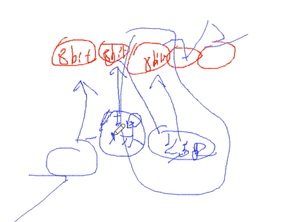
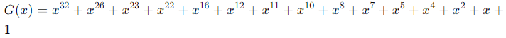
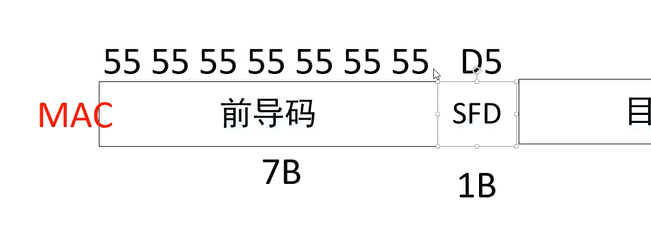

CRC全称：循环冗余校验码（Cyclic Redundancy Check, CRC），它是利用除法及余数的原理来做错误侦测的

1. CRC-7（用于SD卡，校验码是7bit），CRC-8（校验码是8bit）、CRC-16、CRC-32

2. 多项式，在多项式中x的几次幂表示二进制的对应位为1，没有的多项式为0

3. 模二除法

   1. 手算方式：对10110011进行CRC校验，CRC的多项式为Y=X4+X3+1;求CRC校验结果，结果为多项式所得位数-1
   2. 查表法

4. 

   - 以太网的CRC是有一个初始值的。每次运算的结果作为下一次的多项式参与运算。

   - [Easics CRC Tool-在线生成CRC校验码](https://crctool.easics.be/)
   - 以太网中的CRC-32协议规定了输入数据必须进行反转处理

```
以太网FCS（Frame Check Sequence）使用CRC32（Cyclic Redundancy Check 32）算法来校验帧的数据完整性。CRC32是一个32位的校验码，通过对数据帧进行特定的多项式运算生成。以下是关于以太网FCS（CRC32）的详细要求和处理步骤：

CRC32 算法要求
1. 多项式
以太网使用的标准生成多项式是：
（见下图）
对应的二进制表示为：
0x04C11DB7

2. 输入数据处理
输入反转（位反转）：输入的每个字节在计算CRC之前都需要进行位反转。例如，字节11010011（0xD3）反转后变为11001011（0xCB）。
3. 初始值
初始寄存器值：CRC寄存器初始化为0xFFFFFFFF。
4. CRC 计算过程
输入数据按位处理：将数据的每一位（反转后的）按顺序与CRC寄存器的高位进行异或运算，并根据生成多项式更新CRC寄存器的值。
右移和多项式运算：如果CRC寄存器的最高位为1，则将其与生成多项式进行异或，否则仅进行右移操作。
重复步骤1和步骤2：直到所有输入数据位处理完毕。
5. 输出处理
输出反转（位反转）：在计算完成后，CRC寄存器的值需要再次进行位反转。
最终异或值：将反转后的CRC值与0xFFFFFFFF进行异或。
以太网FCS（CRC32）具体步骤
1. 输入数据准备
假设输入数据帧为一组字节：[0x01, 0x23, 0x45, 0x67, 0x89, 0xAB, 0xCD, 0xEF]

2. 位反转处理
对每个字节进行位反转，例如：

0x01 -> 0x80
0x23 -> 0xC4
0x45 -> 0xA2
0x67 -> 0xE6
0x89 -> 0x91
0xAB -> 0xD5
0xCD -> 0xB3
0xEF -> 0xF7
3. 初始寄存器值
初始化CRC寄存器值为0xFFFFFFFF。

4. CRC 计算
将反转后的数据按位输入进行CRC计算，步骤如下：

将当前位与CRC寄存器的最高位进行异或。
根据生成多项式进行更新，如果最高位为1，则与生成多项式异或，否则右移寄存器。
依次处理所有位。
5. 输出处理
位反转：对计算得出的CRC值再次进行位反转。
异或处理：将反转后的值与0xFFFFFFFF进行异或。
6. 最终FCS值
计算得出的32位CRC值作为FCS附加到以太网帧的末尾。
```



---

在MAC层需要对哪些数据做CRC？从目的MAC到尾端（除了FCS）



上图才是正确的帧格式，代码已做修改