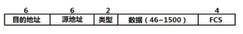
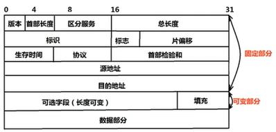
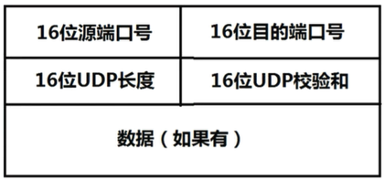
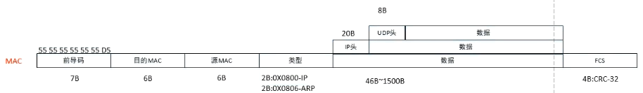
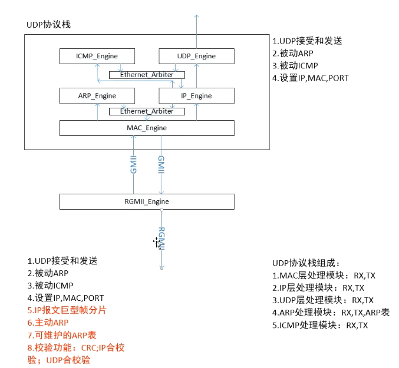
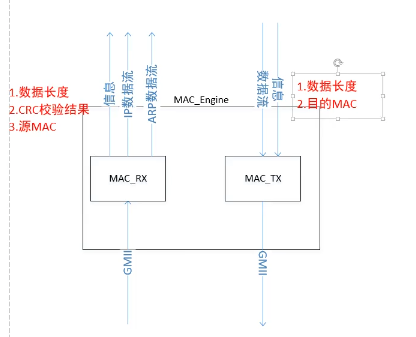

---
https://www.cnblogs.com/linford/p/15272881.html
以太网详解，从这一篇博客看起
https://www.cnblogs.com/limanjihe/p/9808115.html
MII接口介绍
---

PHY芯片通过MII、RMII、GMII和RGMII等Media Independent Interface（媒体独立接口）进行通信。

主要是做UDP协议栈，FPGA做TCP协议栈没有什么优势但是也可以做。

- 以太网协议栈UDP
  1. MAC
  2. IP、ARP
  3. UDP、ICMP

---

**MAC层协议**

- 目的地址（6字节）
  - 单播：第一个字节的LSB为0
  - 组播：第一个字节的LSB为1
  - 广播：所有的字节的全部为1（FF-FF-FF-FF-FF-FF）
- 源地址（6字节）
  - 自身的MAC地址，局域网随便
- 类型（2字节）
  - 数值小于1536，这个字段表示长度；数值大于1536，（0x0800表示IP保报文，0x0806表示ARP报文）
- 数据字段（46B~1500B）
  - 以太网帧长：64B~1518B
- FCS（4字节）
  - CRC32校验值

---

**IP层报文**

- 版本（4bit）：0010-IPV4 0110-IPV6

- 首部长度（4bit）：表示IP首部一共有多少个4Byte，无可选字段值，数值固定为5

- 服务类型（8bit）：3位优先级信息+4位TOS+服务类型（一般置为0）
- 总长度（16bit）：IP首部+IP数据
- 标识（16bit）：第几条报文，上电初值位0，每发一条报文+1
- 标志（3bit）：分片，第一位保留，第二位（1是分片，0是不分片），第三位为标志位
- 片偏移（13bit）：数据的顺序，当前数据是第几分片，第一个分片偏移是0，第二个分片偏移是1，以此类推
- 生存时间（8bit）：表示当前这条报文能路由多少次，一般是64/128，每路由一次生存时间就-1
- 协议（8bit）：TCP为6，UDP为17，ICMP为1
- 首部检验和（16bit）：检验信息
- 源地址：自身IP地址（IPV4）
- 目的地址：接收方IP地址

---

UDP层报文

源端口号：自身端口号

目的端口号：接收方端口号

UDP长度：UDP首部+数据的长度

UDP校验和：与IP校验和算法一致

---

 

---

ARP报文

---

ICMP报文

---

r_rec_type在接受完两个字节的数据之后，进行判断又花费一个周期，这时数据已经输入一个周期了，判断信号（ro_ip_valid和ro_arp_valid）相较于输入数据之后一个时钟周期，所以需要将输入数据打一拍进行对齐（ri_GMII_valid_1d）

---

